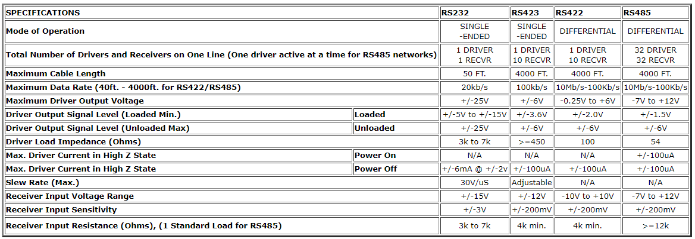

## RS232

    Speed: 20kbps - 1Mbps
    Cable length: 100ft (typical) max
    Signal Levels: ±5V transmit and ±3V receive
    Mode: Full-fuplex?
    Drive Capacity: Point to point only
    Application: modems, printers, and other PC peripherals

Definitely the most popular interface, also being one of the first. However, things may soon change for obvious reasons. Any PC that is purchased will have one (and sometimes more) RS232 port. Sometimes, they are simply referred to as SERIAL PORTS, however this may cause confusion since there are other Serial interfaces available. RS232 is widely used because it is so readily available. However, it does have some disadvantages. Here are a few:
1. Limited Distance - Cable lengths are limited to 50 ft or less. Many will claim to go further, but this is not recommended, and is not part of the RS232 specification.

2. Susceptible to Noise - RS232 is single-ended, which means that the transmit and receive lines are referenced to a common ground

3. Not Multi-drop - You can only connect one RS232 protocol device per port. There are some devices designed to echo a command to a second unit of the same family of products, but this is very rare. This means that if you have 3 meters to connect to a PC, you will need 3 ports, or at least, an RS232 multiplexor.

### _RS232 is NOT UART_
Despite that both protocol share a few common properties: asynchoronous, two wires - Tx and Rx, and point-to-point serial connection, they are NOT the same thing. Simply put, Uart is a protocol that convert parallel data from PC to serial data to be transferred or vice versa. It transfer via logic level (TTL) signals (0 - 5V) and has very short range, usually a few feet. While RS232 standard uses a much wider signal range +-25V making it not as susceptable to noise. However, this wide range of voltage level is usually not directly support by PC or MCUs. To take advantage of its feature, RS222 is usually used in combination with UART interface with the support of a RS222 drive IC:

MAX232 RS232 drive IC is powered up by 5V supply which includes a capacitive voltage generator to drive 232 level voltages. It comes with dual transmitters also called the driver (TIN, TOUT) and receivers (RIN and ROUT). Here, I have used ESP8266 (32-bit microcontroller) which has inbuilt UART.

## RS422

    Speed: > 50Mbps
    Cable length: 100ft (typical) max
    Signal Levels: ±7V transmit and receive
    Mode: unidirectional, Full-duplex
    Drive Capacity: Single transmitter, many receiver
    Application: electrically noisy industrial environments

RS422 is similar to RS232 protocol, and can be programmed in the same way, however, offers a few advantages and disadvantages. One problem is that you need to purchase an RS422 port or at least an RS422 to RS232 converter, since PC's don't come standard with this interface. Also, you may find that there are fewer devices supporting RS422. Some advantages are:
1. Long Distance Runs - Up to 500 feet is generally supported, and with repeaters, even further distances can be achieved.

2. Multi-Drop - Usually, up to 32 devices can be connected per port, and even more using repeaters. Devices are distinguished by unique addresses that are assigned to each device. For example, if you have 5 devices attached to a port, they would be addressed as units 1 to 5. If you want to communicate to unit #1, you send a command to unit #1. All units HEAR the command, but only the addressed unit will respond. This also applies to RS485. The addresses can be set via switches or software, depending on the design of the device.

3. Noise Resistant - Since it uses a separate FLOATING transmit and receive pair (four wires), it offers better noise immunity than RS232.

## RS485

    Speed: > 100Mbps
    Cable length: 4000ft (1.2km)
    Signal Levels: -7V to +12V
    Mode: bidirectional, Half-duplex
    Drive Capacity: 32 unit loads
    Application: POS, industrial, and telecom applications

RS485 is very similar to RS422. So much so that it often causes confusion. Both are multi-drop, and both can communicate via very long distances, so then why choose one over the other? First of all, RS485 is generally a 2-wire system, although some manufacturers may specify 4-wire RS485, which is far less common and very similar to RS422 protocol. It is important that you identify which one is being employed when considering an instrument. Here are some main differences between 2-wire RS485 and RS422:
1. RS485 can have multiple Commanding Devices and multiple Listening Devices. RS422 can have only one Commander and multiple Listeners. For example, you can connect one PC (the Commanding device) to 10 temperature controllers (listeners). The PC can instruct any of the controllers to change setpoint, or to send a temperature reading, but none of the controllers can command any of the other controllers. With RS485, you can have multiple PC's and multiple controllers on one bus, so that one PC can send a command to change a setpoint,and another PC can send a command to send back data, etc. Remember that all devices on the bus must have a unique unit address, so that only the addressed unit will respond. (similar to RS422)

2. RS485 pinout wiring is easier since you are only dealing with 2 wires instead of 4.

3. Programming RS485 is more difficult, since you are sending and receiving on the same two wires, you need to enable and disable the transmitter at the correct time so that you may perform proper communications. Imagine sending a command USD$2SEND out of the transmitter. If the transmitter is not turned off in time, then data being sent by another device will be missed. If the transmitter is turned off too quickly, there is a chance that part of the command USD$S2END will be truncated before it ever has a chance finishing the transmission of the character bits. When programming an RS485 plug-in card, you would read the STATUS REGISTER to determine if it is time to switch or not. Some cards, such as the OMG-ULTRA-485 has an AUTO mode where it is intelligent enough to do this automatically, making it transparent to the programmer. Since RS422, and RS232 for that matter, have separate transmit and receive lines, they are easier to implement. Of course, there are other matters to consider such as handshaking, but will not be covered in this brief description.

## Comparison Chart

## Reference

https://www.maximintegrated.com/en/design/technical-documents/app-notes/3/3884.html

https://www.omega.co.uk/techref/das/rs-232-422-485.html

http://www.rs485.com/rs485spec.html