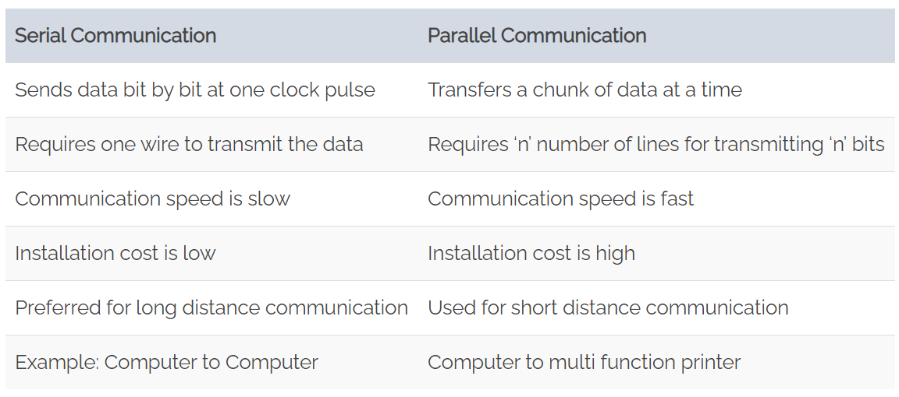

## What is Serial communication?
In serial communication, data is in the form of binary pulses. In other words, we can say Binary One represents a logic HIGH or 5 Volts, and zero represents a logic LOW or 0 Volts. Serial communication can take many forms depending on the type of transmission mode and data transfer. The transmission modes are classified as Simplex, Half Duplex, and Full Duplex. There will be a source (also known as a sender) and destination (also called a receiver) for each transmission mode.

### _Simplex method_
```The Simplex method is a one-way communication technique.```

Only one client (either the sender or receiver is active at a time). If a sender transmits, the receiver can only accept. Radio and Television transmission are the examples of simplex mode.

### _Half Duplex mode_
```In Half Duplex mode, both sender and receiver are active but not at a time```

i.e. if a sender transmits, the receiver can accept but cannot send and vice versa. A good example is an internet. If a client (laptop) sends a request for a web page, the web server processes the application and sends back the information.

### _Full Duplex mode_
```both sender and receiver can transmit and receive at the same time.```

The Full Duplex mode is widely used communication in the world. Here both sender and receiver can transmit and receive at the same time. An example is your smartphone.


## Difference between Serial and Parallel communication
Serial communication sends only one bit at a time. so, these require fewer I/O (input-output) lines. Hence, occupying less space and more resistant to cross-talk. The main advantage of serial communication is, the cost of the entire embedded system becomes cheap and transmits the information over a long distance. Serial transfer is used in DCE (Data communication Equipment) devices like a modem.

In parallel communication, a chunk of data (8,16 or 32 bit) is sent at a time. So, each bit of data requires a separate physical I/O line. The advantage of parallel communication is it is fast but its drawback is it use more number of I/O (input-output) lines. Parallel transfer is used in PC (personal computer) for interconnecting CPU (central processing unit), RAM (random access memory), modems, audio, video and network hardware.


Here is a chart to compare serial and parallel communication:



## Clock Synchronization
For efficient working of serial devices, the clock is the primary source. Malfunction of the clock may lead to unexpected results. The clock signal is different for each serial device, and it is categorized as synchronous protocol and asynchronous protocol.

### _Synchronous serial interface_
```All the devices on Synchronous serial interface use the single CPU bus to share both clock and data.```

 Due to this fact, data transfer is faster. The advantage is there will be no mismatch in baud rate. Moreover, fewer I/O (input-output) lines are required to interface components. 
 
 Examples:

    I2C, SPI etc.

 
### _Asynchronous serial interface_
```The asynchronous interface does not have an external clock signal```

It relies on four parameters namely

    1. Baud rate control
    2. Data flow control
    3. Transmission and reception control
    4. Error control
   
Asynchronous protocols are suitable for stable communication. These are used for long distance applications. 

Examples:

    RS-232, RS-422, and RS-485.


Asynchronous Protocols | Synchronous Protocols
-----------------------|----------------------
To move around the information at a longer distance | On-board communication
For more reliable data transfer | Faster data rate
---|---


## Serial communication Configurations
They are baud rate, data bit selection (framing), start-stop bit, and parity.


### _Baud rate_
```Baud rate is the speed of transferring data from the transmitter to a receiver in the form of bits per second.```

Some of the standard baud rates are 1200, 2400, 4800, 9600, 57600.

### _Framing_
```Framing shows how many data bits you want to send from the host device (Laptop) to mobile (receiver).```

Is it 5, 6, 7, or 8 bits? Mostly many devices, 8 bits are preferred. After selecting the8-bit data chunk, endianness has to be agreed by the sender and receiver.

### _Synchronization_
```Transmitter appends synchronization bits (1 Start bit and 1 or 2 Stop bit) to the original data frame.```

Synchronization bits help the receiver to identify the start and end of the data transfer. This process is known as asynchronous data transfer.

### _Error Control_
```Data corruption may happen due to external noise at the receiver end. The only solution to get the stable output is to check the Parity.```

If the binary data contains an even number of 1’s it is known as even parity and the Parity bit is set to ‘1’. If the binary data include an odd number of 1’s, it is called odd parity, and now parity bit is set to ‘0’.

## Hardware implementation
How is serial communication actually implemented at a signal level? In a variety of ways, actually. There are all sorts of standards for serial signaling. Let's look at a couple of the more popular hardware implementations of serial: logic-level (TTL) and RS-232.

When microcontrollers and other low-level ICs communicate serially they usually do so at a TTL (transistor-transistor logic) level. TTL serial signals exist between a microcontroller's voltage supply range - usually 0V to 3.3V or 5V. A signal at the VCC level (3.3V, 5V, etc.) indicates either an idle line, a bit of value 1, or a stop bit. A 0V (GND) signal represents either a start bit or a data bit of value 0.


RS-232, which can be found on some of the more ancient computers and peripherals, is like TTL serial flipped on its head. RS-232 signals usually range between -13V and 13V, though the spec allows for anything from +/- 3V to +/- 25V. On these signals a low voltage (-5V, -13V, etc.) indicates either the idle line, a stop bit, or a data bit of value 1. A high RS-232 signal means either a start bit, or a 0-value data bit. That's kind of the opposite of TTL serial.


Between the two serial signal standards, TTL is much easier to implement into embedded circuits. However the low voltage levels are more susceptible to losses across long transmission lines. RS-232, or more complex standards like RS-485, are better suited to long range serial transmissions.

When you're connecting two serial devices together, it's important to make sure their signal voltages match up. You can't directly interface a TTL serial device with an RS-232 bus. You'll have to shift those signals!


## Links
[Serial Peripheral Interface basics](https://learn.sparkfun.com/tutorials/serial-peripheral-interface-spi/all)

[Serial Communication Basics](https://www.codrey.com/embedded-systems/serial-communication-basics/)

[Serial basics](https://learn.sparkfun.com/tutorials/serial-communication/all#:~:text=One%20of%20the%20more%20common,fast%20data%20can%20be%20transferred)
