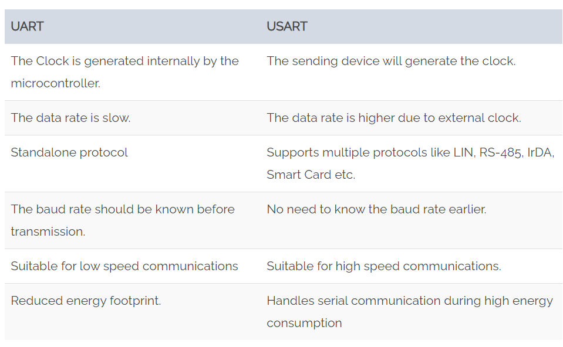

```“UART” stands for Universal Asynchronous receiver-transmitter. It is a hardware peripheral that is present inside a microcontroller. ```

## What is UART?

“UART” stands for Universal Asynchronous receiver-transmitter. It is a hardware peripheral that is present inside a microcontroller. The function of UART is to ***convert the incoming and outgoing data into the serial binary stream***. An 8-bit serial data received from the peripheral device is converted into the parallel form using serial to parallel conversion and parallel data received from the CPU is converted using serial to parallel conversion. This data is present in modulating form and transmits at a defined baud rate.

The final piece to serial communication is finding something to both create the serial packets and control those physical hardware lines. Enter the UART.

A universal asynchronous receiver/transmitter (UART) is a block of circuitry responsible for implementing serial communication. Essentially, the UART acts as an intermediary between parallel and serial interfaces. On one end of the UART is a bus of eight-or-so data lines (plus some control pins), on the other is the two serial wires - RX and TX.


### *Block Diagram*

The UART consists of the following core components. They are the transmitter and receiver. The transmitter consists of the Transmit hold register, Transmit shift register, and control logic. Similarly, the receiver consists of a Receive hold register, Receiver shift register, and control logic. In common, both the transmitter and receiver are provided with a baud rate generator.


The baud rate generator generates the speed at which the transmitter and receiver have to send/receive the data. The Transmit hold register contains the data byte to be transmitted. The transmit shift register and receiver shift register shift the bits to the left or right until a byte of data is sent/received.

In addition to these, a read or write control logic is provided to tell when to read/write. The baud rate generator generates speeds ranging from 110 bps (bits per second) to 230400. Mostly, microcontrollers come up with higher baud rates such as 115200 and 57600 for faster data transfer. Devices like GPS and GSM use slower baud rates in 4800 and 9600.

## Why UART?

Protocols like SPI (serial peripheral interface) and USB (Universal Serial Bus) are used for fast communication. When the high-speed data transfer is not required UART is used. It is a cheap communication device with a single transmitter/receiver. It requires a single wire for transmitting the data and another wire for receiving.


It can be interfaced with a PC (personal computer) using an RS232-TTL converter or USB-TTL converter. The common thing between RS232 and UART is they both don’t require a clock to transmit and receive data. The Uart frame consists of 1 start bit, 1 or 2 stop bits and a parity bit for serial data transfer.

## Protocol Format

The UART starts the communication with a start bit ‘0’. The start bit initiates the transfer of serial data and stop bit ends the data transaction.


It is also provided with a parity bit (even or odd). Even parity bit is represented by ‘0’ (even number of 1’s) and the odd parity bit is represented by ‘1’ (odd number of 1’s).

### *Start Bit*
The UART data transmission line is normally held at a high voltage level when it’s not transmitting data. To start the transfer of data, the transmitting UART pulls the transmission line from high to low for one clock cycle. When the receiving UART detects the high to low voltage transition, it begins reading the bits in the data frame at the frequency of the baud rate.

The start bit is logical low. The start bit signals the receiver that a new character is coming.
 

### *Data Frame*
The data frame contains the actual data being transferred. It can be 5 bits up to 8 bits long if a parity bit is used. If no parity bit is used, the data frame can be 9 bits long. In most cases, the data is sent with the least significant bit first.
 

### *Parity Bit*
Parity describes the evenness or oddness of a number. The parity bit is a way for the receiving UART to tell if any data has changed during transmission. Bits can be changed by electromagnetic radiation, mismatched baud rates, or long distance data transfers. After the receiving UART reads the data frame, it counts the number of bits with a value of 1 and checks if the total is an even or odd number. If the parity bit is a 0 (even parity), the 1 bits in the data frame should total to an even number. If the parity bit is a 1 (odd parity), the 1 bits in the data frame should total to an odd number. When the parity bit matches the data, the UART knows that the transmission was free of errors. But if the parity bit is a 0, and the total is odd; or the parity bit is a 1, and the total is even, the UART knows that bits in the data frame have changed.

### *Stop Bit*
To signal the end of the data packet, the sending UART drives the data transmission line from a low voltage to a high voltage for at least two bit duration.

### *UART Error*
* A framing error occurs when the designated start and stop bits are not found. If the data line is not in the expected state when the stop bit is expected, a framing error will occur.
An Under run error occurs when UART transmitter has completed sending a character and the transmit buffer is empty. In asynchronous mode this is treated as an indication that no data remains to be transmitted.
* A parity error occurs when the parity of the number of 1 bits disagrees with that specified by the parity bit. Using parity is optional, so this error will only occur if parity checking has been enabled.
* A break condition occurs when the receiver input is at the space level for longer than some duration of time, typically, for more than a character time.

## What are the devices use UART protocol?

* GPS module like SIM900/800 uses UART protocol
* Finger print sensor uses the UART protocol
* RFID modules uses the UART protocols
* Serial debug port uses the UART driver to print out the data coming from the external world.
* We can use it to send and receive commands to and from the embedded devices.
* Communication in GPS, GSM/GPRS modem, Wi-Fi chips, etc operates with UART.
* Used in Mainframe access to connect different computers.

## UART Speed (Baud Rate - Bit/Second)
UART supports many baud rate:

    300, 600, 1200, 2400, 4800, 9600, 19200, 38400, 57600, 74880, 115200, 230400, 256000, 460800, 921600, 1843200, 3686400.

## UART Advantage & Disdavantages
### Advantages

* Only two wires intereface
* No clock signal is necessary
* Error checking Feature allow : Has a parity bit check
* The structure of the data packet can be changed as long as both sides are set up for it
* Widely Used method and well documented

### Disadvantage

* Data frame maximum only 9 bits limitted
* Does not support multiple slave or multiple master systems
* The baud rates of each UART must be within 10% of each other

## UART vs USART
USART is the basic form of UART. Technically, they are not the same. But, the definition is the same for both of them. These are microcontroller peripherals that convert parallel data into serial bits and vice versa.

The main difference between UART and USART is, UART supports only asynchronous communication, whereas USART support synchronous as well as asynchronous communication. For easy understanding, here is the comparison between USART and UART.



## Is UART a protocol or hardware?

More like a hardware than protocol:

[UART hardware or protocol discussion](https://electronics.stackexchange.com/questions/399550/uart-a-protocol-or-hardware)

## Key points
* Serial Communication
* Type of Communication : Asynchronous - No clock.
* UART is full duplex communication, But its will works half duplex and simplex method.
* Transmitter and receiver should same baud rate
* Data format and transmission speed is configurable.
* UART contains a shift register, which is the fundamental method of conversion between serial and parallel forms.

## Reference Links

https://aruneworld.com/embedded/embedded-protocol/uart/

https://www.freebsd.org/doc/en_US.ISO8859-1/articles/serial-uart/index.html#uart

[Linux 8250 uart driver](https://elixir.bootlin.com/linux/v5.6.19/source/drivers/tty/serial/8250)

https://www.codrey.com/embedded-systems/uart-serial-communication-rs232/

https://blog.csdn.net/zjy900507/article/details/79789671?utm_medium=distribute.pc_relevant.none-task-blog-baidujs_title-3&spm=1001.2101.3001.4242

https://blog.csdn.net/ayang1986/article/details/106729103

https://www.analog.com/en/analog-dialogue/articles/uart-a-hardware-communication-protocol.html#

