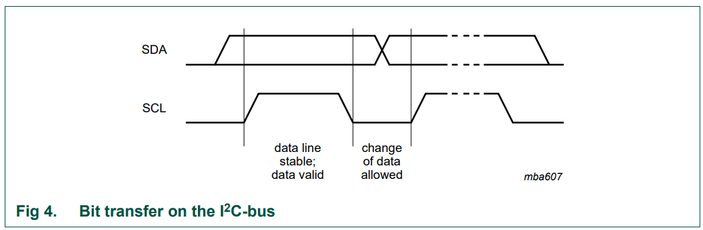
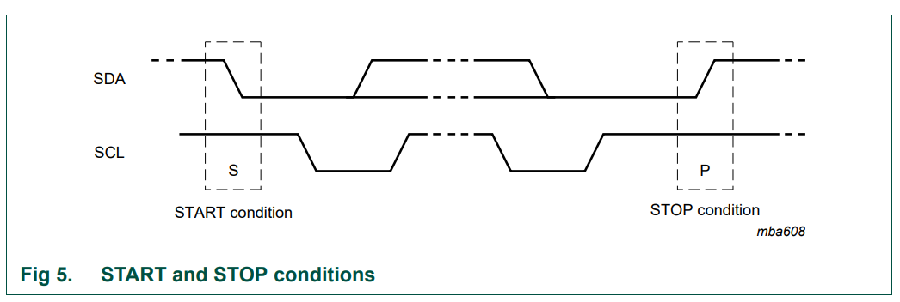
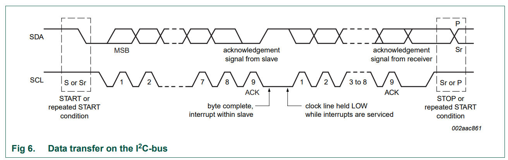
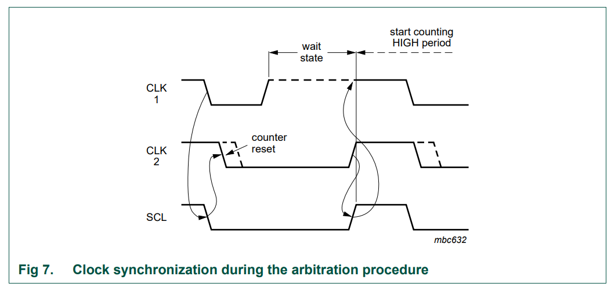
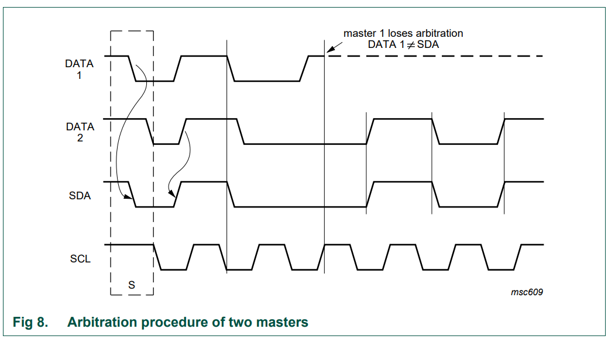
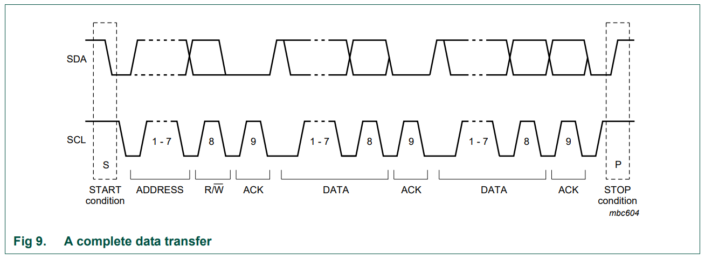
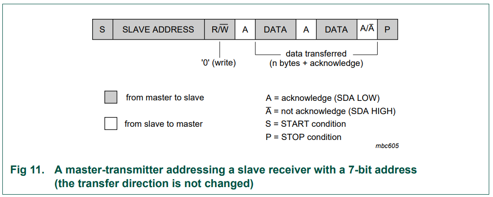
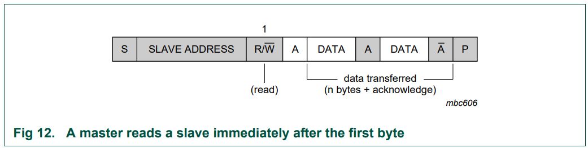
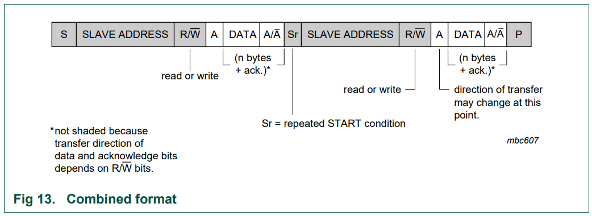
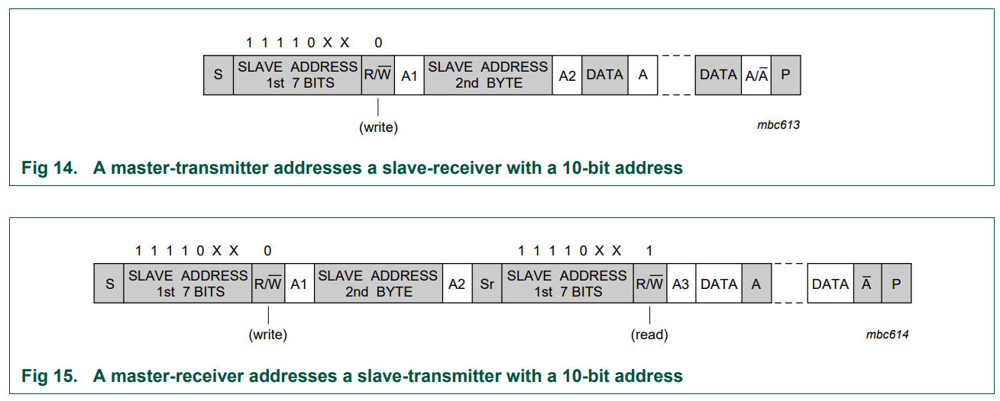

```The Inter-Integrated Circuit (I2C) Protocol is a protocol intended to allow multiple "peripheral" digital integrated circuits ("chips") to communicate with one or more "controller" chips.```

## Intro

The Inter-Integrated Circuit (I2C) Protocol is a protocol intended to allow multiple "peripheral" digital integrated circuits ("chips") to communicate with one or more "controller" chips. Like the Serial Peripheral Interface (SPI), it is only intended for short distance communications within a single device. Like Asynchronous Serial Interfaces (such as RS-232 or UARTs), it only requires two signal wires to exchange information.


## Why Use I2C?
### What's Wrong with Serial UART Ports?
Because serial ports are asynchronous (no clock data is transmitted), devices using them must agree ahead of time on a data rate. The two devices must also have clocks that are close to the same rate, and will remain so--excessive differences between clock rates on either end will cause garbled data.

Asynchronous serial ports require hardware overhead--the UART at either end is relatively complex and difficult to accurately implement in software if necessary. At least one start and stop bit is a part of each frame of data, meaning that 10 bits of transmission time are required for each 8 bits of data sent, which eats into the data rate.

Another core fault in asynchronous serial ports is that they are inherently suited to communications between two, and only two, devices. While it is possible to connect multiple devices to a single serial port, bus contention (where two devices attempt to drive the same line at the same time) is always an issue and must be dealt with carefully to prevent damage to the devices in question, usually through external hardware.

Finally, data rate is an issue. While there is no theoretical limit to asynchronous serial communications, most UART devices only support a certain set of fixed baud rates, and the highest of these is usually around 230400 bits per second.

In summary:

- Asynchronous serial communication require both side have the same clock rate and there must not be any excessive difference clock rates or it will cause garbled data.
- Only point to point communication, no multiple load support.
- Hardware is complex and hence more expensive.
- Uart also eats bit transmitted: out of 10 bits send, at least 2 bits is not data.
- Data rate is slow.

### What's Wrong with SPI?
The most obvious drawback of SPI is the number of pins required. Connecting a single controller [1] to a single peripheral [1] with an SPI bus requires four lines; each additional peripheral device requires one additional chip select I/O pin on the controller. The rapid proliferation of pin connections makes it undesirable in situations where lots of devices must be connected to one controller. Also, the large number of connections for each device can make routing signals more difficult in tight PCB layout situations.

SPI only allows one controller on the bus, but it does support an arbitrary number of peripherals (subject only to the drive capability of the devices connected to the bus and the number of chip select pins available).

SPI is good for high data rate full-duplex (simultaneous sending and receiving of data) connections, supporting clock rates upwards of 10MHz (and thus, 10 million bits per second) for some devices, and the speed scales nicely. The hardware at either end is usually a very simple shift register, allowing easy implementation in software.

In summary:

- Too many pins are used. Every addtional slave devices will require addtional SS wire.
- Only one master/controller allowed.
- Not support hot swap.

### I2C, the best of two worlds
I2C requires a mere two wires, like asynchronous serial, but those two wires can support up to 1008 peripheral devices. Also, unlike SPI, I2C can support a multi-controller system, allowing more than one controller [1] to communicate with all peripheral [1] devices on the bus (although the controller devices can't talk to each other over the bus and must take turns using the bus lines).

Data rates fall between asynchronous serial and SPI; most I2C devices can communicate at 100kHz or 400kHz. There is some overhead with I2C; for every 8 bits of data to be sent, one extra bit of meta data (the "ACK/NACK" bit, which we'll discuss later) must be transmitted.

The hardware required to implement I2C is more complex than SPI, but less than asynchronous serial. It can be fairly trivially implemented in software.

In summary:

- Only require two wires.
- Multi-controller system, allow multiple master and multiple slaves. If address is 7-bits, it allows 128 slave devices.
- Speed can be fast with different modes, only 1 bit is wasted (ACK/NACK).
- Hardware complxity is more than SPI but less than Uart.

## I2C hardware

```I2C bus drivers are "open drain", meaning that they can pull the corresponding signal line low, but cannot drive it high```

Each I2C bus consists of two signals: SCL and SDA. SCL is the clock signal, and SDA is the data signal. The clock signal is always generated by the current bus controller; some peripheral devices may force the clock low at times to delay the controller sending more data (or to require more time to prepare data before the controller attempts to clock it out). This is called "clock stretching" and is described on the protocol page.

Unlike UART or SPI connections, the I2C bus drivers are ***"open drain"***, meaning that they can pull the corresponding signal line low, but cannot drive it high. Thus, there can be no bus contention where one device is trying to drive the line high while another tries to pull it low, eliminating the potential for damage to the drivers or excessive power dissipation in the system. Each signal line has a ***pull-up resistor*** on it, to restore the signal to high when no device is asserting it low.


Resistor selection varies with devices on the bus, but a good rule of thumb is to start with 4.7kΩ resistor and adjust down if necessary. I2C is a fairly robust protocol, and can be used with short runs of wire (2-3m). For long runs, or systems with lots of devices, smaller resistors are better.

    Rule of thump pull-up resistor choice:   4.7kΩ

Here is a good link about how to choose capacitance and pull-upresistance value and the reason behind it:

[I2C typical setup](https://www.i2c-bus.org/i2c-primer/typical-i2c-bus-setup/)

## Clock, Stretching, Arbitration
### Clock Generation
The SCL clock is always generated by the I2C master. The specification requires minimum periods for the low and high phases of the clock signal. Hence, the actual clock rate may be lower than the nominal clock rate e.g. in I2C buses with large rise times due to high capacitances.

### Clock Stretching
I2C devices can slow down communication by stretching SCL: During an SCL low phase, any I2C device on the bus may additionally hold down SCL to prevent it from rising again, enabling it to slow down the SCL clock rate or to stop I2C communication for a while. This is also referred to as clock synchronization.

Note: The I2C specification does not specify any timeout conditions for clock stretching, i.e. any device can hold down SCL *as long as it likes*.

### Arbitration
Several I2C multi-masters can be connected to the same I2C bus and operate concurrently. By constantly monitoring SDA and SCL for start and stop conditions, they can determine whether the bus is currently idle or not. If the bus is busy, masters delay pending I2C transfers until a stop condition indicates that the bus is free again.

However, it may happen that two masters start a transfer at the same time. During the transfer, the masters constantly monitor SDA and SCL. If one of them detects that SDA is low when it should actually be high, it assumes that another master is active and immediately stops its transfer. This process is called arbitration.

## Protocol
```Two kinds of frames: address frame and data frame.```

Messages are broken up into two types of frame: an ***address frame***, where the controller indicates the peripheral to which the message is being sent, and one or more ***data frames***, which are 8-bit data messages passed from controller to peripheral or vice versa. Data is placed on the SDA line after **SCL goes low, and is sampled after the SCL line goes high**. The time between clock edge and data read/write is defined by the devices on the bus and will vary from chip to chip.


Data is sampled when SCL is high, so SDA line must be stable when SCL is HIGH. SDA is allowed to change when SCL is low:



### Start and Stop Condition
- All transactions begin with a **START (S)** and are terminated by a **STOP (P)**
- A **HIGH to LOW** transition on the SDA line while SCL is **HIGH** defines a START condition.
- A **LOW to HIGH** transition on the SDA line while SCL is HIGH defines a **STOP** condition.



START and STOP conditions are always generated by the master. The bus is considered to be busy after the START condition. The bus is considered to be free again a certain time after the STOP condition.

The bus stays busy if a repeated START (Sr) is generated instead of a STOP condition. In this respect, the START (S) and repeated START (Sr) conditions are functionally identical.

### Byte format
```Every byte put on the SDA line must be eight bits long.```

The number of bytes that can be transmitted per transfer is unrestricted. Each byte must be followed by an Acknowledge bit. Data is transferred with the Most Significant Bit (**MSB**) first (see Figure 6). If a slave cannot receive or transmit another complete byte of data until it has performed some other function, for example servicing an internal interrupt, it can hold the clock line SCL LOW to force the master into a wait state ***(clock stretching)***. Data transfer then continues when the slave is ready for another byte of data and releases clock line SCL.



### Acknowledge (ACK) and Not Acknowledge (NACK)
```The acknowledge takes place after every byte.```

The acknowledge bit allows the receiver to signal the transmitter that the byte was successfully received and another byte may be sent. The master generates all clock pulses, including the acknowledge ninth clock pulse.

The Acknowledge signal is defined as follows: **the transmitter releases the SDA line during the acknowledge clock pulse so the receiver can pull the SDA line LOW and it remains stable LOW during the HIGH period of this clock pulse**. Set-up and hold times must also be taken into account.

```When SDA remains HIGH during this ninth clock pulse, this is defined as the Not Acknowledge signal.```

The master can then generate either a STOP condition to abort the transfer, or a repeated START condition to start a new transfer. There are five conditions that lead to the generation of a NACK:

1. No receiver is present on the bus with the transmitted address so there is no device to respond with an acknowledge.
2. The receiver is unable to receive or transmit because it is performing some real-time
function and is not ready to start communication with the master.
3. During the transfer, the receiver gets data or commands that it does not understand.
4. During the transfer, the receiver cannot receive any more data bytes.
5. A master-receiver must signal the end of the transfer to the slave transmitter.

According to condition five, NACK is sometimes send at the end of transmission (slave not drive SDA line low to send ACK) and master will send stop condition to end the transmission.

### Clock synchronization

```A synchronized SCL clock is generated with its LOW period determined by the master with the longest clock LOW period, and its HIGH period determined by the one with the shortest clock HIGH period.```

Two masters can begin transmitting on a free bus at the same time and there must be a method for deciding which takes control of the bus and complete its transmission. This is done by clock synchronization and arbitration. **In single master systems, clock synchronization and arbitration are not needed.**

Clock synchronization is performed using the wired-AND connection of I2C interfaces to the SCL line. This means that a HIGH to LOW transition on the SCL line causes the masters concerned to start counting off their LOW period and, once a master clock has gone LOW, it holds the SCL line in that state until the clock HIGH state is reached (see Figure 7). However, if another clock is still within its LOW period, the LOW to HIGH transition of this clock may not change the state of the SCL line. The SCL line is therefore held LOW by the master with the longest LOW period. Masters with shorter LOW periods
enter a HIGH wait-state during this time.



When all masters concerned have counted off their LOW period, the clock line is released and goes HIGH. There is then no difference between the master clocks and the state of the SCL line, and all the masters start counting their HIGH periods. The first master to complete its HIGH period pulls the SCL line LOW again.

### Arbitration

```Arbitration, like synchronization, refers to a portion of the protocol required only if more than one master is used in the system.```

Slaves are not involved in the arbitration procedure. A master may start a transfer only if the bus is free. Two masters may generate a START condition within the minimum hold time (tHD;STA) of the START condition which results in a valid START condition on the bus. Arbitration is then required to determine which master will complete its transmission.



### Clock stretching
```Clock stretching pauses a transaction by holding the SCL line LOW. The transaction cannot continue until the line is released HIGH again.```

Clock stretching is optional and in fact, most slave devices do not include an SCL driver so they are unable to stretch the clock.

A device may be able to receive bytes of data at a fast rate, but needs more time to store a received byte or prepare another byte to be transmitted. Slaves can then hold the SCL line LOW after reception and acknowledgment of a byte to force the master into a wait state until the slave is ready for the next byte transfer in a type of handshake procedure 

### Addressing

```After the START condition (S), a slave address is sent. This address is seven bits long followed by an eighth bit which is a data direction bit (R/W) — a ‘zero’ indicates a transmission (WRITE), a ‘one’ indicates a request for data (READ) (refer to Figure 10).```

A data transfer is always terminated by a **STOP condition (P) generated by the master**. However, if a master still wishes to communicate on the bus, it can generate a **repeated START condition (Sr) and address another slave without first generating a STOP condition**. Various combinations of read/write formats are then possible within such a transfer.




Possible transfer formats:
- ***Master-transmitter transmits to slave-receiver.*** The transfer direction is not changed. The slave receiver acknowledges each byte.



- ***Master reads slave immediately after first byte.*** At the moment of the first acknowledge, the master-transmitter becomes a master-receiver and the slave-receiver becomes a slave-transmitter. This first acknowledge is still generated **by the slave**. The **master generates subsequent acknowledges**. The **STOP condition is generated by the master**, which sends a **not-acknowledge (A) just before the STOP condition**.



- ***Combined format.*** During a change of direction within a transfer, the START condition and the slave address are both repeated, but with the R/W bit reversed. If a master-receiver sends a repeated START condition, it sends a not-acknowledge (A) just before the repeated START condition.



### 10-bit addressing
```The 10-bit slave address is formed from the first two bytes following a START condition (S) or a repeated START condition (Sr).```

The first seven bits of the first byte are the combination 1111 0XX of which the last two bits (XX) are the two Most-Significant Bits (MSB) of the 10-bit address; the eighth bit of the first byte is the R/W bit that determines the direction of the message.



## I2C code example
Send I2C start signal:
```c
void I2C_Start(void)
{
    I2C_SDA_High();     //SDA=1
    I2C_SCL_High();     //SCL=1
    I2C_Delay();
    I2C_SDA_Low();
    I2C_Delay();
    I2C_SCL_Low();
    I2C_Delay();
}
```
Send I2C Stop signal:
```c
void I2C_Stop(void)
{
    I2C_SDA_Low();
    I2C_SCL_High();
    I2C_Delay();
    I2C_SDA_High();
    I2C_Delay();
}
```

Send a Byte
```c
u8 I2C_SendByte(uint8_t Byte)
{
    uint8_t i;
 
    /* Send MSB first */
    for(i = 0 ; i < 8 ; i++)
    {
        if(Byte & 0x80)
        {
            I2C_SDA_High();
        }
        else
        {
            I2C_SDA_Low();
        }
        I2C_Delay();
        I2C_SCL_High();
        I2C_Delay();
        I2C_SCL_Low();
        I2C_Delay();
 
        if(i == 7)
        {
            I2C_SDA_High();   /* Release SDA when done*/
        }
        Byte <<= 1;           /* left shift */
 
        I2C_Delay();
    }
}　
```

Read a Byte:
```c
u8 I2C_ReadByte(void)
{
    uint8_t i;
    uint8_t value;
 
    /* Read MSB */
    value = 0;
    for(i = 0 ; i < 8 ; i++)
    {
        value <<= 1;
        I2C_SCL_High();
        I2C_Delay();
        if(I2C_SDA_READ())
        {
            value |= 0x1;
        }
        I2C_SCL_Low();
        I2C_Delay();
    }
 
    return value;
}
```

Generate a ACK:
```c
void I2C_Ack(void)
{
    I2C_SDA_Low();
    I2C_Delay();
    I2C_SCL_High();
    I2C_Delay();
    I2C_SCL_Low();
    I2C_Delay();
    
    /* Release SDA line */
    I2C_SDA_High();
}
```

Generate a NACK:
```c
void I2C_NoAck(void)
{
    I2C_SDA_High();
    I2C_Delay();
    I2C_SCL_High();
    I2C_Delay();
    I2C_SCL_Low();
    I2C_Delay();
}
```

Read ACK:
```c
uint8_t I2C_WaitToAck(void)
{
    uint8_t redata;
 
    I2C_SDA_High();
    I2C_Delay();
    I2C_SCL_High();
    I2C_Delay();
    
    /* if SDA is low, then ACK is being set, return 0 for success */
    if(I2C_SDA_READ())
    {
        redata = 1;
    }
    else
    {
        redata = 0;
    }
    I2C_SCL_Low();
    I2C_Delay();
 
    return redata;
}
```

### Controller transmission example

Given the following timing diagram, please write transfer function using method listed earilier:


Diagram break down:


      1. Send START signal.
      2. Send 7-bit address + 1 R/W bit.
      3. Prephrial send ACK.
      4. Send register address, which is a 8-bit data.
      5. Prephrial send ACK.
      6. Send one byte data.
      7. Prephrial send ACK.
      8. Send one byte CRC.
      9. Prephrial send ACK or NACK.
      10. Send STOP signal. 

Code:
```c
#define WRITE 0x0
#define READ 0x1

u8 I2C_WriteBytes(void)
{
    int ret;

    I2C_Start();                                //1
 
    I2C_SendByte((slave_Addr << 1) | WRITE);    //2
    ret = I2C_WaitToAck();                      //3
    if (ret) goto BAIL;
 
    I2C_SendByte(reg_Addr);                     //4
    ret = I2C_WaitToAck();                      //5
    if (ret) goto BAIL;
 
    I2C_SendByte(data);                         //6
    ret = I2C_WaitToAck();                      //7
    if (ret) goto BAIL;

    I2C_SendByte(crc);                          //8
    I2C_WaitToAck();                            //9

    /* No need to check ACK for 9 cuz both ACK and NACK are ok */
    I2C_Stop();                     //10

BAIL:
    /* failure handling procedure */
}
```

### Controller read example


Timing analysis:


     1. Send START signal.
     2. Send 7-bit address + 1 R/W bit.
     3. Prephrial send ACK.
     4. Send register address, which is a 8-bit data.
     5. Prephrial send ACK.
     6. Controller send repeated start (which is esstentially START)
     7. Controller sends 7-bit address + 1 R/W bit.
     8. Prephrial send ACK.
     9. Prephrial send one byte (controller read).
     10. Controller send ACK.
     11. Prephrial send one byte CRC (controller read).
     12. Controller sends NACK.
     13. Controller sends STOP signal.

Code:
```c
#define WRITE 0x0
#define READ 0x1

u8 I2C_ReadBytes(void)
{
    u8 data;
    u8 crc;
    int ret;
 
    I2C_Start();                                //1
 
    I2C_SendByte((slave_Addr << 1) | WRITE);    //2
    ret = I2C_WaitToAck();                      //3
    if (ret) goto BAIL;
 
    I2C_SendByte(Reg_Addr);                     //4
    ret = I2C_WaitToAck();                      //5
    if (ret) goto BAIL;
    
    /* Send repeated START (SR) */
    I2C_Start();                                //6
 
    I2C_SendByte((slave_Addr << 1) | READ);     //7
    ret = I2C_WaitToAck();                      //8
    if (ret) goto BAIL;
 
    data = I2C_ReadByte();                      //9
    I2C_Ack();                                  //10
    
    crc = I2C_ReadByte();                       //11
    I2C_NoAck();                                //12
    
    I2C_Stop();                                 //13

BAIL:
    /* failure handling procedure */
}
```

## I2C speed
```There are now five operating speedcategories. Standard-mode, Fast-mode (Fm), Fast-mode Plus (Fm+)```

High-speed mode (Hs-mode) devices are downward-compatible — any device may be operated at a lower bus speed. Ultra Fast-mode devices are not compatible with previous versions since the bus is unidirectional.

- Bidirectional bus:
    - Standard-mode (Sm), with a bit rate up to 100 kbit/s
    - Fast-mode (Fm), with a bit rate up to 400 kbit/s
    - Fast-mode Plus (Fm+), with a bit rate up to 1 Mbit/s
    - High-speed mode (Hs-mode), with a bit rate up to 3.4 Mbit/s.
- Unidirectional bus:
    - Ultra Fast-mode (UFm), with a bit rate up to 5 Mbit/s

## I2C Pros and cons
Advantages of I2C communication?

- It is the synchronous communication protocol, so there is no need of a precise oscillator for the master and slave.
- It requires only two-wire, one wire for the data (SDA) and other wire for the clock (SCL).
- It provides the flexibility to the user to select the transmission rate as per the requirements.
- In I2C bus, each device on the bus is independently addressable.
- It follows the master and slave relationships.
- It has the capability to handle multiple masters and multiple slaves on the I2C Bus.
- I2C has some important features like arbitration, clock synchronization, and clock stretching.
- I2C provides ACK/NACK (acknowledgment/ Not-acknowledgement) features that provide help in error handling.
 

What are the limitations of I2C interface?
- Half-duplex communication, so data is transmitted only in one direction (because of the single data bus) at a time.
Since the bus is shared by many devices, debugging an I2C bus (detecting which device is misbehaving) for issues is pretty difficult.
- The I2C bus is shared by multiple slave devices if anyone of these slaves misbehaves (pull either SCL or SDA low for an indefinite time) the bus will be stalled. No further communication will take place.
- I2C uses resistive pull-up for its bus. Limiting the bus speed.
- Bus speed is directly dependent on the bus capacitance, meaning longer I2C bus traces will limit the bus speed.
- imposes protocol overhead that reduces throughput
- requires pull-up resistors, which
  - limit clock speed
  - consume valuable PCB real estate in extremely space-constrained systems
  - increase power dissipation

## SMBus - System Management Bus

```SMBus allow hot-swap and has a time-out feature which resets device if communication takes too long.```

The SMBus uses I2C hardware and I2C hardware addressing, but adds second-level software for building special systems. In particular, its specifications include an Address Resolution Protocol that can make dynamic address allocations.

Dynamic reconfiguration of the hardware and software allow bus devices to be ‘hot-plugged’ and used immediately, without restarting the system. m. The devices are recognized automatically and assigned unique addresses. This advantage results in a plug-and-play user interface. In both those protocols, there is a very useful distinction made between a System Host and all the other devices in the system that can have the names and functions of masters or slaves.

SMBus and I2C protocols are basically the same: A SMBus master is able to control I2C devices and vice versa at the protocol level. The SMBus clock is defined from 10 kHz to 100 kHz while I2C can be 0 Hz to 100 kHz, 0 Hz to 400 kHz, 0 Hz to 1 MHz and 0 Hz to 3.4 MHz, depending on the mode. This means that an I2C-bus running at less than 10 kHz is not SMBus compliant since the SMBus devices may time-out.

### Time-out feature
SMBus has a time-out feature which resets devices if a communication takes too long. I2C can be a ‘DC’ bus, meaning that a slave device stretches the master clock when performing some routine while the master is accessing it. This notifies the master that the slave is busy but does not want to lose the communication. The slave device will allow continuation after its task is complete. There is no limit in the I2C-bus protocol as to how long this delay can be, whereas for a SMBus system, it would be limited to 35 ms.

SMBus protocol just assumes that if something takes too long, then it means that there is a problem on the bus and that all devices must reset in order to clear this mode. Slave devices are not then allowed to hold the clock LOW too long.


## Reference
[I2C Spec NXP](https://www.nxp.com/docs/en/user-guide/UM10204.pdf)

https://learn.sparkfun.com/tutorials/i2c/all

https://www.edn.com/design-calculations-for-robust-i2c-communications/

https://www.cnblogs.com/Tangledice/p/7622794.html

https://www.i2c-bus.org/

