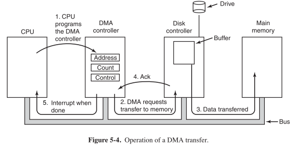

## Introduction to DMA

#### What is DMA?
DMA refers to the ability of an I/O device to transfer data directly to and from memory without going through the CPU. Contrast DMA with programmed I/O where the CPU explicitly
copies data using loads & stores.

#### Why use DMA?
* Higher transfer bandwidth (one bus op instead of two)
* CPU can do other things during transfer
* Faster, more consistent response times (no interrupt or polling overhead)

#### Why not use DMA?
* Hardware more complicated: I/O device must know how to become bus master, issue transactions, etc. (all while still acting as a slave too)
* Software more complicated
* DMA transfer takes bus away from CPU (can limit ability of CPU to do other stuff)
* Overhead to set up transfer: need to transfer many bytes to overcome

#### What registers to set in DMA Controller?
* Starting address of memory buffer
* Number of bytes to transfer
* Transfer direction (to/from device, read/write on bus)
* device-specific control (e.g., head, cylinder, sector for disk access)

#### DMA transfer steps

###### Diagram

###### Details
1. Program makes I/O request to device
2. CPU does initiation routine (usu. part of device driver)
    * use programmed I/O (stores) to set up control regs
    * device-specific parameters
    * DMA parameters (buffer address/length)
    * last write: enable (start) bit
3. I/O device interface does transfer
    1. Arbitrate for bus mastership
    2. Put address on bus, assert control signals to do read/write (looks just like CPU to memory)
    3. Likely use burst transfer if available
    4. Size/type may be programmable via control reg
    5. I/O device supplies/consumes data
    6. Increment address, decrement byte count
    7. If byte count > 0, repeat
    8. Release bus to give other devices a chance
    9. if byte count == 0, set completion bit in status reg, generate interrupt
4. CPU ISR runs completion routine (also part of driver)
    1. check for errors, retry if necessary
    2. notify program that transfer is done (e.g., set flag variable in memory)
    3. set up next transfer if appropriate (call initiation routine)
5. Program notices that request is complete 