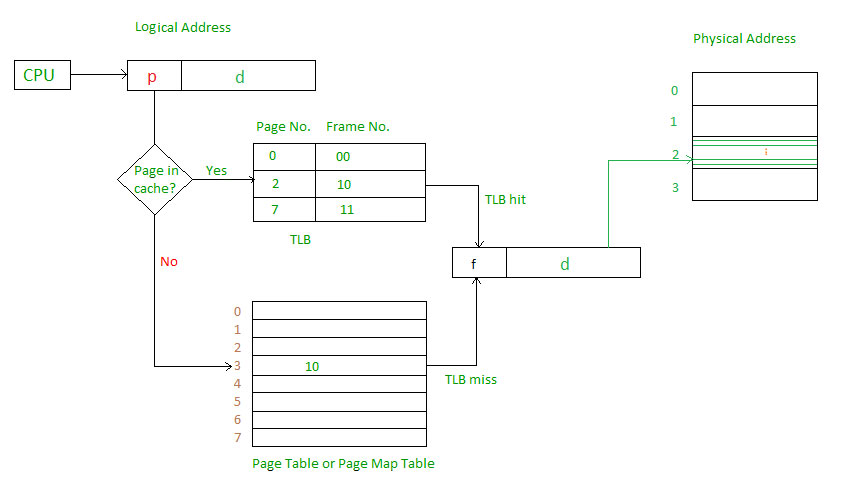
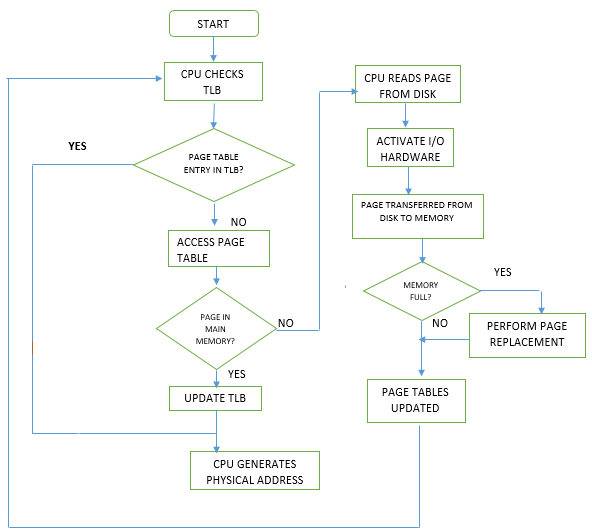

## Introduction to TLB

#### What is TLB?
A translation Lookaside Buffer (TLB) is nothing but a special cache used to keep track of recently used transactions. TLB contains page table entries that have been most recently used. Given a virtual address, the processor examines the TLB if a page table entry is present (TLB hit), the frame number is retrieved and the real address is formed. If a page table entry is not found in the TLB (TLB miss), the page number is used as index while processing page table. TLB first checks if the page is already in main memory, if not in main memory a page fault is issued then the TLB is updated to include the new page entry. 

#### What's inside TLB?
A typical TLB might have 32, 64, or 128 entries and be what is called fully associative. Basically, this just means that at any given translation can be anywhere in the TLB, and that the hardware will search the entire TLB in parallel to find the desired translation. A typical TLB entry might looks like this: **[VPN | PFN | other bits]**. More interstings are the other bits. For example the TLB commonly has a **valid bit**, which says whether the entry has a valid translation or not. Also common are **protection bits**, which determine how a page can be accessed (as in the page table). For example, code pages may be marked read and execute, whereas heap pages may be marked read and right. There may also be a few other fields, including an address space identifier, a **dirty bit** and so forth. 

#### TLB hit vs TLB miss

###### TLB hit
Extract the virtual page number (VPN) from the virtual address and check if TLB holds the translation for this VPN. If it does we have a TLB hit.

###### TLB miss
If the cpu does not find the translation in TLB (TLB miss), the hardware accesses the page table to find the translation, and, assuming that the virtual memory reference generated by the process is valid and accesible, update TLB with the translation. Finally, once the TLB is updated, the hardware retries current instruction. This time, the translation is found in the TLB, and the memory reference is processed quickly.