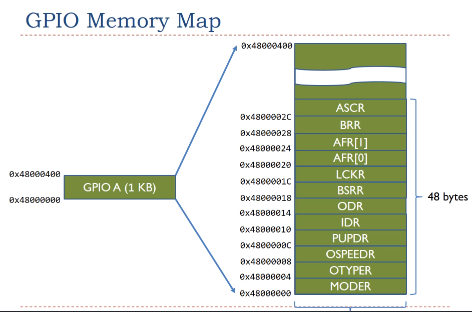

## Memory map IO register Implementation

### **Problem statement**

*Suppose we have a GPIO memory map as follow, please implement a data struture that enables setting/clear certain register in the map in a clean and easy-to-understand manner. This is a **little endian** machine.*



```Please set 1 to GPIO 15.```

*(GPIO<pin_num> are set by writting 1 to the bit<pin_num> of ODR register)*.

### **Implementation**

```c
// Volatile for register values. Hardware may change its value at any time
typedef struct {
    voltatile uint32_t MODER,  // little endian, LSB at lowest address
    voltatile uint32_t OTYPER,
    voltatile uint32_t OSPEEDR,
    voltatile uint32_t PUPDR,
    voltatile uint32_t IDR,
    voltatile uint32_t ODR,
    voltatile uint32_t BSRR,
    voltatile uint32_t LCKR,
    voltatile uint32_t AFR[2],
    voltatile uint32_t BRR,
    voltatile uint32_t ASCR,  
} GPIO_REG;

// Register port map
#define GPIO_A = ((GPIO_REG*) 0x48000000)
#define GPIO_B = ((GPIO_REG*) 0x48000400)
#define GPIO_C = ((GPIO_REG*) 0x48000800)

// Set pin 15 of GPIOA to 1
GPIO_A->ODR |= 1UL << 15;

// Macro to set arbitrary GPIO pin of any port 
#define SET_GPIO(pin_num, GPIO_PORT) (GPIO_PORT->ODR = 1UL<<pin_num;)

```

### **Follow up question**

*What if in the original memory map, the following registers are 16-bit register instead of 32-bit? How will you change the data structure?*

```
uint16_t OTYPER
uint16_t IDR
uint16_t ODR
```

### **Implementation**

```c
#define voltatile _IO

typedef struct {
    _IO uint32_t MODER,
    _IO uint16_t OTYPER,
        uint16_t rev0,  // 2 byte padding
    _IO uint32_t OSPEEDR,
    _IO uint32_t PUPDR,
    _IO uint16_t IDR,
        uint16_t rev1,  // 2 byte padding
    _IO uint16_t ODR,
        uint16_t rev2,  // 2 byte padding
    _IO uint32_t BSRR,
    _IO uint32_t LCKR,
    _IO uint32_t AFR[2],
    _IO uint32_t BRR,
    _IO uint32_t ASCR,  
} GPIO_REG;
```

## Reference 

[Yifeng zhu - Embedded Systems with ARM Cortex-M Microcontrollers in Assembly Language and C: Third Edition](https://www.youtube.com/watch?v=aT5XMOrid7Y&list=PLRJhV4hUhIymmp5CCeIFPyxbknsdcXCc8&index=5&ab_channel=EmbeddedSystemswithARMCortex-MMicrocontrollersinAssemblyLanguageandC)