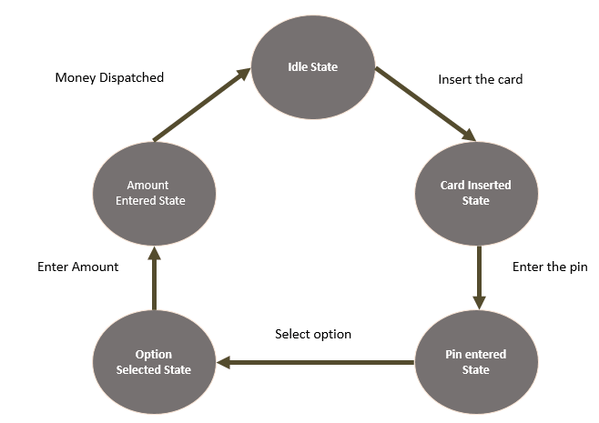

# Finite State Machine (FSM) Implementation

## Overview
A Finite State Machine (FSM) is a computational model used to design computer programs and digital logic circuits. It consists of a finite number of states, transitions between those states, and actions. FSMs are particularly important in embedded systems for managing system behavior, user interfaces, and protocol implementations.

## Key Concepts

### States
- **Idle State**: Initial state when no card is inserted
- **Card Inserted State**: State after a card is inserted
- **PIN Entered State**: State after PIN is entered
- **Option Selected State**: State after user selects an option
- **Amount Entered State**: State after amount is entered

### Events
- **Card Insert Event**: Triggered when a card is inserted
- **PIN Enter Event**: Triggered when PIN is entered
- **Option Selection Event**: Triggered when user selects an option
- **Amount Enter Event**: Triggered when amount is entered
- **Amount Dispatch Event**: Triggered when amount is dispatched

### Transitions
The FSM transitions between states based on events. Each transition is handled by a specific event handler function.

## Implementation

### FSM Diagram


### Usage
```bash
make
./stateMachine
```

### Code Implementation

#### Header File (`state_machine.h`)
```c
#ifndef STATE_MACHINE_H
#define STATE_MACHINE_H

#include <stdio.h>
#include <stdlib.h>

// System states enumeration
typedef enum {
    IDLE_STATE,
    CARD_INSERTED_STATE,
    PIN_ENTERED_STATE,
    OPTION_SELECTED_STATE,
    AMOUNT_ENTERED_STATE,
    MAX_STATES
} eSystemState;

// System events enumeration
typedef enum {
    CARD_INSERT_EVENT,
    PIN_ENTER_EVENT,
    OPTION_SELECTION_EVENT,
    AMOUNT_ENTER_EVENT,
    AMOUNT_DISPATCH_EVENT,
    MAX_EVENTS
} eSystemEvent;

// Function prototypes
eSystemState amountDispatchHandler(void);
eSystemState enterAmountHandler(void);
eSystemState optionSelectionHandler(void);
eSystemState enterPinHandler(void);
eSystemState insertCardHandler(void);

// State machine functions
void stateMachineInit(void);
eSystemState processEvent(eSystemState currentState, eSystemEvent event);
const char* getStateName(eSystemState state);
const char* getEventName(eSystemEvent event);

#endif // STATE_MACHINE_H
```

#### Implementation File (`state_machine.c`)
```c
#include "state_machine.h"

// Event handler functions
eSystemState amountDispatchHandler(void) {
    printf("Amount dispatched. Returning to idle state.\n");
    return IDLE_STATE;
}

eSystemState enterAmountHandler(void) {
    printf("Amount entered successfully.\n");
    return AMOUNT_ENTERED_STATE;
}

eSystemState optionSelectionHandler(void) {
    printf("Option selected successfully.\n");
    return OPTION_SELECTED_STATE;
}

eSystemState enterPinHandler(void) {
    printf("PIN entered successfully.\n");
    return PIN_ENTERED_STATE;
}

eSystemState insertCardHandler(void) {
    printf("Card inserted successfully.\n");
    return CARD_INSERTED_STATE;
}

// State machine processing function
eSystemState processEvent(eSystemState currentState, eSystemEvent event) {
    switch(currentState) {
        case IDLE_STATE:
            if(event == CARD_INSERT_EVENT) {
                return insertCardHandler();
            }
            break;
            
        case CARD_INSERTED_STATE:
            if(event == PIN_ENTER_EVENT) {
                return enterPinHandler();
            }
            break;
            
        case PIN_ENTERED_STATE:
            if(event == OPTION_SELECTION_EVENT) {
                return optionSelectionHandler();
            }
            break;
            
        case OPTION_SELECTED_STATE:
            if(event == AMOUNT_ENTER_EVENT) {
                return enterAmountHandler();
            }
            break;
            
        case AMOUNT_ENTERED_STATE:
            if(event == AMOUNT_DISPATCH_EVENT) {
                return amountDispatchHandler();
            }
            break;
            
        default:
            printf("Invalid state: %d\n", currentState);
            break;
    }
    
    printf("Invalid event %s for state %s\n", getEventName(event), getStateName(currentState));
    return currentState;
}

// Utility functions
const char* getStateName(eSystemState state) {
    static const char* stateNames[] = {
        "IDLE_STATE",
        "CARD_INSERTED_STATE", 
        "PIN_ENTERED_STATE",
        "OPTION_SELECTED_STATE",
        "AMOUNT_ENTERED_STATE"
    };
    return (state < MAX_STATES) ? stateNames[state] : "UNKNOWN_STATE";
}

const char* getEventName(eSystemEvent event) {
    static const char* eventNames[] = {
        "CARD_INSERT_EVENT",
        "PIN_ENTER_EVENT",
        "OPTION_SELECTION_EVENT", 
        "AMOUNT_ENTER_EVENT",
        "AMOUNT_DISPATCH_EVENT"
    };
    return (event < MAX_EVENTS) ? eventNames[event] : "UNKNOWN_EVENT";
}
```

#### Main Application (`main.c`)
```c
#include "state_machine.h"

int main(int argc, char *argv[]) {
    eSystemState currentState = IDLE_STATE;
    eSystemEvent newEvent;
    char input;
    
    printf("=== ATM State Machine Demo ===\n");
    printf("Available events:\n");
    printf("0 = Card Insert Event\n");
    printf("1 = PIN Enter Event\n");
    printf("2 = Option Selection Event\n");
    printf("3 = Amount Enter Event\n");
    printf("4 = Amount Dispatch Event\n");
    printf("q = Quit\n\n");
    
    while(1) {
        printf("Current State: %s\n", getStateName(currentState));
        printf("Enter event (0-4, q to quit): ");
        
        input = getchar();
        getchar(); // Consume newline
        
        if(input == 'q' || input == 'Q') {
            printf("Exiting...\n");
            break;
        }
        
        newEvent = (eSystemEvent)atoi(&input);
        
        if(newEvent >= 0 && newEvent < MAX_EVENTS) {
            eSystemState nextState = processEvent(currentState, newEvent);
            if(nextState != currentState) {
                printf("State transition: %s -> %s\n", 
                       getStateName(currentState), getStateName(nextState));
                currentState = nextState;
            }
        } else {
            printf("Invalid event. Please enter 0-4 or q to quit.\n");
        }
        
        printf("\n");
    }
    
    return 0;
}
```

#### Makefile
```makefile
CC = gcc
CFLAGS = -Wall -Wextra -std=c99
TARGET = stateMachine
SOURCES = main.c state_machine.c
HEADERS = state_machine.h

$(TARGET): $(SOURCES) $(HEADERS)
	$(CC) $(CFLAGS) -o $(TARGET) $(SOURCES)

clean:
	rm -f $(TARGET)

.PHONY: clean
```

## Common Interview Questions

1. **What is a Finite State Machine?**
   - A computational model with a finite number of states and transitions
   - Used for modeling behavior in embedded systems
   - Consists of states, events, and transitions

2. **What are the advantages of using FSMs?**
   - Clear and predictable behavior
   - Easy to debug and maintain
   - Modular design
   - Suitable for real-time systems

3. **How would you implement an FSM in C?**
   - Use enums for states and events
   - Implement state transition table or switch statements
   - Create event handler functions
   - Use a main loop to process events

4. **What are the different types of FSMs?**
   - **Moore Machine**: Output depends only on current state
   - **Mealy Machine**: Output depends on current state and input

5. **How would you handle invalid state transitions?**
   - Add error handling in transition logic
   - Log invalid transitions
   - Return to a safe state or error state

## Advanced Topics

### State Machine Patterns
1. **Hierarchical State Machines**: States can contain sub-states
2. **Nested State Machines**: States can be state machines themselves
3. **Parallel State Machines**: Multiple state machines running concurrently

### Implementation Considerations
- **Memory efficiency**: Use lookup tables for large state machines
- **Performance**: Optimize transition logic for real-time systems
- **Maintainability**: Use clear naming conventions and documentation
- **Testing**: Create comprehensive test cases for all transitions

## Resources
- [State Machine Using C - AticleWorld](https://aticleworld.com/state-machine-using-c/)
- [Finite State Machines in Embedded Systems](https://embeddedartistry.com/blog/2018/07/12/an-introduction-to-finite-state-machines/)
- [State Machine Design Patterns](https://www.state-machine.com/doc/concepts.html)
