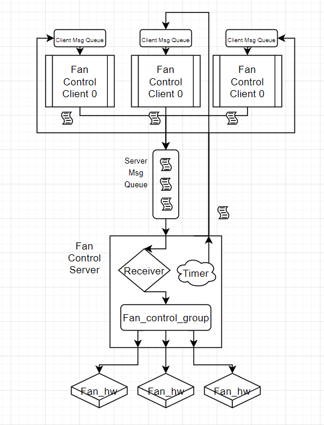

## Fan Control App demo 

**Table of Contents:**
- Project Objective
- App Demo Design Analysis
  - Architecture
  - Feature
  - Design Details
  - Limitation
  - Improvments
- Usage 
  - Compilation and cleanup
  - Run the demo program
  - Stop the demo program
- Demo Result Exhibitaion 


## Project Objective
The task is to develop an application to control fan speeds. The application should meet the following
requirements:

    • The temperature of each subsystem is provided as a 32-bit floating point number in °C via IPC.

    • The number of subsystems and the number of fans present should both be configurable at startup, but you may assume that each of these numbers has an upper bound. You may assume that the number of each is constant after startup.

    • The speed of each fan is set by writing a 32-bit unsigned integer to a specific hardware register that is different for each fan. This integer is in PWM counts and is proportional to fan duty cycle.

    • The PWM counts corresponding to 100% duty cycle may be different for different fans. You may assume that 0 PWM counts always represents 0% duty cycle

The fan control algorithm should behave as follows:

    1. The most recent temperature measurements from each subsystem should be collected, and the fan duty cycle should be computed from the maximum of the most recent temperatures of all subsystems.

    2. All fans should be set to the same duty cycle.

    3. If the temperature is 25° C or below, the fans should run at 20% duty cycle.

    4. If the temperature is 75° C or above, the fans should run at 100% duty cycle.

    5. If the maximum measured subsystem temperature is in between 25° C and 75° C, the fans should run at a
    duty cycle linearly interpolated between 20% and 100% duty cycle.

The submission should include:

    1. a small demo program to communicate subsystem temperatures and write fan duty
    cycle in PWM counts. 

    2. Minimalist interfaces for reading temperature measurements over IPC, configuring the application, and writing to hardware registers should be mocked out as you see fit. 

For your test program, you
may make up the number of fans, the number of subsystems, and the max PWM counts of each fan as you
please.

## App Demo Design Analysis
### Architecture


***Fan Control Server:***
- A standalone program that hadnles temperature reading message from fan control clients.

***Fan Control Server - Receiver:***
- A dedicate functionality (main loop) to read from the server message queue. If message from client, manipulate the fan control group.

***Fan Control Server - Timer:***
- A preset timer that wakes up repeatedly and performs action, for example, send out temperature reading query to all active module clients and set fan control group speed.

***Fan Control Server - Fan Control Group:***
- A abstration data struture that groups all modules and their fans together as well as handles fan hardware related operation such as module temperature value updating and fan speed duty cycle seting and calculation.

***Fan Control Client:***
- A program that performs temperature reading and send them out either as a reply to server's request, or as whenever it feels appropriate to (e.g. need urgent fan speed increase due to overheat)
- In real-world scenario, client module process usually has other tasks. However in our app demo, client is assumed to have one task only - to read temperature and send out to server whenever it needs to.

***Server Msg Queue***
- A FIFO one-sided IPC mechanism for client to deliver its temperature and other message to the server. Client can only write to the queue while the server is only allowed to read.

***Client Msg Queue***
- A FIFO one-sided IPC mechanism for server to deliver its query message to the client. Server can only write to the queue while the client is only allowed to read.

***Fan_hw***
- Fan hardware instance data sturcture that contains hardware level vendor-specific information regarding fan controling logic such as register offsets and specific function to convert duty cycle to PWN counts.

### Feature
- ***Module Hotplug:*** Support dynamic addition/deletion of client modules. Fan server will only turn on fans of these active clients in order to avoid generating too much noise keeping fan on for unused module.
- ***Priority Message Delivery:*** Temperature reading message are divided into 4 different priorities depending on the value. Higher the reading, higher the priority of the message in the queue. High-priority message will be placed in front of the queue to ensure faster delivery.
- ***Individual Module Fan Speed Adjustment:*** Fans speed of any specific module can be adjusted individually based on their latest temperature reading without affecting other modules.
- ***Dynamic Module Fan Number Configuration:*** Despite in the demo program only 1 fan is assumed per module, it is very easy to assign arbitary number of fans to any module.
- ***Heartbeat Temperature Reading Query:*** Server will wake up every a while and request for temperature reading by sending a query message to each active client's message queue.
- ***Urgent Request Processing:*** In adition to setting universal fan speed routinely, it is also able to respond to urgent client request immediately. Upon receiving the message due to a overheating event, server will directly max the fan speed setting of that particular overheating module.
- ***Hardware Abstaction Layer:*** The generic hardware interface and hardware abstration datat structure ensure effortless fan support for different vendors. Hardware support is as easy as swapping out a few register values and function pointers in the data structure. 

### Design Details
Will talke about it during the panel discussion.

### Limitation
- ***No Sense of Time:*** The control server has no idea when did the reading happen so the fan speed adjustment may base on a out-of-date data from one of the modules.

### Improvments
- ***Add Module Reading Timestamp and Force Kick:*** To resolve the sense of time limitation, client can also record the timestamp value of the reading and include in the message to be delivered. Knowing this, server can force kick irresponsive modules if it has not reply to server query message and its temperature reading not updated for long. It is likely that these modules are already offline unexpectedly so their old reading should not be taken into consideration.
- ***PID-like algorithm to enhance cooling performance:*** It would definitely help enhance the overall system cooling performance by implementing PID algorithm in replacemnet of current simple linear algorithm. 

## Usage
### Compilation and cleanup
***Build:***
```
    make all
```

***Clean up:***
```
    make clean
```

### Run the demo program
***Run fan_control server:***
```
    sudo ./fan_control_server <number-of-module>|<Enter>
```
It takes first argument as the number of module allowed to be connected. If unspecified, 20 will be used as the default value. 

***Run fan_control server:***
```
    sudo ./fan_control_client <module-id>
```
It takes the first argument as the module ID. This value will be used by the server to identify the module. Please note that if a module with the same ID already exists, client will NOT run.

```NOTE: Please use 'sudo' to run both client/server demo programs. Otherwise message queues will not be created!```

### Stop the demo program

Use Ctrl-C to generate termination signal to each program.

## Demo Result
```
sudo ./fan_control_server 10

sudo ./fan_control_client 0
sudo ./fan_control_client 1
sudo ./fan_control_client 2
sudo ./fan_control_client 3
...
```

***Fan_control server output:***
```
Max module number to be conncted: 10
Start receiving from message queue!
timer_handler triggered.

No active module. Continue.

timer_handler triggered.

Server: temp val 0.000000 from module 0.
Server: client 0 queue name /fan-control-client-0
Start receiving from message queue!
Server: temp val 93.000000 from module 0.
Server: Received urgent msg from module 0. Adjust speed now!
Start receiving from message queue!
timer_handler triggered.

=======================
Active module number: 1
Max temperature: 93
Temperature by Module: 93
[93 0 0 0 0 0 0 0 0 0 ]
Fan speed duty cycle: 100
=======================

Server: Query all active module for temperature.
Server: temp val 29.000000 from module 0.
Start receiving from message queue!
Server: temp val 0.000000 from module 1.
Server: client 1 queue name /fan-control-client-1
Start receiving from message queue!
Server: temp val 93.000000 from module 1.
Server: Received urgent msg from module 1. Adjust speed now!
Start receiving from message queue!
timer_handler triggered.

=======================
Active module number: 2
Max temperature: 93
Temperature by Module: 93
[29 93 0 0 0 0 0 0 0 0 ]
Fan speed duty cycle: 100
=======================

```

***Fan_control client 0 output:***
```
Module ID: 0
Client 0: Send module ATTACH message.
Client 0 Temp_val: 83
Client 0 Temp_val: 86
Client 0 Temp_val: 77
Client 0 Temp_val: 15
Client 0 Temp_val: 93
Client 0: Module Temperature above threshold! Send urgent message!.
Client 0 Temp_val: 35
Client 0: Receive msg from server. Reply..
Client 0 Temp_val: 86
Client 0 Temp_val: 92
Client 0: Module Temperature above threshold! Send urgent message!.
Client 0 Temp_val: 49
Client 0 Temp_val: 21
Client 0 Temp_val: 62
Client 0: Receive msg from server. Reply..
Client 0 Temp_val: 27
Client 0 Temp_val: 90
Client 0 Temp_val: 59
Client 0 Temp_val: 63
Client 0 Temp_val: 26
Client 0: Receive msg from server. Reply..
```

***Fan_control client 1 output:***
```
Module ID: 1
Client 1: Send module ATTACH message.
Client 1 Temp_val: 83
Client 1 Temp_val: 86
Client 1 Temp_val: 77
Client 1 Temp_val: 15
Client 1 Temp_val: 93
Client 1: Module Temperature above threshold! Send urgent message!.
Client 1 Temp_val: 35
Client 1: Receive msg from server. Reply..
Client 1 Temp_val: 86
Client 1 Temp_val: 92
Client 1: Module Temperature above threshold! Send urgent message!.
Client 1 Temp_val: 49
Client 1 Temp_val: 21
Client 1 Temp_val: 62
Client 1: Receive msg from server. Reply..

```
