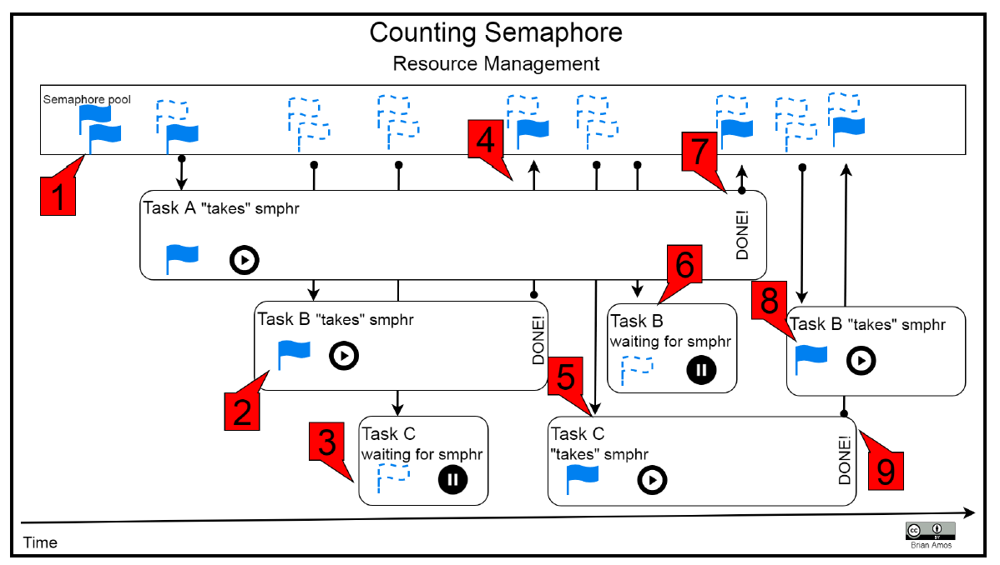
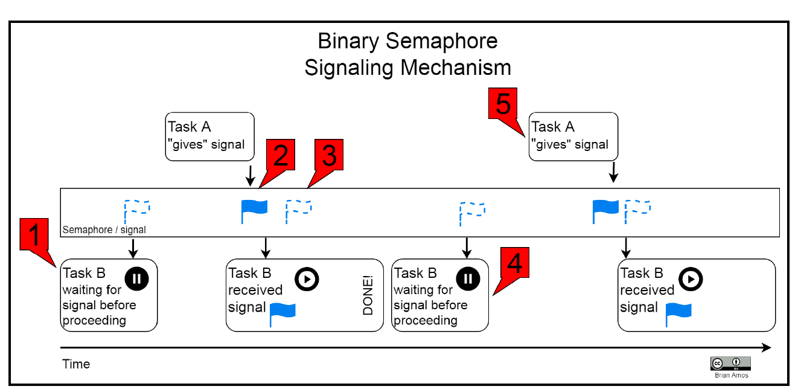
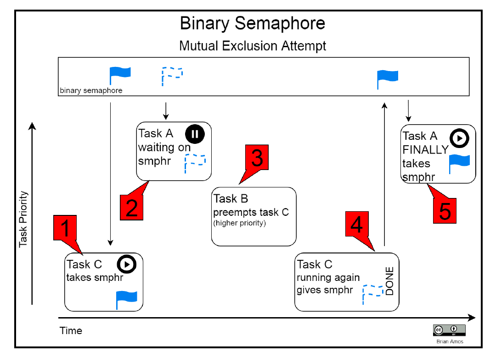
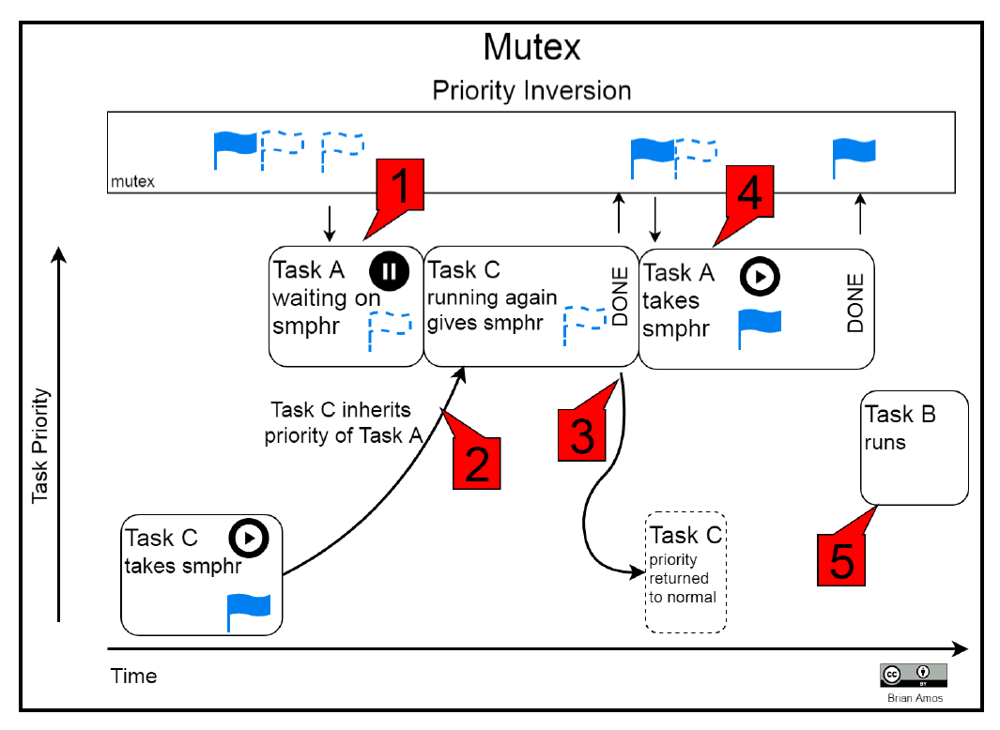

## Interview Conceptual Questions

### Conceptual Questions and Links Table

Index | Question | Diffculty | Importance
--|-----------------|----------|---|---
1 | [What is Deadlock? How to avoid and prevent?](https://practice.geeksforgeeks.org/problems/deadlock-in-os/) | Easy | ***** 
2 | [What is the basic difference between  #include  <FileName> and  #include   "FileName" ?](https://practice.geeksforgeeks.org/problems/header-file/) | Easy 
3 | [Explain Thrashing in Operating Systems](https://practice.geeksforgeeks.org/problems/thrashing-in-os/) | Medium 
4 | [What are the different layers of OSI model?](https://practice.geeksforgeeks.org/problems/what-are-the-different-layers-of-osi-model/) | Easy | ***** 
5 | [Explain the booting process in Linux ?](https://practice.geeksforgeeks.org/problems/booting-in-linux) | Easy | ***** 
6 | [If you kill a parent process then what will happen ?](https://practice.geeksforgeeks.org/problems/child-parent-process) | Medium | ***** 
7 | [What is a semaphore?](https://practice.geeksforgeeks.org/problems/what-is-a-semaphore) | Easy 
8 | [How does a process handle a interrupt](https://practice.geeksforgeeks.org/problems/handle-interrupt) | Easy | v	
9 | [Explain TCP/IP model. Protocols used in respective layers with their functionalities](https://practice.geeksforgeeks.org/problems/tcpip-model/) | 
10 | [Preprocessor Directive "pragma" in C](https://practice.geeksforgeeks.org/problems/pragma-question/) |
11 | [Difference between Process and thread](https://practice.geeksforgeeks.org/problems/difference-between-process-and-thread/) |
12 | [Size of void pointer in C](https://practice.geeksforgeeks.org/problems/size-of-void-pointer-in-c) | 

#### **Peripheral devices often have access to processor interrupts to get the attention of the processor when certain events happens. Please simply describe this interrupt mechanism.**
Points to consider: 
1. What is Interupt?

   An interrupt is a signal to the processor emitted by hardware or software indicating an event that needs immediate attention. 

   There are two types of interrupt: Software and Hardware.

   hareware interrupt (external interrupt) can be divided into two catagories:
   blockable interrupt and unblockable interrupt. 

   Blockable interrupt are interrupts that can be blocked, usually issues by not so important peripheral devices such as printer. Unblockable interrupts must be served by the operating system such as disk reading error. 

2. What happen during an interrupt operation?

   Whenever an interrupt occurs, the controller completes the execution of the current instruction and starts the execution of an Interrupt Service Routine (ISR) or Interrupt Handler. ISR tells the processor or controller what to do when the interrupt occurs. The interrupts can be either hardware interrupts or software interrupts.

[Interrupt flow](http://hi.csdn.net/attachment/200910/18/10307_1255838664t2Or.jpg)

1. How is interrupt implemented? 
2. It is often simpler to put a significant code in the interrupt handler, but this can lead to poor results in practice. Why is that?
   1. Upper half/bottom half
   2. tasklet

Useful Links:

[CPU interrupt mechanism](https://blog.csdn.net/qq_36894974/article/details/79172603)

[Interrupts, Exceptions, and System Calls](http://www.cse.iitm.ac.in/~chester/courses/15o_os/slides/5_Interrupts.pdf)

#### **What are semaphore and mutex?  What is priority inversion? How is mutex different from semaphore in FreeRTOS?**
   1. Semaphore and mutex are inter-task synchronization and signaling mechanisms.
   2. Semaphore is a signaling mechanism and has two categories:
      1. Counting Semaphore: most often used to manage a shared resource that has limitation on the number of simultaneous users. e.g. The number of simultaneous Socket connections.
      

      2. Binary semaphore is counting semaphore with counts up to 1, usually used for synchronization purpose.
      

   3. Howevevr, using binary semaphore may cause priority inversion, in which a lower-priority tasks takes precedence over a higher-priority task. 
   

   4. In FreeRTOS, mutex differs from binary Semaphore in the way that task with acquired mutex lock will get a priority boost in which the scheduler will temporarily boost the task holding the lock so that other task will not be able to prempt it. Its priority will fall back to normal once mutex lock is release. This way, it resolves the priority inversion problem binary semaphore has.
   
