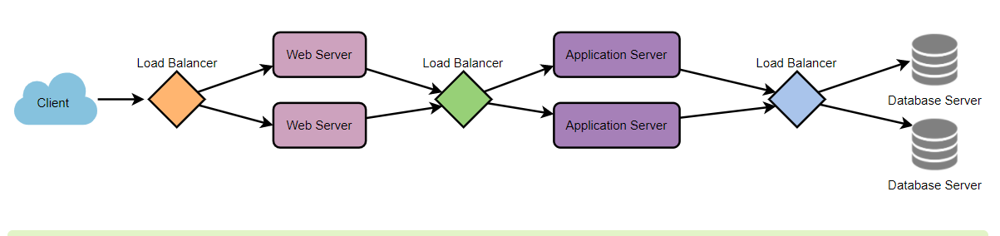

## Load Balancing

Load Balancer (LB) is another critical component of any distributed system. It helps to spread the traffic across a cluster of servers to improve responsiveness and availability of applications, websites or databases. LB also keeps track of the status of all the resources while distributing requests. If a server is not available to take new requests or is not responding or has elevated error rate, LB will stop sending traffic to such a server.

Typically a load balancer sits between the client and the server accepting incoming network and application traffic and distributing the traffic across multiple backend servers using various algorithms. By balancing application requests across multiple servers, a load balancer reduces individual server load and prevents any one application server from becoming a single point of failure, thus improving overall application availability and responsiveness.

To utilize full scalability and redundancy, we can try to balance the load at each layer of the system. We can add LBs at three places:

- Between the user and the web server
- Between web servers and an internal platform layer, like application - servers or cache servers
- Between internal platform layer and database.

### **Benefits of Load Balancing**

- Users experience faster, uninterrupted service. Users won’t have to wait for a single struggling server to finish its previous tasks. Instead, their requests are immediately passed on to a more readily available resource.
  
- Service providers experience less downtime and higher throughput. Even a full server failure won’t affect the end user experience as the load balancer will simply route around it to a healthy server.
  
- Load balancing makes it easier for system administrators to handle incoming requests while decreasing wait time for users.
  
- Smart load balancers provide benefits like predictive analytics that determine traffic bottlenecks before they happen. As a result, the smart load balancer gives an organization actionable insights. These are key to automation and can help drive business decisions.
  
- System administrators experience fewer failed or stressed components. Instead of a single device performing a lot of work, load balancing has several devices perform a little bit of work.

### **Load Balancing Algorithms**

***How does the load balancer choose the backend server?***

Load balancers consider two factors before forwarding a request to a backend server. They will first ensure that the server they choose is actually responding appropriately to requests and then use a pre-configured algorithm to select one from the set of healthy servers. We will discuss these algorithms shortly.

***Health Checks*** - Load balancers should only forward traffic to “healthy” backend servers. To monitor the health of a backend server, “health checks” regularly attempt to connect to backend servers to ensure that servers are listening. If a server fails a health check, it is automatically removed from the pool, and traffic will not be forwarded to it until it responds to the health checks again.

Algorithms:

- Least Connection Method — This method directs traffic to the server with the fewest active connections. This approach is quite useful when there are a large number of persistent client connections which are unevenly distributed between the servers.
  
- Least Response Time Method — This algorithm directs traffic to the server with the fewest active connections and the lowest average response time.
  
- Least Bandwidth Method - This method selects the server that is currently serving the least amount of traffic measured in megabits per second (Mbps).
  
- Round Robin Method — This method cycles through a list of servers and sends each new request to the next server. When it reaches the end of the list, it starts over at the beginning. It is most useful when the servers are of equal specifica tion and there are not many persistent connections.
  
- Weighted Round Robin Method — The weighted round-robin scheduling is designed to better handle servers with different processing capacities. Each server is assigned a weight (an integer value that indicates the processing capacity). Servers with higher weights receive new connections before those with less weights and servers with higher weights get more connections than those with less weights.
  
- IP Hash — Under this method, a hash of the IP address of the client is calculated to redirect the request to a server.

### **Redundant Load Balancers**

The load balancer can be a single point of failure; to overcome this, a second load balancer can be connected to the first to form a cluster. Each LB monitors the health of the other and, since both of them are equally capable of serving traffic and failure detection, in the event the main load balancer fails, the second load balancer takes over.

### Advance Readings

[What is load balancing](https://avinetworks.com/what-is-load-balancing/)

[Introduction to architecting systems for scale](https://lethain.com/introduction-to-architecting-systems-for-scale/)

## Reference

Grokking the System Design Interview by Educative.io