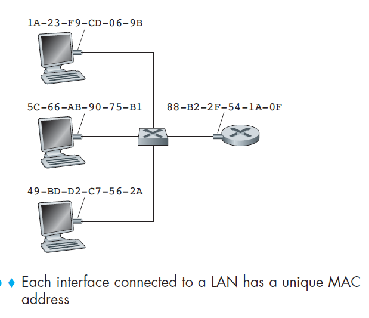
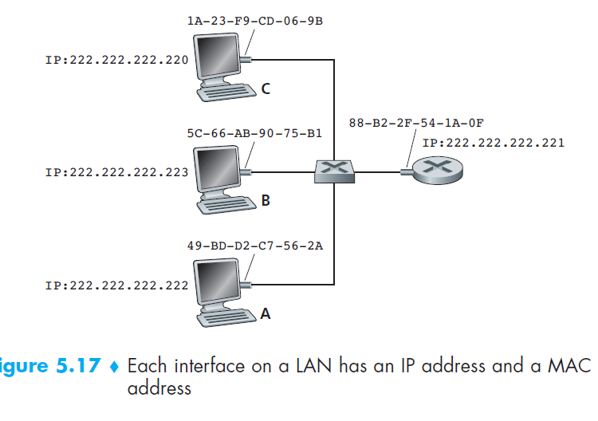
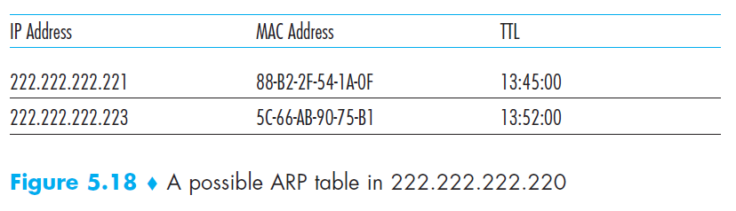
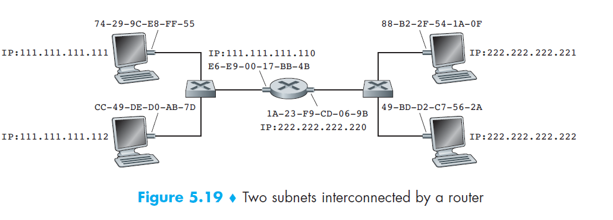

## MAC address
```A link-layer address is variously called a LAN address, a physical address, or a MAC address.```

The term address resolution refers to the process of finding an address of a computer in a network. The address is "resolved" using a protocol in which a piece of information is sent by a client process executing on the local computer to a server process executing on a remote computer. The information received by the server allows the server to uniquely identify the network system for which the address was required and therefore to provide the required address. The address resolution procedure is completed when the client receives a response from the server containing the required address.

Host or router with multiple network interfaces will thus have multiple link-layer
addresses associated with it, just as it would also have multiple IP addresses associated
with it. It's important to note, however, that link-layer switches do not have
link-layer addresses associated with their interfaces that connect to hosts and
routers. This is because the job of the link-layer switch is to carry datagrams
between hosts and routers; a switch does this job transparently, that is, without the
host or router having to explicitly address the frame to the intervening switch.
For most LANs (including Ethernet and 802.11 wireless LANs), the
MAC address is 6 bytes long, giving 248 possible MAC addresses.



Despite that it is possible to change MAC address via software, in most cases, MAC address is fixed. The IEEE manages the
MAC address space. In particular, when a company wants to manufacture
adapters, it purchases a chunk of the address space consisting of 224 addresses for
a nominal fee. IEEE allocates the chunk of 224 addresses by fixing the first 24 bits
of a MAC address and letting the company create unique combinations of the last
24 bits for each adapter.

An adapter’s MAC address has a flat structure (as opposed to a hierarchical
structure) and doesn’t change no matter where the adapter goes. An adapter’s MAC address is analogous to a person’s
social security number, which also has a flat addressing structure and which
doesn’t change no matter where the person goes.

When an adapter wants to send a frame to some destination adapter, the sending
adapter inserts the destination adapter’s MAC address into the frame and then
sends the frame into the LAN.

In truth, it is not hosts and routers that have link-layer addresses but rather their
**adapters (that is, network interfaces)** that have link-layer addresses. A host or
router with multiple network interfaces will thus have **multiple link-layer addresses** associated with it, just as it would also have **multiple IP addresses** associated
with it. It's important to note, however, that link-layer switches **do not** have
link-layer addresses associated with their interfaces that connect to hosts and
routers.

## Address Resolution Protocol (ARP)
```Its functionality is to translate IP address to physical address.```



Suppose that the host with IP address 222.222.222.220 wants to send an IP
datagram to host 222.222.222.222. In this example, both the source and destination
are in the same subnet, in the addressing sense of Section 4.4.2. To send a datagram,
the source must give its adapter not only the IP datagram but also the MAC address
for destination 222.222.222.222. The sending adapter will then construct a linklayer
frame containing the destination’s MAC address and send the frame into
the LAN.

ARP resolves an IP address to a MAC address. In many ways it
is analogous to DNS (studied in Section 2.5), which resolves host names to IP
addresses. However, one important difference between the two resolvers is that
DNS resolves host names for hosts anywhere in the Internet, whereas ARP resolves
IP addresses only for hosts and router interfaces **on the same subnet.**


### ARP cache table
Each host and router has an ARP table in its memory, which contains mappings of IP
addresses to MAC addresses.



The ARP table also contains a time-to-live (TTL)
value, which indicates when each mapping will be deleted from the table. Note that
a table **does not necessarily** contain an entry for every host and router on the subnet;
some may have never been entered into the table, and others may have expired.
A typical expiration time for an entry is 20 minutes from when an entry is placed in
an ARP table.

### ARP messages and its format
There are four types of arp messages that may be sent by the arp protocol. These are identified by four values in the "operation" field of an arp message. The types of message are:

1. **ARP-Request** (Broadcast, source IP address of the requester)
2. **ARP-Reply** (Unicast to requester, the target)

Message format:


### Address resolution procedure
```An ARP request is a broadcast, and an ARP response is a Unicast. ```

This task is easy
if the sender’s ARP table has an entry for the destination node. If not, first, the sender constructs
a special packet called an ARP packet. An ARP packet has several fields,
including the sending and receiving IP and MAC addresses. Both ARP query and
response packets have the same format. The purpose of the ARP query packet is
to query all the other hosts and routers on the subnet to determine the MAC
address corresponding to the IP address that is being resolved.

For example, 222.222.222.220 passes an ARP query packet to
the adapter along with an indication that the adapter should send the packet to the
MAC broadcast address, namely, FF-FF-FF-FF-FF-FF. The adapter encapsulates
the ARP packet in a link-layer frame, uses the broadcast address for the frame’s
destination address, and transmits the frame into the subnet.

The frame containing the ARP
query is received by all the other adapters on the subnet, and (because of the
broadcast address) each adapter passes the ARP packet within the frame up to its
ARP module. Each of these ARP modules checks to see if its IP address matches
the destination IP address in the ARP packet. The one with a match sends back to
the querying host a response ARP packet with the desired mapping. The querying
host 222.222.222.220 can then update its ARP table and send its IP datagram,
encapsulated in a link-layer frame whose destination MAC is that of the host or
router responding to the earlier ARP query.


### Scenarios

1. **CASE-1: The sender is a host and wants to send a packet to another host on the same network**.
    - Use ARP to find another host’s physical address
2. **CASE-2: The sender is a host and wants to send a packet to another host on another network**. 
    - Sender looks at its routing table.
    - Find the IP address of the next hop (router) for this destination.
    - Use ARP to find the router’s physical address
3. **CASE-3: the sender is a router and received a datagram destined for a host on another network**. 
    - Router check its routing table.
    - Find the IP address of the next router.
    - Use ARP to find the next router’s physical address.
4. **CASE-4: The sender is a router that has received a datagram destined for a host in the same network**. 
    - Use ARP to find this host’s physical address.



### Terms with ARP

1. ARP Cache: After resolving MAC address, the ARP sends it to the source where it stores in a table for future reference. The subsequent communications can use the MAC address from the table
2. ARP Cache Timeout (TTL): It indicates the time for which the MAC address in the ARP cache can reside
3. ARP request: This is nothing but broadcasting a packet over the network to validate whether we came across destination MAC address or not. 
The physical address of the sender.
The IP address of the sender.
The physical address of the receiver is FF:FF:FF:FF:FF:FF or 1’s.
The IP address of the receiver
4. ARP response/reply: It is the MAC address response that the source receives from the destination which aids in further communication of the data. 

### ARP layer

As we’ve seen, an ARP packet is encapsulated within a link-layer frame
and thus lies architecturally above the link layer. However, an ARP packet has
fields containing link-layer addresses and thus is arguably a link-layer protocol,
but it also contains network-layer addresses and thus is also arguably a networklayer
protocol. In the end, ARP is probably best considered a protocol that straddles
the boundary between the link and network layers.


## Reference

[RFC 826 - ARP](https://tools.ietf.org/html/rfc826)

[How ARP works?](https://www.geeksforgeeks.org/how-address-resolution-protocol-arp-works/)

https://erg.abdn.ac.uk/users/gorry/course/inet-pages/arp.html