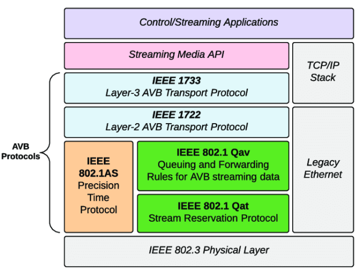

## Audio/Video Bridging and Time Sensitive Networks

### **Intro**

[***Avu Alliance automative white paper***](../Resources/2014-11-20_AVnu-Automotive-White-Paper_Final_Approved.pdf)

A whitepaper outlines the features and benefits of in-vehicle networking using the AVB technologies.

### **Fundamental standards that composes of AVB**

***IEEE 802.1AS (gPTP)***: Timing and Synchronization for Time-Sensitive Applications in Bridged Local Area Networks.

- This auto-selects a device to be the master clock, which then distributes time throughout the bridged LAN / IP subnet to all other nodes.
- The 802.1AS clock is not used as a media clock. Rather, the 802.1AS time is used as a shared clock reference between nodes which is used to port a media clock from talker to listener.
- Such a reference removes the need to fix the latency of packet delivery, or compute long running averages in order to estimate the actual media rate of the transmitter in the presence of substantial network jitter.
- based on the ratified IEEE 1588-2008 (PTP) standard.

[***IEEE 802 1AS and IEEE 1588 IEEE 802.1AS and IEEE 1588 slides by IEEE***](https://www.itu.int/dms_pub/itu-t/oth/06/38/T06380000040002PDFE.pdf)

[***MEASURING 802.1AS SLAVE CLOCK ACCURACY***](https://www.keysight.com/us/en/assets/7019-0404/technical-overviews/Measuring-802-1AS-Slave-Clock-Accuracy.pdf)

***IEEE 802.1Q-2012 (SRP)***: Virtual Bridged Local Area Networks - Amendment 9: Stream Reservation Protocol (SRP).

- This allows a stream reservation to be established between a talker and listener in a bridged LAN / IP subnet.

***IEEE 802.1Q2012 (FQTSS)***: Virtual Bridged Local Area Networks - Amendment 11: Forwarding and Queuing for Time-Sensitive Streams.

- This describes a token-bucket method for shaping network traffic such that the latency and bandwidth of reserved streams can be controlled.

***IEEE 802.1BA***: “Audio/Video Bridging (AVB) Systems”

- This references and defines relevant IEEE 802.1 and other standards for use in building AVB systems.

***IEEE 1722***: “Layer 2 Transport Protocol for Time-Sensitive Applications in Bridged LANs.”

- This specifies the protocol, data encapsulations, and presentation time procedures used to ensure interoperability between audio- and video-based end stations that use standard networking services provided by all IEEE 802 networks meeting quality-of-service requirements for time-sensitive applications.

[***IEEE 1722 Audio Video Transport Protocol (AVTP) slides by AVU alliance***](https://avnu.org/wp-content/uploads/2014/05/AVnu-AAA2C_Audio-Video-Transport-Protocol-AVTP_Dave-Olsen.pdf)

***IEEE 1733***: “Layer 3 Transport Protocol for Time-Sensitive Applications in Bridged LANs.”