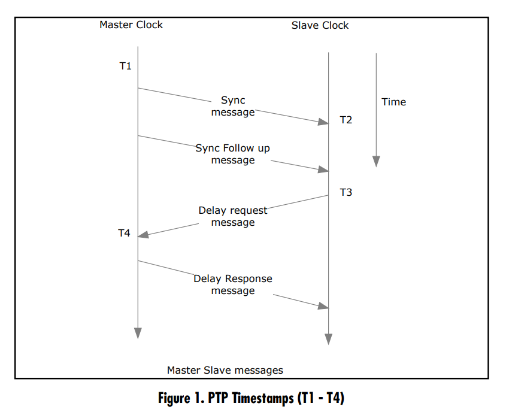

## Precision Type Protocol (PTP IEEE1588)

The Precision Time Protocol, PTP, is designed to synchronize clocks on a local area network (LAN) to sub-microsecond precision. The underlying assumption is that the accurate time source is on the same LAN as the systems that are synchronizing their clocks. That differs from NTP, which assumes that the time server is remote. An advantage of synchronizing via the LAN is that latency becomes far more predictable. There are no queuing delays due to routers (recall that routers have to store an entire message before forwarding it to the next router) and physical distances tend to be far smaller. Ethernet switches do create some latency, of course, and there is a chance that a packet may be queued if a destination is receiving other messages. Switch latency, however, tend to be on the order of a few microseconds and queuing can be nonexistent if there isn’t much traffic.

To further minimize delay and jitter, high-precision PTP implementations will try to generate timestamps at the very lowest levels of the network stack such as at the MAC layer (Ethernet transceiver) right before sending the packet out.

### Best master clock
In a network of computers running PTP, one system has to be elected as the master clock. This system is deemed to have the most accurate clock and other systems are slaves that synchronize from the master.

A best master clock selection process is used to determine which system has the best clock to use for synchronization. This is done via an election where systems present information about their clocks and the best clock is selected from the following ranked attributes:

1. Priority 1 (an admin-defined hint, allowing the administrator to force the use of a certain system as the master)
2. Clock class (type of clock)
3. Clock accuracy
4. Clock variance: an estimate of stability based on past syncs
5. Priority 2 (another admin-defined hint, allowing the preference of one system over another if all other values are equivalent)
6. Unique ID (serves as a tie-breaker on the chance that all other values are equivalent among systems)

### PTP messages
1. PTP synchronizes a clock by exchanging three messages:
2. The master initiates the sync by sending a sync message.
3. The slave sends a delay request message back to the master.
4. The master responds with a delay response message.

A delay request message isn’t quite what it sounds: it is not a query asking the master what the network delay is. The master has no clue. Rather, it is an additional message that allows the slave to get an accurate estimate of the network delay.



### **Network Requirements to Achieve Sub-100 Nanosecond Synchronization**
Obtaining sub-100 nanosecond timing on a local area network requires an architecture that is fully IEEE-1588 compliant. The
three main components are: a GPS Grandmaster clock, an Ethernet switch (transparent or boundary clock), and a PTP slave. All
components must support hardware timestamping. The Grandmaster and Slave are discussed in the “PTP Implementation” section.
Below is a discussion of the required Ethernet switch.

***Ethernet Switches***

Ethernet switches can be categorized as standard Ethernet switches and IEEE-1588 enabled Ethernet switches. A standard Ethernet
switch temporarily stores packets before sending them out. The storing time of the packet is non-deterministic and network load
dependent resulting in packet delay variation. The packet delay variation is the primary reason that standard Ethernet switches
result in poor time synchronization even when the master and slave clock support hardware timestamping. An IEEE-1588 enabled
switch is either a transparent clock or a boundary clock. Using a transparent clock or a boundary clock improves synchronization
between the master and slave and ensures that the master and slave are not impacted by the affects of packet delay variation.

***High-Speed, Low-Latency Switches***

High-speed low-latency switches are characterized as standard switches when it comes to timing. High-speed low-latency store
and forward switches can produce very stable and accurate synchronization under light network loads; however, they will still store
packets thus increasing the packet delay variation that will negatively affect impact time synchronization.

***Transparent Switches***

A transparent switch is an Ethernet switch that handles IEEE-1588 packets differently compared to a standard switch. The transparent clock measures the time that the packet is stored in the switch. It then adds the measured time into the correction field of the
follow-up message. To account for the packet delay, the slave clock uses the origin timestamp and the correction field.

***Boundary Clocks***

A boundary clock is an Ethernet switch that handles IEEE-1588 packets differently compared to a standard switch or transparent
switch. The subnets to a network must isolate PTP packets when installing a boundary clock. The boundary clock acts much like an
ordinary clock on the network and becomes the master clock on the isolated subnets. The boundary clock only handles PTP packets
while the standard Ethernet switches or routers handle all of the other network traffic. A slave on the isolated subnet synchronizes
to the boundary clock as if it were the master clock.

### Grandmaster selection algorithm: BMS

## Generalized Precision Type Protocol (gPTP IEEE 802.1AS) 

```IEEE 802.1AS is an adaptation of PTP for use with Audio Video Bridging and Time-Sensitive Networking.```

## Reference

https://endruntechnologies.com/pdf/PTP-1588.pdf

[PTP-1588 paper](resources/PTP-1588.pdf)

[PTP Intro Video](https://www.youtube.com/watch?v=kJcmPg-qIFA&ab_channel=alantalkstech)

[How a PTP slave syncs with a PTP master Video](https://www.youtube.com/watch?v=Forh3XfD_Ec&ab_channel=DavidGessner)

[Tutorial on Time-Synchronization for
AAA2C based on
IEEE Std 802.1AS](https://avnu.org/wp-content/uploads/2014/05/AVnu-AAA2C_Tutorial-on-time-synchronization-for-AAA2C-based-on-IEEE-Std-802.1AS%E2%84%A2-2011_Kevin-Stanton-5.pdf)

[AVB Wiki](https://en.wikipedia.org/wiki/Audio_Video_Bridging)

[TSN Wiki](https://en.wikipedia.org/wiki/Time-Sensitive_Networking)

