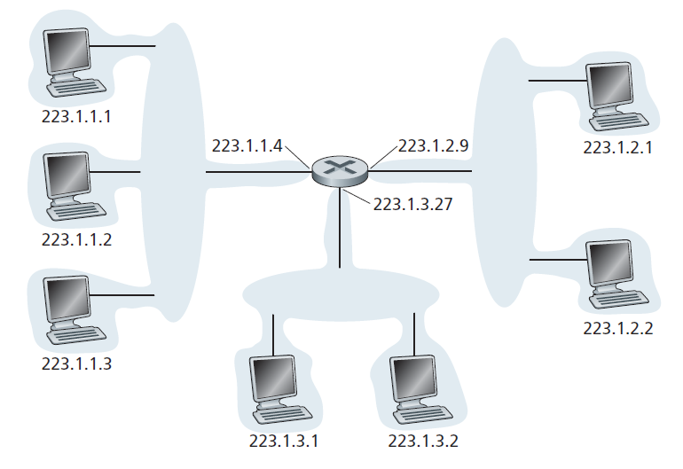
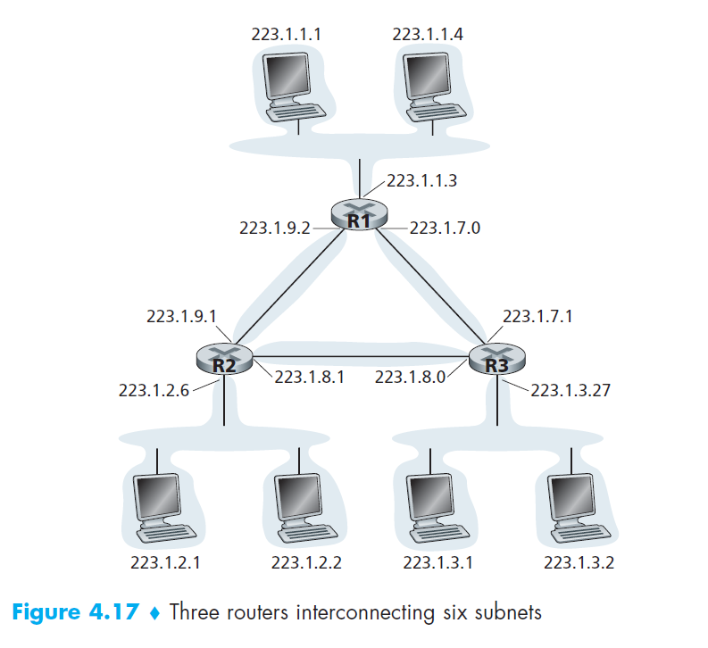
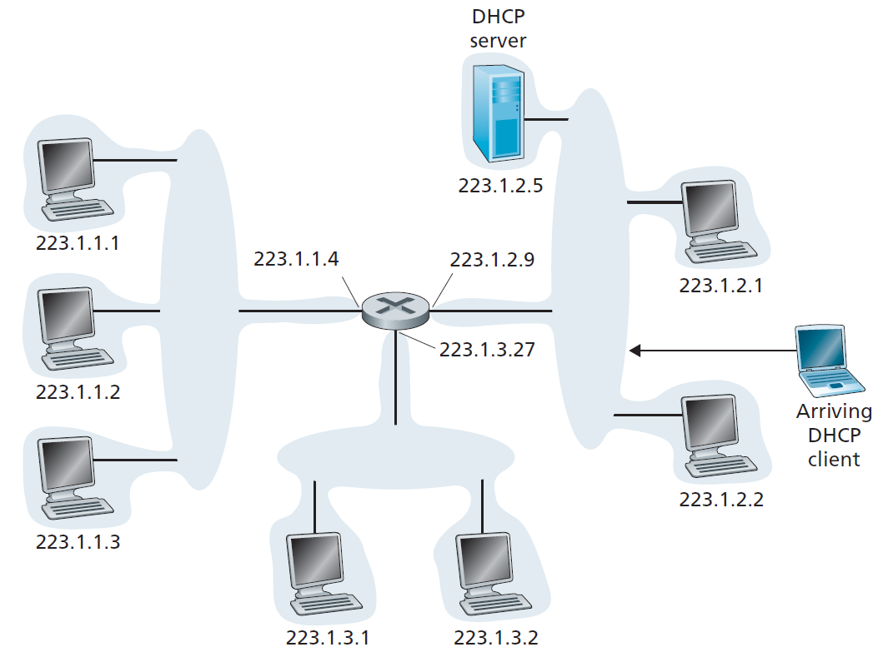
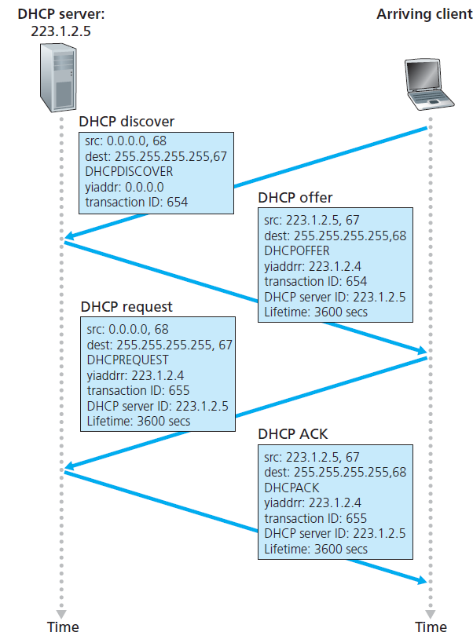
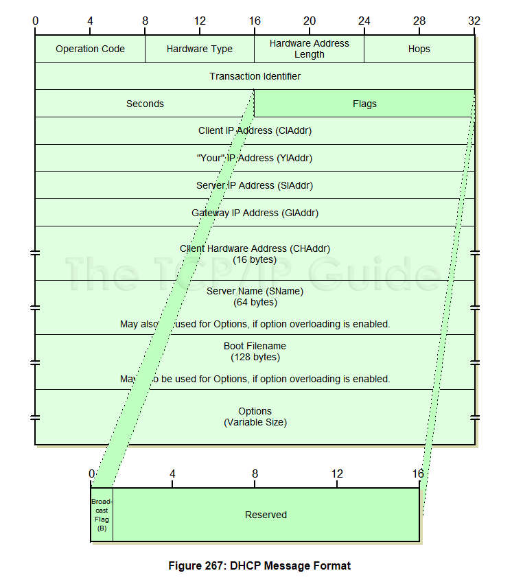

## IPV4 addressing
```Each IP address is 32 bits long (equivalently, 4 bytes), and there are thus a total of 232 possible IP addresses.```

The boundary between the host and the physical link is called an
interface. The boundary
between the router and any one of its links is also called an interface. A router thus
has multiple interfaces, one for each of its links. Because every host and router is
capable of sending and receiving IP datagrams, IP requires each host and router
interface to have its own IP address. ***Thus, an IP address is technically associated
with an interface, rather than with the host or router containing that interface.***



In IP terms, this network interconnecting three host interfaces and one router
interface forms a subnet. IP addressing assigns an address to this
subnet: 223.1.1.0/24, where the /24 notation, sometimes known as a subnet mask,
indicates that the leftmost 24 bits of the 32-bit quantity define the subnet
address.



The x most significant bits of an address of the form a.b.c.d/x constitute the
network portion of the IP address, and are often referred to as the prefix (or network
prefix) of the address.

## Obatining a host address: the DHCP protocol
```Host addresses can also be configured manually, but more often this task is now done using the Dynamic Host Configuration Protocol (DHCP)```

DHCP allows a host to obtain (be allocated) an IP address automatically. In addition to host IP address assignment, DHCP also
allows a host to learn additional information, such as its subnet mask, the address of
its first-hop router (often called the default gateway), and the address of its local
DNS server.

Because of DHCP’s ability to automate the network-related aspects of connecting
a host into a network, it is often referred to as a ***plug-and-play protocol***. As the hosts join and leave,
the DHCP server needs to update its list of available IP addresses. Each time a host
joins, the DHCP server allocates an arbitrary address from its current pool of available
addresses; each time a host leaves, its address is returned to the pool.

DHCP is a ***client-server protocol***. A client is typically a newly arriving host
wanting to obtain network configuration information, including an IP address for
itself.



For a newly arriving host, the DHCP protocol is a four-step process (DORA):

- **DHCP server Discovery.** The first task of a newly arriving host is to find a DHCP
server with which to interact. This is done using a DHCP discover message,
which a client sends within a UDP packet to port 67. The UDP packet is encapsulated
in an IP datagram. The DHCP client
creates an IP datagram containing its DHCP discover message along with the
broadcast destination IP address of 255.255.255.255 and a “this host” source IP
address of 0.0.0.0. The DHCP client passes the IP datagram to the link layer,
which then broadcasts this frame to all nodes attached to the subnet.
- **DHCP server Offer(s)**. A DHCP server receiving a DHCP discover message
responds to the client with a DHCP offer message that is broadcast to all nodes
on the subnet, again using the IP broadcast address of 255.255.255.255.
- **DHCP Request.** The newly arriving client will choose from among one or more
server offers and respond to its selected offer with a DHCP request message,
echoing back the configuration parameters.
- **DHCP ACK.** The server responds to the DHCP request message with a DHCP
ACK message, confirming the requested parameters.



- **DHCP Release** And finally, If the host wants to move to other network or if it has finished  its work, it sends the DHCPRELEASE packet to the server indicating that it wants to disconnect. Then the server marks the IP address as available in the storage so that it can be assigned to other machine.

## DHCP message format



[Here is a detailed explanation of DHCP packet fields](http://www.tcpipguide.com/free/t_DHCPMessageFormat.htm)

## Reference 

http://www.tcpipguide.com/free/t_DHCPMessageFormat.htm

https://www.geeksforgeeks.org/how-dhcp-server-dynamically-assigns-ip-address-to-a-host/

https://www.youtube.com/watch?v=k4t-NJrKLgM&ab_channel=HowTo