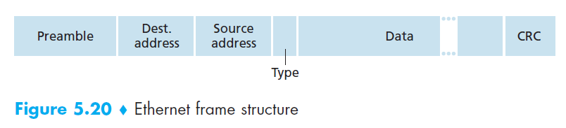
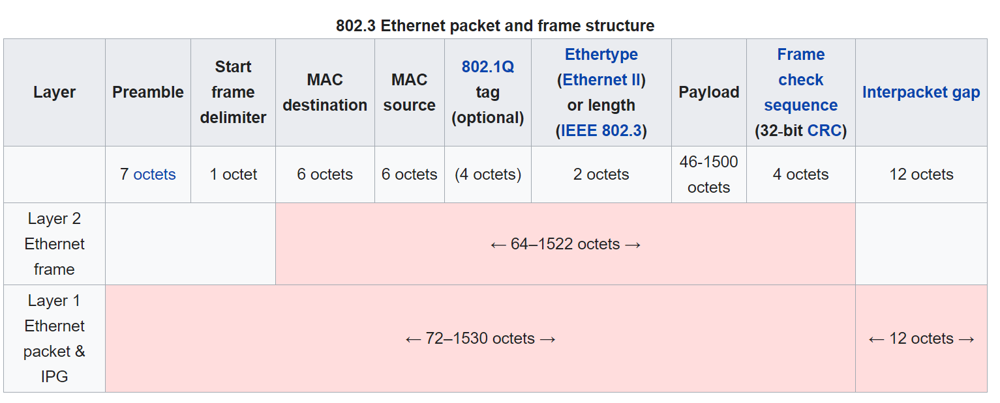
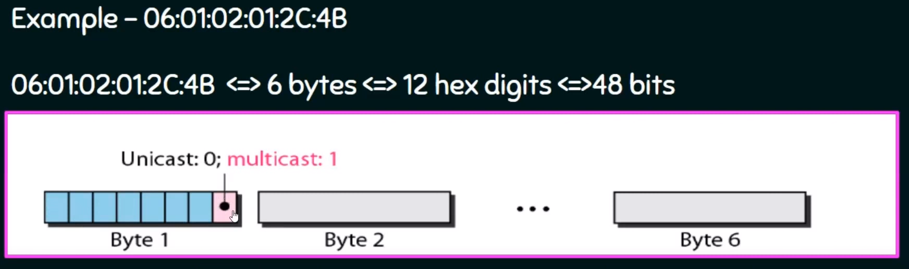
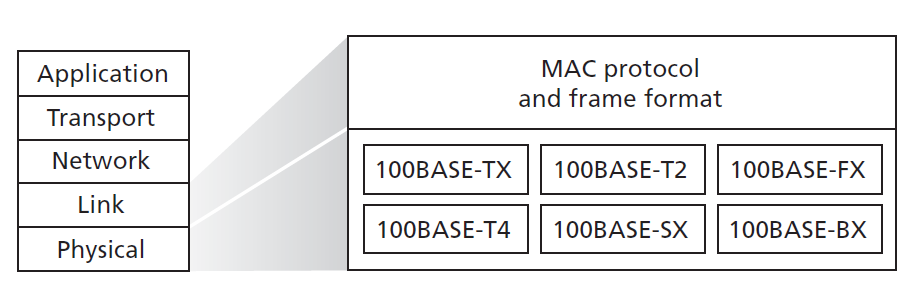
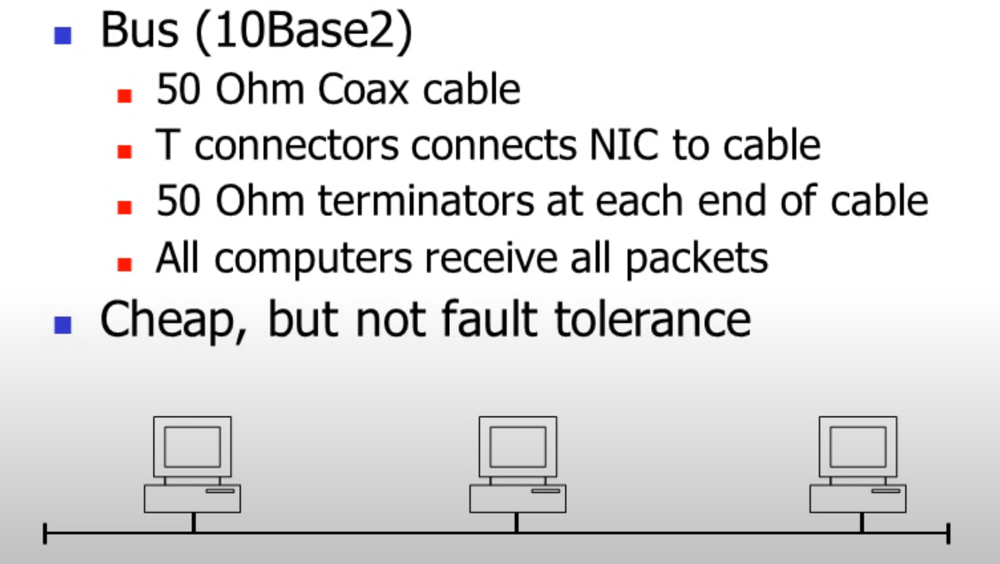
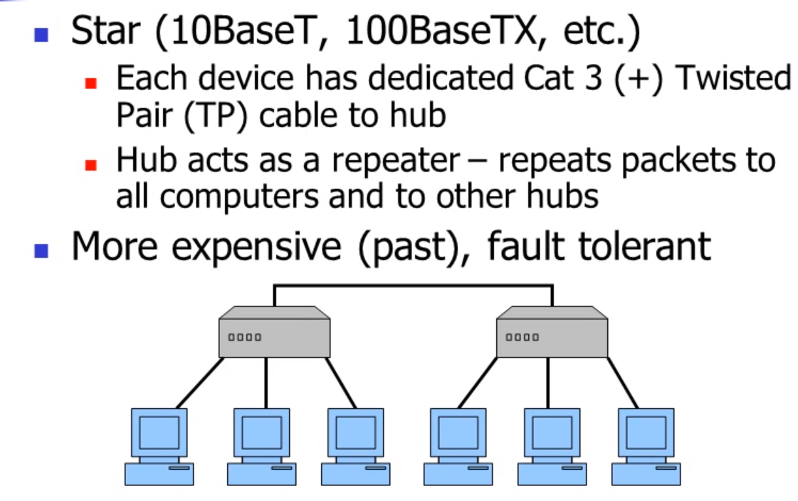

## Ethernet Connection 

All of the Ethernet technologies provide **connectionless service** to the network
layer. That is, when adapter Awants to send a datagram to adapter B, adapter Aencapsulates
the datagram in an Ethernet frame and sends the frame into the LAN, without
first handshaking with adapter B. This layer-2 connectionless service is analogous to
IP’s layer-3 datagram service and UDP’s layer-4 connectionless service.

Ethernet technologies provide an unreliable service to the network layer.
Specifically, when adapter B receives a frame from adapter A, it runs the frame
through a CRC check, but neither sends an acknowledgment when a frame passes
the CRC check nor sends a negative acknowledgment when a frame fails the CRC
check. When a frame fails the CRC check, adapter B simply discards the frame.
Thus, adapter A has no idea whether its transmitted frame reached adapter B and
passed the CRC check. This lack of reliable transport (at the link layer) helps to
make Ethernet simple and cheap. But it also means that the stream of datagrams
passed to the network layer can have gaps.

If there are gaps due to discarded Ethernet frames, does the application at Host
B see gaps as well? If the application is using UDP, then the application in
Host B will indeed see gaps in the data. On the other hand, if the application is using
TCP, then TCP in Host B will not acknowledge the data contained in discarded
frames, causing TCP in Host A to retransmit. Note that when TCP retransmits data,
the data will eventually return to the Ethernet adapter at which it was discarded.
Thus, in this sense, Ethernet does retransmit data, although Ethernet is unaware of
whether it is transmitting a brand-new datagram with brand-new data, or a datagram
that contains data that has already been transmitted at least once.

## Frame structure
There are multiple types of ethernet frames:

**802.3**:



**Ethernet II**:


In general:



```Payload size: 46 - 1500 Bytes```

```Frame Packet Size: 64 - 1518 Bytes```


- **Preamble (8 bytes)**. The Ethernet frame begins with an 8-byte preamble field.
Each of the first 7 bytes of the preamble has a value of 10101010; the last byte is 10101011. The first 7 bytes of the preamble serve to **“wake up”** the receiving
adapters and to synchronize their clocks to that of the sender’s clock. Keep in mind that adapter A aims
to transmit the frame at 10 Mbps, 100 Mbps, or 1 Gbps, depending on the type
of Ethernet LAN. However, because nothing is absolutely perfect, adapter A will
not transmit the frame at exactly the target rate; there will always be some drift
from the target rate, a drift which is not known a priori by the other adapters on
the LAN. A receiving adapter can lock onto adapter A’s clock simply by locking
onto the bits in the first 7 bytes of the preamble. The last 2 bits of the eighth byte
of the preamble (the first two consecutive 1s) alert adapter B that the “important
stuff” is about to come.

- **Data field (46 to 1,500 bytes)**. This field carries the IP datagram. The maximum
transmission unit (MTU) of Ethernet is 1,500 bytes. This means that if the IP
datagram exceeds 1,500 bytes, then the host has to fragment the datagram. The minimum size of the data field is 46 bytes. This
means that if the IP datagram is less than 46 bytes, the data field has to be
“stuffed” to fill it out to 46 bytes. ***Leaest Significant bit of first address byte determines the type of address: 0 for Unicast, Multicast otherwise.***



- **Destination address (6 bytes)**. This field contains the MAC address of the destination
adapter, BB-BB-BB-BB-BB-BB. When adapter B receives an Ethernet
frame whose destination address is either BB-BB-BB-BB-BB-BB or the
MAC broadcast address, it passes the contents of the frame’s data field to the
network layer; if it receives a frame with any other MAC address, it discards
the frame. ***Mac address is unique address burned in NIC cards by manufature.***

- **Source address (6 bytes)**. This field contains the MAC address of the adapter that
transmits the frame onto the LAN, in this example, AA-AA-AA-AA-AA-AA.

- **Type field (2 bytes)**. The type field permits Ethernet to multiplex network-layer
protocols. Network-layer protocols using different protocols for different applications. For
this reason, when the Ethernet frame arrives at adapter B, adapter B needs to
know to which network-layer protocol it should pass (that is, demultiplex) the
contents of the data field. Furthermore,
the ARP protocol (discussed in the previous section) has its own type
number, and if the arriving frame contains an ARP packet (i.e., has a type field
of 0806 hexadecimal), the ARP packet will be demultiplexed up to the ARP protocol.

- **Cyclic redundancy check** (CRC) (4 bytes).

## Ethernet Technology

Ethernet comes in many different flavors, with somewhat bewildering
acronyms such as 10BASE-T, 10BASE-2, 100BASE-T, 1000BASE-LX, and 10GBASE-T. The first part of the acronym refers to the speed of the standard: 10, 100,
1000, or 10G, for 10 Megabit (per second), 100 Megabit, Gigabit, and 10 Gigabit
Ethernet, respectively. “BASE” refers to baseband Ethernet, meaning that the physical
media only carries Ethernet traffic; almost all of the 802.3 standards are for baseband
Ethernet. The final part of the acronym refers to the physical media itself; Ethernet is
both a link-layer and a physical-layer specification and is carried over a variety of
physical media including coaxial cable, copper wire, and fiber. Generally, a “T” refers
to twisted-pair copper wires. The original Ethernet MAC protocol and frame format were preserved,
but higher-speed physical layers were defined for copper wire (100BASE-T)
and fiber (100BASE-FX, 100BASE-SX, 100BASE-BX).



## Ethernet Connection
### BUS


### Star


## Ethernet Operation

### CSMA/CD (only relevant to older duplex Ethernet)
- 10 Mbit broadcast bus technology with best-effort delivery semantics and distributed access control
- transceiver "listens" on wire
- when perceives wire idle, transmits
- when determines collision has occurred
  - generates random number
  - waits that interval
  - retransmits
  - if another collision occurs, doubles wait and retransmits
  - applies recursively, with exponential waits
- when frame address matches host address, receives
- bridges block or forward frames between LANs, using adaptive learning strategies

## Reference

[Introduction of Ethernet](https://www.ccontrols.com/pdf/ExtV1N3.pdf)

[Youtube Ethernet](https://www.youtube.com/watch?v=fRHkZPtsR5I&ab_channel=LearnTCPIP)

[Wikipedia](https://en.wikipedia.org/wiki/Ethernet_frame)

[Multicast Fundamentals Video](https://www.youtube.com/watch?v=P6uYh4OEgk4&ab_channel=AlliedTelesis)
