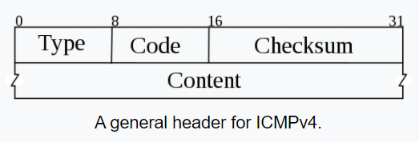
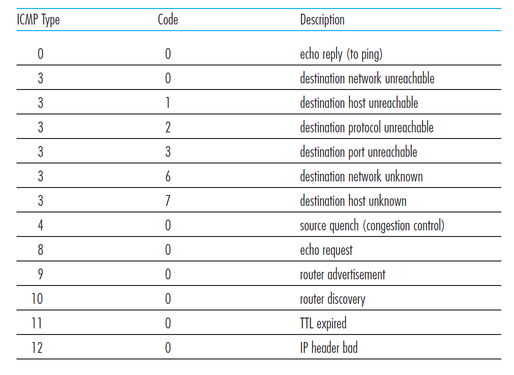

## Internet Control Message Protocol (ICMP)

Since IP does not have a inbuilt mechanism for sending error and control messages. It depends on Internet Control Message Protocol(ICMP) to provide an error control. It is used for reporting errors and management queries. It is a supporting protocol and used by networks devices like routers for sending the error messages and operations information.

ICMP is often considered part of IP but architecturally **it lies just above IP**, as
ICMP messages are carried inside IP datagrams. That is, ICMP messages are carried
as IP payload, just as TCP or UDP segments are carried as IP payload. Similarly,
when a host receives an IP datagram with ICMP specified as the upper-layer protocol,
it demultiplexes the datagram’s contents to ICMP, just as it would demultiplex a
datagram’s content to TCP or UDP.

## ICMP header and message types

ICMP messages have a type and a code field, and contain the header and the
first 8 bytes of the IP datagram that caused the ICMP message to be generated in the
first place (so that the sender can determine the datagram that caused the error).

## Application

- **Ping**: The well-known ping program sends an ICMP type 8 code 0 message to the
specified host. The destination host, seeing the echo request, sends back a type 0
code 0 ICMP echo reply

- **Traceroute**: Traceroute in the source sends a series of ordinary
IP datagrams to the destination. Each of these datagrams carries a UDP segment
with an unlikely UDP port number. When the nth datagram arrives at the nth router, the nth router observes
that the TTL of the datagram has just expired. According to the rules of the IP protocol,
the router discards the datagram and sends an ICMP warning message to the
source (type 11 code 0). This warning message includes the name of the router and
its IP address. When this ICMP message arrives back at the source, the source
obtains the round-trip time from the timer and the name and IP address of the nth
router from the ICMP message. One of the datagrams will eventually make it all the way to the destination host.
Because this datagram contains a UDP segment with an unlikely port number, the
destination host sends a port unreachable ICMP message (type 3 code 3) back to the
source.

### How Does Ping Work?

1. As the ping program initializes, it opens a raw ICMP socket so that it can employ IP directly, circumventing TCP and UDP.
2. Ping formats an ICMP type 8 message, an Echo Request, and sends it (using the “sendto” function) to
the designated target address. The system provides the IP header and the data link layer envelope.
3. As ICMP messages are received, ping has the opportunity to examine each packet to pick out those
items that are of interest.
4. The usual behavior is to siphon off ICMP type 0 messages, Echo Replies, which have an identification
field value that matches the program PID.

[How Does Ping Really Work](http://www.galaxyvisions.com/pdf/white-papers/How_does_Ping_Work_Style_1_GV.pdf)

This inspirational document detailed about how the well-know ping application works. 

## Reference

https://www.geeksforgeeks.org/internet-control-message-protocol-icmp/

https://en.wikipedia.org/wiki/Internet_Control_Message_Protocol#:~:text=The%20ICMP%20header%20starts%20after,code%20of%20that%20ICMP%20packet.