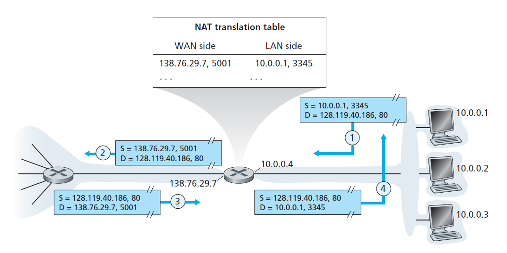

## NAT

**Network address translation (NAT)** is a method of remapping an IP address space into another by modifying network address information in the IP header of packets while they are in transit across a traffic routing device. The technique was originally used to avoid the need to assign a new address to every host when a network was moved, or when the upstream Internet service provider was replaced, but could not route the networks address space. It has become a popular and essential tool in conserving global address space in the face of IPv4 address exhaustion. One Internet-routable IP address of a NAT gateway can be used for an entire private network.

## NAT types

- **Static NAT** – In this, a single unregistered (Private) IP address is mapped with a legally registered (Public) IP address i.e one-to-one mapping between local and global address. This is generally used for Web hosting. These are not used in organisations as there are many devices who will need Internet access and to provide Internet access, the public IP address is needed. Suppose, if there are 3000 devices who need access to the Internet, the organisation have to buy 3000 public addresses that will be very costly.

- **Dynamic NAT** – In this type of NAT, an unregistered IP address is translated into a registered (Public) IP address from a pool of public IP address. If the IP address of pool is not free, then the packet will be dropped as an only a fixed number of private IP address can be translated to public addresses. This is also very costly as the organisation have to buy many global IP addresses to make a pool.

- **Port Address Translation (PAT)** – This is also known as NAT overload. In this, many local (private) IP addresses can be translated to a single registered IP address. Port numbers are used to distinguish the traffic i.e., which traffic belongs to which IP address. This is most frequently used as it is cost-effective as thousands of users can be connected to the Internet by using only one real global (public) IP address.

## Advantages of NAT

- NAT conserves legally registered IP addresses .
- It provides privacy as the device IP address, sending and receiving the traffic, will be hidden.
- Eliminates address renumbering when a network evolves.

## Disadvantage of NAT

T- ranslation results in switching path delays.
- Certain applications will not function while NAT is enabled.
- Complicates tunneling protocols such as IPsec.
- Also, router being a network layer device, should not tamper with port numbers(transport layer) but it has to do so because of NAT.

## Reference

[Introduction to Network Address Translation](https://nsrc.org/workshops/2018/btnog-wireless/presentations/00_NAT_Introduction.pdf)

This slide provide a comprehensive overview of NAT and illustrate its typical use case with Campus Network Design & Operations Workshop.

[Cisco − How NAT Works](http://academy.delmar.edu/Courses/download/CiscoIOS/NAT_HowItWorks.pdf)

A document published by Cisco that gives a insighful angle of how NAT works.

[A Retrospective View of Network Address Translation](http://web.cs.ucla.edu/~lixia/papers/08IEEE-NAT-Retrospect.pdf)

Today, network address translators, or NATs, are everywhere. Their ubiquitous
adoption was not promoted by design or planning but by the continued growth of
the Internet, which places an ever-increasing demand not only on IP address space
but also on other functional requirements that network address translation is perceived to facilitate. This article presents a personal perspective on the history of
NATs, their pros and cons in a retrospective light, and the lessons we can learn
from the NAT experience.

[NAT WIKIpedia](https://en.wikipedia.org/wiki/Network_address_translation)

[NAT Geek for geek](https://www.geeksforgeeks.org/network-address-translation-nat/)

[Types of NAT](https://www.geeksforgeeks.org/types-of-network-address-translation-nat/?ref=lbp)