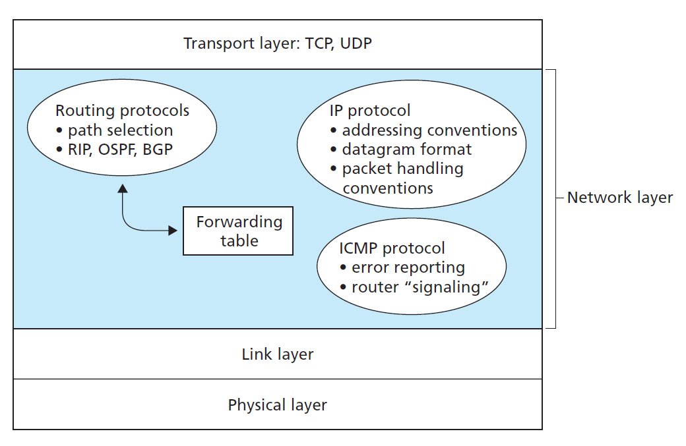
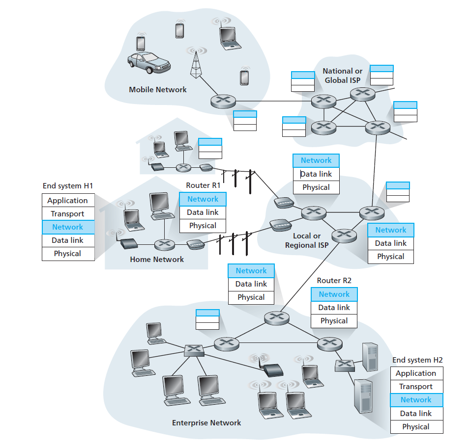
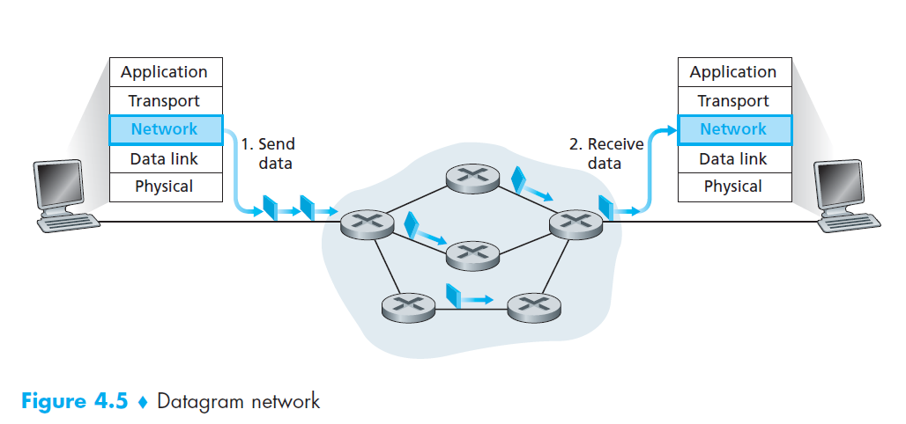

## Network Layer

Responsibilities of Network Layer:
- Packet forwarding/Routing of packets: Relaying of data packets from one network segment to another by nodes in a computer network
- Connectionless communication(IP): A data transmission method used in packet-switched networks in which each data unit is separately addressed and routed based on information carried by it
- Fragmentation of data packets: Splitting of data packets that are too large to be transmitted on the network

Network layer has three major components:
- **IP protocol**
- **Routing Component**
- **facility to report errors in datagrams and respond to requests for certain network-layer information**



## Network layer architect



The role of the network layer is thus deceptively simple—to move packets from a sending host to a receiving host. To do so, two important network-layer functions can be identified:

- ***Forwarding***. Forwarding refers to the router-local action of transferring a packet from an input link
interface to the appropriate output link interface.

When a packet arrives at a router’s input link, the router must move the packet to the appropriate output link. For example, a packet arriving from Host H1 to Router R1 must be forwarded to the next router on a path to H2.

- ***Routing***. Routing refers to the network-wide process that determines the end-to-end paths that packets take from source to destination.

The network layer must determine the route or path taken by packets as they flow from a sender to a receiver. The algorithms that calculate these paths are referred to as routing algorithms. A routing algorithm would determine, for example, the path along which packets flow from H1 to H2.

### Datagram networks
```Internet is a datagram networks.```

In a datagram network, each time an end system wants to send a packet, it stamps the packet with the address of the destination end system and then pops the packet into the network.

As a packet is transmitted from source to destination, it passes through a series of routers. Each of these routers uses the packet’s destination address to forward the packet. Specifically, each router has a forwarding table that maps destination addresses to link interfaces; when a packet arrives at the router, the router uses the packet’s destination address to look up the appropriate output link interface in the forwarding table. The router then intentionally forwards the packet to that output link interface.




