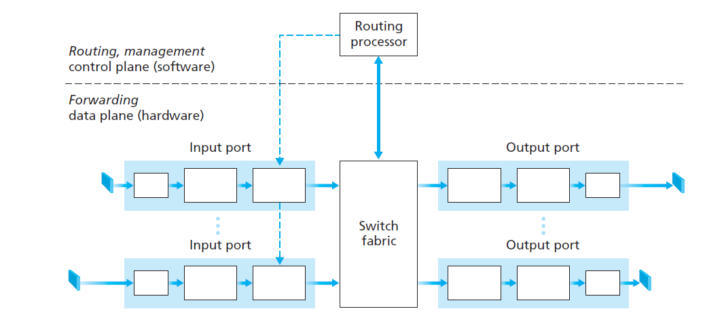
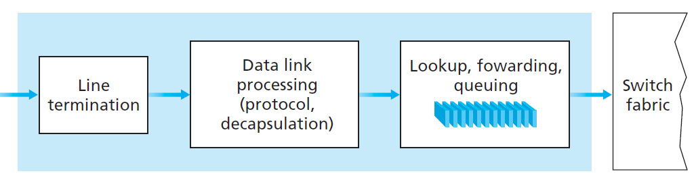
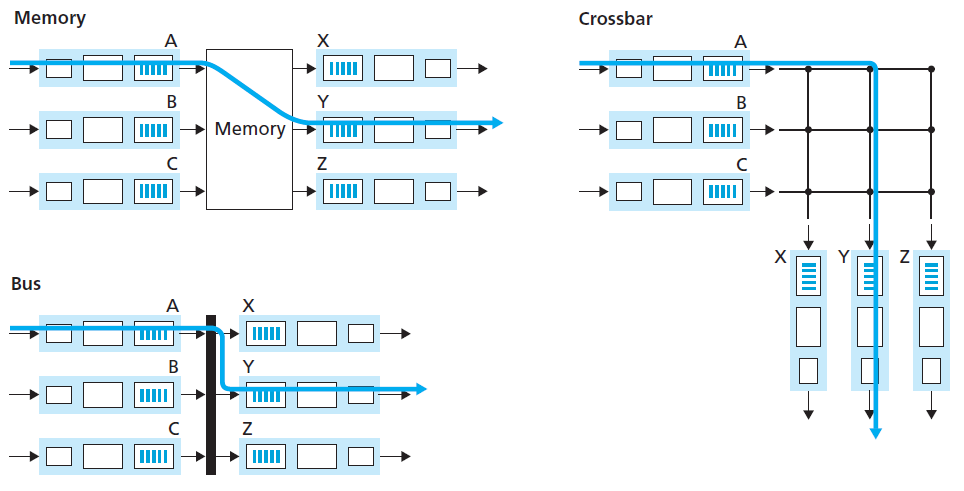
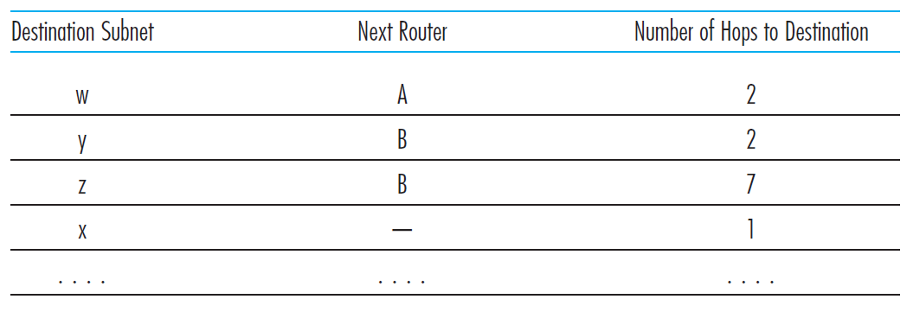
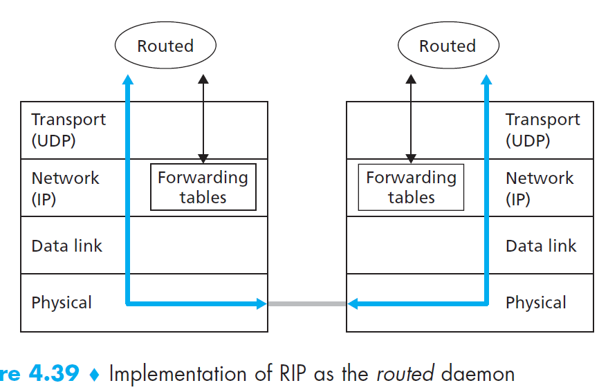
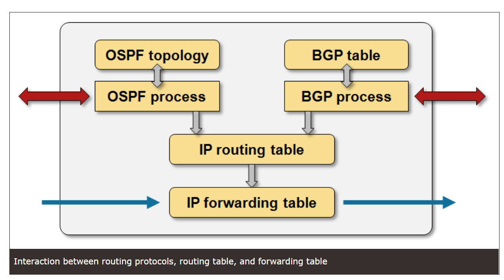

## Router

```Router is network layer device while switches are link layer devices```

Some packet switches, called link-layer switches (examined
in Chapter 5), base their forwarding decision on values in the fields of the linklayer frame; switches are thus referred to as link-layer (layer 2) devices. Other packet switches, called routers, base their forwarding decision on the value in the networklayer field. Routers are thus network-layer (layer 3) devices. but must also implement layer 2 protocols as well, since layer 3 devices require the services of layer 2 to implement their (layer 3) functionality.

## Inside a Router
```Router's main duty - forwarding function: the actual transfer of packets from a router’s incoming links to the appropriate outgoing links at that router.```

### Router Architecture:
- **Input ports** 
    - It performs the ***physical layer function*** of terminating an incoming physical link at a router.
    - An input port also performs ***link-layer functions*** needed to interoperate with the link layer at the other side of the incoming link
    - Perhaps most crucially, ***the lookup function*** is also performed at the input port; It is here that the forwarding table is consulted to determine the router output port to which an arriving packet will be forwarded via the switching fabric. ***Control packets*** (for example, packets carrying routing protocol information) are forwarded from an input port to the routing processor.
- **Switching fabric**
    - The switching fabric connects the router’s input ports to its output ports.
- **Output ports**
    - An output port stores packets received from the switching fabric and transmits these packets on the outgoing link by performing the necessary ***link-layer and physical-layer functions***.
- **Routing processor**
    - The routing processor executes the routing protocols.
    - maintains routing tables.
    - attached link state information.
    - computes the forwarding table for the router.
    - It also performs the network management functions.



A router’s input ports, output ports, and switching fabric
together implement the forwarding function and are almost always implemented in ***hardware***. These forwarding functions are sometimes collectively referred to as the router ***forwarding data plane***.

These router control plane functions are usually implemented in ***software*** and execute on the routing processor (typically a traditional CPU).

### Input Processing
The input port’s line termination function and link-layer processing implement the
physical and link layers for that individual input link. The lookup performed in the
input port is central to the router’s operation—it is here that the router uses the forwarding
table to look up the output port to which an arriving packet will be forwarded via the switching fabric. The forwarding table is computed and updated
by the routing processor, with a ***shadow copy typically stored at each input port***. The
forwarding table is copied from the routing processor to the line cards over a separate
bus (e.g., a PCI bus) indicated by the dashed line from the routing processor to
the input line cards. Therefore, forwarding decisions can be
made ***locally***, at each input port, without invoking the centralized routing processor
on a per-packet basis and thus avoiding a centralized processing bottleneck.



Four major events happen here:

- Routing table lookup.
- physical - and link-layer processing
must occur, as discussed above; 
- the packet’s version number, checksum
and time-to-live field — all must be checked
and the latter two fields rewritten
- counters used for network management
(such as the number of IP datagrams received) must be updated.

### Switching
```To ensure packets are switched (that is, forwarded) from an input port to an output port.```

There are three switching method:

- **Switching via memory**. An input port with an arriving packet
first signaled the routing processor via an interrupt. The packet was then copied from the input port into processor memory. The routing processor then extracted
the destination address from the header, looked up the appropriate output port in
the forwarding table, and copied the packet to the output port’s buffers. (memory mapped ports)
- **Switching via a bus.** In this approach, an input port transfers a packet directly to the
output port over a shared bus, without intervention by the routing processor.
- **Switching via an interconnection network.** One way to overcome the bandwidth
limitation of a single, shared bus is to use a more sophisticated interconnection network,
such as those that have been used in the past to interconnect processors in a
multiprocessor computer architecture.



### Output processing

Output port processing, takes packets that have been stored in
the output port’s memory and transmits them over the output link. This includes:

- selecting and de-queueing packets for transmission
-  performing the needed linklayer and physical-layer transmission functions.


### Forwarding table
```Every router has a forwarding table. It dictates which port should the packet be forwarded to```

A router forwards a packet by examining the value of a field in the arriving packet’s header, and then using this header value to index into the router’s forwarding table. The value stored in the forwarding table entry for that header indicates the router’s outgoing link interface to which that packet is to be forwarded. Depending on the network-layer protocol, the header value could be the destination address of the packet or an indication of the connection to which the packet belongs.


With this style of forwarding table, the router matches a prefix of the packet’s destination address with the entries in the table; if there’s a match, the router forwards the packet to a link associated with the match. The router uses the **longest prefix matching rule**; that
is, it finds the longest matching entry in the table and forwards the packet to the link interface associated with the longest prefix match.

Although routers in datagram networks maintain no connection state information,
they nevertheless maintain forwarding state information in their forwarding
tables. However, the time scale at which this forwarding state information changes
is relatively slow. Indeed, in a datagram network the forwarding tables are modified
by the routing algorithms, which typically update a forwarding table every one-to five minutes or so.

### Routing Table
```Each router maintains a a routing table. A router’s routing table includes both the router’s distance vector and the router’s forwarding table.```

Recall that RIP routers exchange advertisements approximately every 30 seconds. If a router
does not hear from its neighbor at least once every 180 seconds, that neighbor is
considered to be no longer reachable. When this happens, RIP modifies the local routing
table and then propagates this information by sending advertisements to its neighboring
routers (the ones that are still reachable). A router can also request information
about its neighbor’s cost to a given destination using RIP’s request message.
Routers send RIP request and response messages to each other over UDP using **port number 520**. The **UDP segment** is carried between routers in a standard IP datagram.



Figure below sketches how RIP is typically implemented in a UNIX system, for
example, a UNIX workstation serving as a router. Aprocess called routed (pronounced
“route dee”) executes RIP, that is, maintains routing information and exchanges
messages with routed processes running in neighboring routers:



Because RIP is implemented as an application-layer process (albeit a very special one that is able to manipulate the routing tables within the UNIX kernel), it can send and receive messages
over a standard socket and use a standard transport protocol.

Despite that RIP is discussed here, **OSPF** is instead the most often used intra-AS routing protocol to update a router's routing table.

### How does an entry enters router's forwarding table?

When a packet arrives to the router,
the packet’s destination IP address is compared with the prefixes in the forwarding table to
find the one with the longest prefix match. The packet is then forwarded (within the router)
to the router port associated with that prefix. To make things
interesting, let’s assume that the prefix is a “foreign prefix,” that is, it does not belong to
the router’s AS but to some other AS.

1. Become aware of the prefix (corresponding to a subnet or an aggregation of subnets) via **BGP route advertisment**. Such an advertisement may be sent to it over an eBGP session (from a router in another AS) or over an iBGP session (from a router in the same AS).
2. If the router receives more than one route advertisement for this prefix, the router uses the BGP route selection process, to find the best route for the prefix.
3. Suppose such a best route has been selected. As
described earlier, the selected route includes a NEXT-HOP attribute, which is the **IP address** of
the first router outside the router’s AS along this best route.
4. The router then uses its **intra-AS routing protocol (typically OSPF)** to determine the shortest path to the NEXT-HOP router.
5. The router finally determines the **port number** to associate with the prefix by identifying the first link along that shortest path.
6. The router can then enter the prefix-port pair into its forwarding table! The forwarding table computed by the routing processor is then pushed to the router’s input **port line cards**.

### Routing Information Base (RIB) vs Forwarding Information Base (FIB) 




**Routing Information Base (RIB)**, is a data table stored in a router or a networked computer that lists the routes to particular network destinations, and in some cases, metrics (distances) associated with those routes. The routing table contains information about the topology of the network immediately around it. The construction of routing tables is the primary goal of routing protocols. Static routes are entries made in a routing table by non-automatic means and which are fixed rather than being the result of some network topology ‘discovery’ procedure.

Basically, show ip route is the FIB which is a collection of best routes from each RIB. Each routing protocol will have an associated RIB with it. All routes for BGP would have a routing database as would all OSPF routes have a separate routing database (RIB). For example, OSPF/IS-IS database, EIGRP topology table or BGP table. Preferred routes out of each of those would be loaded into fast lookup ASICs for wire speed forwarding in fast path memory.

Example bgp RIB databases:

    RR#show ip bgp | begin Network
    Network          Next Hop            Metric LocPrf Weight Path
    r>i10.0.1.1/32      10.0.1.1                 0    100      0 i
    r>i10.0.1.2/32      10.0.1.2                 0    100      0 i
    *>i10.0.11.11/32    10.0.1.1                 0    100      0 i

Example OSPF databases:

    RR#show ip ospf database router 10.0.1.1

                OSPF Router with ID (10.0.1.5) (Process ID 1)

                    Router Link States (Area 0)

    LS age: 1612
    Options: (No TOS-capability, DC)
    LS Type: Router Links
    Link State ID: 10.0.1.1
    Advertising Router: 10.0.1.1
    LS Seq Number: 80000003
    Checksum: 0xC764
    Length: 60
    Number of Links: 3

        Link connected to: a Stub Network
        (Link ID) Network/subnet number: 10.0.1.1
        (Link Data) Network Mask: 255.255.255.255
        Number of MTID metrics: 0
        TOS 0 Metrics: 1

        Link connected to: another Router (point-to-point)
        (Link ID) Neighboring Router ID: 10.0.1.6
        (Link Data) Router Interface address: 10.0.7.9
        Number of MTID metrics: 0
        TOS 0 Metrics: 64

        Link connected to: a Stub Network
        (Link ID) Network/subnet number: 10.0.7.8
        (Link Data) Network Mask: 255.255.255.252
        Number of MTID metrics: 0
        TOS 0 Metrics: 64

**Forwarding information base (FIB)**, also known as a forwarding table, is most commonly used in network bridging, routing, and similar functions to find the proper interface to which the input interface should send a packet to be transmitted by the router. In contrast to routing information bases (RIB), also known as routing tables, FIBs are optimized for fast lookup of destination addresses.

Forwarding Information Base (FIB) and Cisco Express Forwarding (CEF) were introduced to make **layer-3 switching performance consistent**. When IP routes are copied from RIB to FIB, their next hops are resolved, outgoing interfaces are computed and multiple entries are created when the next-hop resolution results in multiple paths to the same destination.

Example showing the CEF (RIB):

    RR#show ip cef 10.0.11.11 detail
    10.0.11.11/32, epoch 0, flags rib only nolabel, rib defined all labels
    recursive via 10.0.1.1
        nexthop 10.0.2.1 FastEthernet0/0 label 19


## Reference 

http://networkstatic.net/juniper-and-cisco-comparisons-of-rib-lib-fib-and-lfib-tables/

https://blog.ipspace.net/2010/09/ribs-and-fibs.html