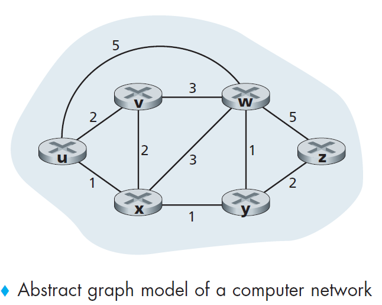
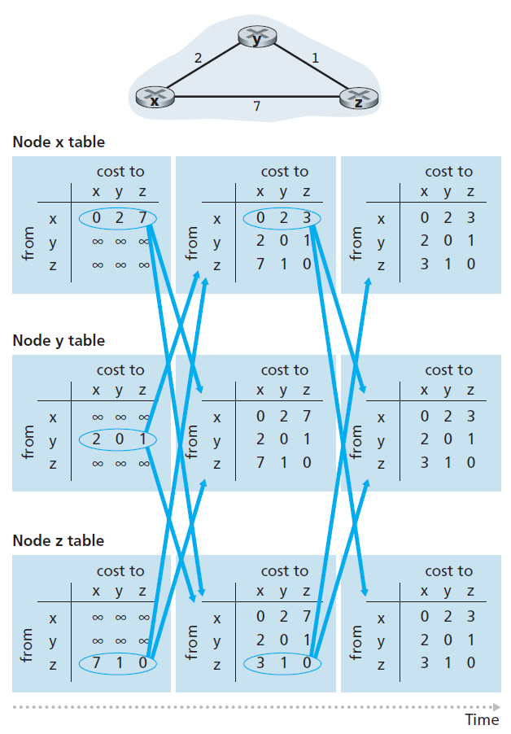
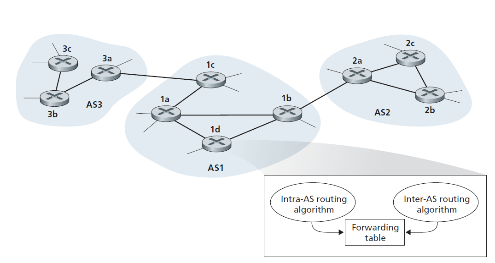
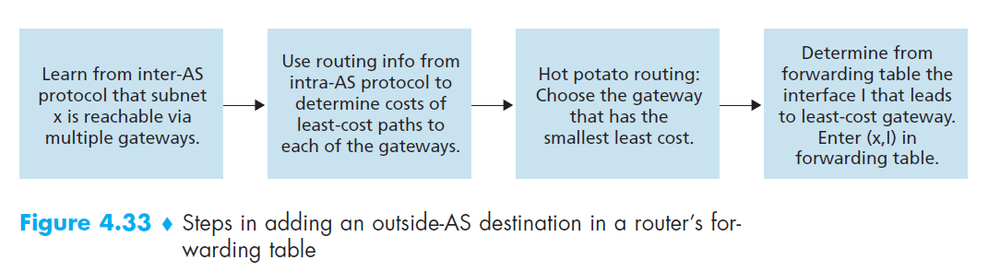
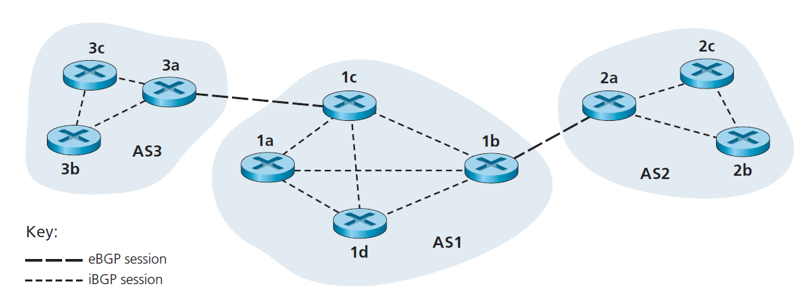
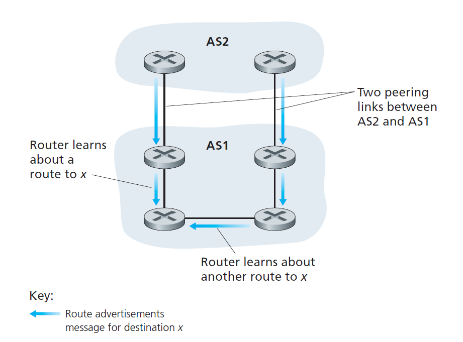

## What is routing?

Typically a host is attached directly to one router, the default router for the
host (also called the **first-hop router** for the host). Whenever a host sends a packet,
the packet is transferred to its default router. We refer to the default router of the
source host as the **source router** and the default router of the destination host as the
**destination router**. The problem of routing a packet from source host to destination
host clearly boils down to the problem of routing the packet from source router to
destination router, which is the focus of this section.

## Routing Algorithm
```A graph is used to formulate routing problems.```

The purpose of a routing algorithm is then simple: given a set of routers, with
links connecting the routers, a routing algorithm finds a “good” path from source
router to destination router.



- **least-cost path**. The least-cost
problem is therefore clear: Find a path between the source and destination that has
least cost.
- **shortest path**. that is, the
path with the smallest number of links between the source and the destination.

Ways to classify routing algorithm:
- **Static routing algorithms**, routes change very slowly over
time, often as a result of human intervention.
- **Dynamic routing algorithms** change the routing
paths as the network traffic loads or topology change.
- **Load-sensitive algorithm**, link costs vary dynamically
to reflect the current level of congestion in the underlying link. Today’s Internet routing algorithms (such as RIP, OSPF, and
BGP) are load-insensitive.

### Global routing algorithm

```In practice, algorithms with global state information are often referred to as link-state (LS) algorithms```

A global routing algorithm computes the least-cost path between a source and
destination using complete, global knowledge about the network. That is, the
algorithm takes the connectivity between all nodes and all link costs as inputs.
This then requires that the algorithm somehow obtain this information before
actually performing the calculation.

### Decentralized routing algorithm
```The decentralized routing algorithm is called a distance-vector (DV) algorithm```

In a decentralized routing algorithm, the calculation of the least-cost path is
carried out in an iterative, distributed manner. No node has complete information
about the costs of all network links. Instead, each node begins with only the
knowledge of the costs of its own directly attached links. Then, through an iterative
process of calculation and exchange of information with its neighboring
nodes (that is, nodes that are at the other end of links to which it itself is
attached), a node gradually calculates the least-cost path to a destination or set of
destinations.

## Link-State (LS) routing algorithm
```Each node broadcast link-state packets to all other nodes in the network (link broadcast algorithm), all nodes have an identical and complete view of the network.```

Recall that in a link-state algorithm, the network topology and all link costs are
known, that is, available as input to the LS algorithm. In practice this is accomplished
by having each node broadcast link-state packets to all other nodes in the
network, with each link-state packet containing the identities and costs of its
attached links.

Specific Algoritm:
- Dijkstra’s algorithm (most prevalent)
- Prim’s algorithm

Link-State (LS) Algorithm for Source Node u (Pseudo Code)

    1 Initialization:
    2 N’ = {u}
    3 for all nodes v
    4 if v is a neighbor of u
    5 then D(v) = c(u,v)
    6 else D(v) = ∞
    7
    8 Loop
    9 find w not in N’ such that D(w) is a minimum
    10 add w to N’
    11 update D(v) for each neighbor v of w and not in N’:
    12 D(v) = min( D(v), D(w) + c(w,v) )
    13 /* new cost to v is either old cost to v or known
    14 least path cost to w plus cost from w to v */
    15 until N’= N

## Distance Vector Routing Algorithm
```the distance vector (DV) algorithm is iterative, asynchronous, and distributed.```

Whereas the LS algorithm is an algorithm using global information, the distance vector
(DV) algorithm is iterative, asynchronous, and distributed. It is distributed
in that each node receives some information from one or more of its directly
attached neighbors, performs a calculation, and then distributes the results of its
calculation back to its neighbors.

It is iterative in that this process continues
on until no more information is exchanged between neighbors. (Interestingly, the
algorithm is also self-terminating—there is no signal that the computation should
stop; it just stops.) The algorithm is asynchronous in that it does not require all of
the nodes to operate in lockstep with each other.

Bellman-Ford algorithm pesudo code:

    1 Initialization:
    2 for all destinations y in N:
    3 Dx(y) = c(x,y) /* if y is not a neighbor then c(x,y) = ∞ */
    4 for each neighbor w
    5 Dw(y) = ? for all destinations y in N
    6 for each neighbor w
    7 send distance vector Dx = [Dx(y): y in N] to w
    8
    9 loop
    10 wait (until I see a link cost change to some neighbor w or
    11 until I receive a distance vector from some neighbor w)
    12
    13 for each y in N:
    14 Dx(y) = minv{c(x,v) + Dv(y)}
    15
    16 if Dx(y) changed for any destination y
    17 send distance vector Dx = [Dx(y): y in N] to all neighbors
    18
    19 forever

DV-like algorithms are used in many routing
protocols in practice, including the Internet’s **RIP and BGP, ISO IDRP, Novell IPX**,
and the original ARPAnet.



## A Comparison of LS and DV Routing Algorithms

The DV and LS algorithms take complementary approaches towards computing
routing. In the DV algorithm, each node talks to **only its directly connected neighbors**,
but it provides its neighbors with **least-cost estimates from itself to all the nodes** (that it knows about) in the network. In the LS algorithm, each node talks with
**all other nodes (via broadcast)**, but it tells them only the costs of its **directly connected links**.

- **Message complexity**. We have seen that LS requires each node to know the
cost of each link in the network. This requires O(|N| |E|) messages to be sent.
Also, whenever a link cost changes, the new link cost must be sent to all
nodes. The DV algorithm requires message exchanges between directly connected
neighbors at each iteration. We have seen that the time needed for the
algorithm to converge can depend on many factors. When link costs change,
the DV algorithm will propagate the results of the changed link cost only if
the new link cost results in a **changed least-cost path** for one of the nodes
attached to that link.

- **Speed of convergence**. We have seen that our implementation of LS is an O(|N|2)
algorithm requiring O(|N| |E|)) messages. The DV algorithm can converge slowly
and can have routing loops while the algorithm is converging. DV also suffers
from the count-to-infinity problem.

- **Robustness**. What can happen if a router fails, misbehaves, or is sabotaged?
Under LS, a router could broadcast an incorrect cost for one of its attached
links (but no others). A node could also corrupt or drop any packets it received
as part of an LS broadcast. But an LS node is computing only its own forwarding
tables; other nodes are performing similar calculations for themselves. This
means route calculations are somewhat separated under LS, providing a degree
of robustness. Under DV, a node can advertise incorrect least-cost paths to any
or all destinations. (Indeed, in 1997, a malfunctioning router in a small ISP provided national backbone routers with erroneous routing information. This
caused other routers to flood the malfunctioning router with traffic and caused
large portions of the Internet to become disconnected for up to several hours
[Neumann 1997].) More generally, we note that, at each iteration, a node’s calculation
in DV is passed on to its neighbor and then indirectly to its neighbor’s
neighbor on the next iteration. ***In this sense, an incorrect node calculation can be diffused through the entire network under DV.***

## Hierarchical Routing

LS and DV algorithm do not suit for real-world scenaior in the sense that:

- **Scale**: As the number of routers becomes large, the overhead involved in
computing, storing, and communicating routing information becomes prohibitive. Today’s public
Internet consists of hundreds of millions of hosts. Note enough memory to store all infor for LS algorithm and it will never converge for DV algorithm for such large number of routers.
- **Administrative autonomy**: Although researchers tend to ignore issues such as a
company’s desire to run its routers as it pleases (for example, to run whatever
routing algorithm it chooses) or to hide aspects of its network’s internal organization
from the outside, these are important considerations. Ideally, an organization
should be able to run and administer its network as it wishes, while still
being able to connect its network to other outside networks.

### Autonomous Systems (ASs)
```The problems of scale and administrative authority are solved by defining autonomous systems. Autonomous System is basically a sub-group of routers.```

Both of these problems can be solved by organizing routers into **autonomous systems
(ASs)**, with each AS consisting of a group of routers that are typically under
the same administrative control (e.g., operated by the same ISP or belonging to the
same company network). Routers within the same AS all run the same routing algorithm
(for example, an LS or DV algorithm) and have information about each
other—exactly as was the case in our idealized model in the preceding section. The
routing algorithm running within an autonomous system is called an **intra-autonomous system routing protocol**. It will be necessary, of course, to connect
ASs to each other, and thus one or more of the routers in an AS will have the added
task of being responsible for forwarding packets to destinations outside the AS;
these routers are called gateway routers.


```Within an AS, all routers run the same intra-AS routing protocol. Among themselves, the ASs run the same inter-AS routing protocol.```

Obtaining reachability information from neighboring ASs and propagating
the reachability information to all routers internal to the AS—are handled by the **inter-AS routing protocol**.

As an example, consider a subnet x (identified by its CIDRized address), and
suppose that AS1 learns from the inter-AS routing protocol that subnet x is reachable
from AS3 but is not reachable from AS2. AS1 then propagates this information
to all of its routers. When router 1d learns that subnet x is reachable from AS3, and
hence from gateway 1c, it then determines, from the information provided by the
intra-AS routing protocol, the router interface that is on the least-cost path from
router 1d to gateway router 1c. Say this is interface I. The router 1d can then put the
entry (x, I) into its forwarding table. (This example, and others presented in this section,
gets the general ideas across but is a simplification of what really happens in
the Internet.

Following up on the previous example, now suppose that AS2 and AS3 connect
to other ASs, which are not shown in the diagram. Also suppose that AS1
learns from the inter-AS routing protocol that subnet x is reachable both from AS2,
via gateway 1b, and from AS3, via gateway 1c. AS1 would then propagate this
information to all its routers, including router 1d. In order to configure its forwarding
table, router 1d would have to determine to which gateway router, 1b or 1c, it
should direct packets that are destined for subnet x. One approach, which is often
employed in practice, is to use **hot-potato routing**. In hot-potato routing, the AS
gets rid of the packet (the hot potato) as quickly as possible (more precisely, as
inexpensively as possible). This is done by having a router send the packet to the
gateway router that has the smallest router-to-gateway cost among all gateways
with a path to the destination. In the context of the current example, hot-potato
routing, running in 1d, would use information from the intra-AS routing protocol
to determine the path costs to 1b and 1c, and then choose the path with the least
cost. Once this path is chosen, router 1d adds an entry for subnet x in its forwarding
table. Figure 4.33 summarizes the actions taken at router 1d for adding the new
entry for x to the forwarding table.

When an AS learns about a destination from a neighboring AS, the AS can
advertise this routing information to some of its other neighboring ASs. For example,
suppose AS1 learns from AS2 that subnet x is reachable via AS2. AS1 could then tell
AS3 that x is reachable via AS1. In this manner, if AS3 needs to route a packet
destined to x, AS3 would forward the packet to AS1, which would in turn forward the
packet to AS2.



### what is the relationship between ISPs and ASs?

You might think that
the routers in an ISP, and the links that interconnect them, constitute a single AS.
Although this is often the case, many ISPs partition their network into multiple ASs.
For example, some tier-1 ISPs use one AS for their entire network; others break up
their ISP into tens of interconnected ASs.

## Routing in the Internet

## Intra-AS Routing in the Internet
```An intra-AS routing protocol is used to determine how routing is performed within an autonomous system (AS)```

Intra-AS routing protocols are also known as interior
gateway protocols. Historically, two routing protocols have been used extensively
for routing within an autonomous system in the Internet: the **Routing Information Protocol (RIP)** and **Open Shortest Path First (OSPF)**.

### Routing Information Protocol (RIP)
```RIP is a distance-vector protocol that operates in a manner very close to the idealized DV protocol. RIP is a application layer protocol that relies on UDP```

In RIP (and also in OSPF), costs are actually from source router to a destination
subnet. RIP uses the term hop, which is the number of subnets traversed
along the shortest path from source router to destination subnet, including the destination
subnet. The maximum cost of a path is limited to 15, thus limiting the use of RIP to
autonomous systems that are **fewer than 15 hops in diameter**.

In RIP, routing updates
are exchanged between neighbors approximately **every 30 seconds** using a
RIP response message. The response message sent by a router or host contains
a list of **up to 25 destination subnets** within the AS, as well as the sender’s
distance to each of those subnets. Response messages are also known as RIP
advertisements. If a router
does not hear from its neighbor at least once every 180 seconds, that neighbor is
considered to be no longer reachable.

When this happens, RIP modifies the local routing
table and then propagates this information by sending advertisements to its neighboring
routers (the ones that are still reachable). A router can also request information
about its neighbor’s cost to a given destination using RIP’s request message.
Routers send RIP request and response messages to each other over UDP using port
number 520. The UDP segment is carried between routers in a standard IP datagram.

#### Features of RIP :

1. Updates of the network are exchanged periodically.
2. Updates (routing information) are always broadcast.
3. Full routing tables are sent in updates.
4. Routers always trust on routing information received from neighbor routers. This is also known as Routing on rumours.

### OSPF
```OSPF is a link-state protocol that uses flooding of link-state information and a Dijkstra least-cost path algorithm. OSPF is deployed in upper-tier ISPs whereas RIP is deployed in lower-tier ones and enterprise networks```

With
OSPF, a router constructs a complete topological map (that is, a graph) of the entire
autonomous system. The router then locally runs ***Dijkstra’s shortest-path algorithm***
to determine a shortest-path tree to all subnets, with itself as the root node. Individual
link costs are configured by the network administrator (see Principles and Practice:
Setting OSPF Weights). The administrator might choose to set all link costs to
1, thus achieving minimum-hop routing, or might choose to set the link weights to
be inversely proportional to link capacity in order to discourage traffic from using
low-bandwidth links. OSPF does not mandate a policy for how link weights are set
(that is the job of the network administrator), but instead provides ***the mechanisms (protocol) for determining least-cost path routing for the given set of link weights***.

With OSPF, a router broadcasts routing information to all other routers in the
autonomous system, not just to its neighboring routers. A router broadcasts linkstate
information whenever there is a change in a link’s state (for example, a change
in cost or a change in up/down status). It also broadcasts a link’s state periodically
(at least once every 30 minutes), even if the link’s state has not changed.

OSPF advertisements are contained in OSPF messages that
are carried directly by IP, with an upper-layer protocol of 89 for OSPF. Thus, the
OSPF protocol must itself implement functionality such as reliable message transfer
and link-state broadcast. The OSPF protocol also checks that links are operational
(via a HELLO message that is sent to an attached neighbor) and allows an OSPF
router to obtain a neighboring router’s database of network-wide link state.

Some of the advances embodied in OSPF include the following:
- **Security**. Exchanges between OSPF routers (for example, link-state updates)
can be authenticated. Preventing malicious intruders from
injecting incorrect information into router tables.
- **Multiple same-cost paths**. When multiple paths to a destination have the same
cost, OSPF allows multiple paths to be used (that is, a single path need not be
chosen for carrying all traffic when multiple equal-cost paths exist).
- **Integrated support for unicast and multicast routing**. Multicast OSPF (MOSPF)
[RFC 1584] provides simple extensions to OSPF to provide for multicast routing
MOSPF uses the existing
OSPF link database and adds a new type of link-state advertisement to the existing
OSPF link-state broadcast mechanism.
- **Support for hierarchy within a single routing domain.** Perhaps the most significant
advance in OSPF is the ability to structure an autonomous system hierarchically. 

An OSPF autonomous system can be **configured hierarchically** into areas. Each
area runs its own OSPF link-state routing algorithm, with each router in an area
broadcasting its link state to all other routers in that area.
Within each area, one or
more area border routers are responsible for routing packets outside the area. Lastly,
exactly one OSPF area in the AS is configured to be the **backbone area**. The primary
role of the backbone area is to route traffic between the other areas in the AS. The
backbone always contains all area border routers in the AS and may contain nonborder
routers as well. Inter-area routing within the AS requires that the packet be first
routed to an area border router (intra-area routing), then routed through the backbone
to the area border router that is in the destination area, and then routed to the
final destination.
4.6 • ROUTING IN THE INTERNET 389

### Difference between RIP and OSPF

No    |	RIP	| OSPF
------|-----|-----
1	|RIP Stands for Routing Information Protocol.|	OSPF stands for Open Shortest Path First.
2	|RIP works on Bellman Ford algorithm.	|OSPF works on Dijkstra algorithm.
3	|It is a Distance Vector protocol and it uses the distance or hops count to determine the transmission path.	|It is a link state protocol and it analyzes different sources like the speed, cost and path congestion while identifying the shortest path.
4	|It is basically use for smaller size organization.	|It is basically use for larger size organization in the network.
5	|It allows a maximum of 15 hops.	|There is no such restriction on the hop count.
6	|It is not a more intelligent dynamic routing protocol.	|It is a more intelligent routing protocol than RIP.
7	|The networks are classified as areas and tables here.	|The networks are classified as areas, sub areas, autonomous systems and backbone areas here.
8	|Its administrative distance is 120.	|Its administrative distance is 110.
9	|RIP uses UDP(User Datagram Protocol) Protocol.	|OSPF works for IP(Internet Protocol) Protocol.
10	|It calculates the metric in terms of Hop Count.	|It calculates the metric in terms of bandwidth.

## Inter-AS Routing

### Border Gateway Protocol (BGP or BGP4)
```The Border Gateway Protocol version 4, specified in RFC 4271 (see also [RFC 4274), is the de facto standard inter-AS routing protocol in today’s Internet.```

BGP provides each AS a means to:

1. Obtain subnet reachability information from neighboring ASs.
2. Propagate the reachability information to all routers internal to the AS.
3. Determine “good” routes to subnets based on the reachability information and
on AS policy.

Most importantly, BGP allows each subnet to advertise its existence to the rest of
the Internet. A subnet screams “I exist and I am here,” and BGP makes sure that all
the ASs in the Internet know about the subnet and how to get there. If it weren’t for
BGP, each subnet would be isolated—alone and unknown by the rest of the Internet.

In BGP, pairs of routers exchange routing information over **semipermanent TCP connections using port 179**. There is typically one such BGP TCP
connection for each link that directly connects two routers in two different ASs;



There is a TCP connection between gateway routers 3a and 1c
and another TCP connection between gateway routers 1b and 2a. There are also
semipermanent BGP TCP connections between routers within an AS. For each TCP connection, the two routers at the end of the connection are called
**BGP peers**, and the TCP connection along with all the BGP messages sent over the connection is called a **BGP session**. Furthermore, a BGP session that spans two ASs
is called an **external BGP (eBGP) session**, and a BGP session between routers in
the same AS is called an **internal BGP (iBGP) session**.

BGP allows each AS to learn which destinations are reachable via its neighboring
ASs. In BGP, destinations are not hosts but instead are CIDRized prefixes, with
each prefix representing a subnet or a collection of subnets.

### Characteristics of BGP
- Inter-Autonomous System Configuration: The main role of BGP is to provide communication between two autonomous systems.
- BGP supports Next-Hop Paradigm.
- Coordination among multiple BGP speakers within the AS (Autonomous System).
- Path Information: BGP advertisement also include path information, along with the reachable destination and next destination pair.
- Policy Support: BGP can implement policies that can be configured by the administrator. For ex:- a router running BGP can be configured to distinguish between the routes that are known within the AS and that which are known from outside the AS.
- Runs Over TCP.
- BGP conserve network Bandwidth.
- BGP supports CIDR.
- BGP also supports Security.

### BGP sessions
As you might expect, using the eBGP
session between the gateway routers 3a and 1c, AS3 sends AS1 the list of prefixes
that are reachable from AS3; and AS1 sends AS3 the list of prefixes that are reachable
from AS1. Similarly, AS1 and AS2 exchange prefix reachability information
through their gateway routers 1b and 2a. Also as you may expect, when a gateway
router (in any AS) receives **eBGP-learned prefixes**, the gateway router uses its **iBGP
sessions** to distribute the prefixes to the other routers in the AS. Thus, all the routers
in AS1 learn about AS3 prefixes, including the gateway router 1b. The gateway
router 1b (in AS1) can therefore re-advertise AS3’s prefixes to AS2. When a router
(gateway or not) learns about a new prefix, it creates an entry for the prefix in its
forwarding table.

### Path Attributes and BGP Routes

When a router advertises a prefix across a BGP session, it includes with the prefix
a number of BGP attributes. In BGP jargon, **a prefix along with its attributes** is
called a ***route***. Thus, BGP peers advertise routes to each other. Two of the more
important attributes are **AS-PATH** and **NEXT-HOP**:

- **AS-PATH.** This attribute contains the ASs through which the advertisement for the
prefix has passed. When a prefix is passed into an AS, the AS adds its ASN to the ASPATH
attribute. Routers use the AS-PATH attribute to **detect and
prevent looping advertisements**; specifically, if a router sees that its AS is contained
in the path list, it will reject the advertisement. Routers also use
the AS-PATH attribute in **choosing among multiple paths** to the same prefix.
- **NEXT-HOP.** The NEXT-HOP is the router interface that begins the AS-PATH. The NEXT-HOP attribute is used by
routers to properly configure their forwarding tables. For example, after
learning about this route to a external AS from iBGP, router 1d may want to forward packets to x along the
route, that is, router 1d may want to include the entry (x, l) in its forwarding table,
where l is its interface that begins the least-cost path from 1d towards the gateway
router 1c. To determine l, 1d provides the IP address in the NEXT-HOP attribute to its intra-AS routing module.

The following diagram shows another case where NEXT-HOP arrtibute is needed. The router knows two different routes to get to AS2 (to the same prefix). These two routes could have the same
AS-PATH to x, but could have different NEXT-HOP values corresponding to the different
peering links. Using the NEXT-HOP values and the intra-AS routing algorithm,
the router can determine the cost of the path to each peering link, and then
apply hot-potato routing to determine the appropriate interface - The AS gets rid of the packet (the hot potato) as quickly as possible (more precisely, as
inexpensively as possible)



### BGP route selection
As described earlier in this section, BGP uses eBGP and iBGP to distribute routes
to all the routers within ASs. From this distribution, a router may learn about more
than one route to any one prefix, in which case the router must select one. If there are two or more routes to the
same prefix, then BGP sequentially invokes the following elimination rules until one
route remains:

- **Routes are assigned a local preference value as one of their attributes**. The local
preference of a route could have been set by the router or could have been
learned by another router in the same AS. This is a policy decision that is left up
to the AS’s network administrator.
- The route with the **shortest AS-PATH** is selected.
- The route with the **closest NEXT-HOP router** is selected. This process is called hot-potato routing.
- If more than one route still remains, the router uses **BGP identifiers** to select the route.


## Reference

***Computer Networking - A top down approach***

https://www.geeksforgeeks.org/routing-information-protocol-rip/

https://www.geeksforgeeks.org/border-gateway-protocol-bgp/

[Formal analysis of routing protocols - UIUC](http://seclab.illinois.edu/wp-content/uploads/2011/04/Obradovic02.pdf)