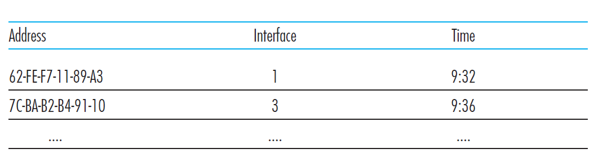
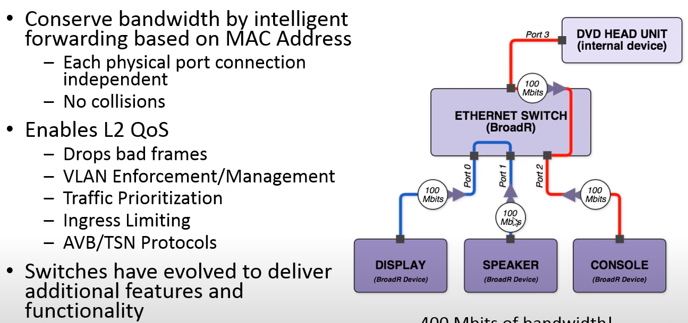
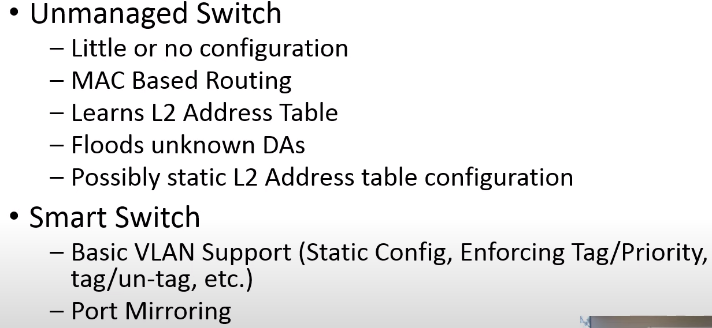
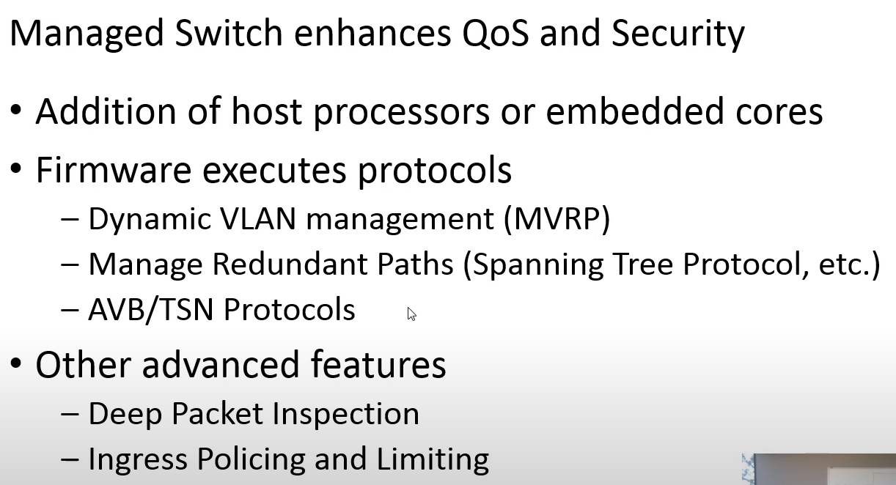
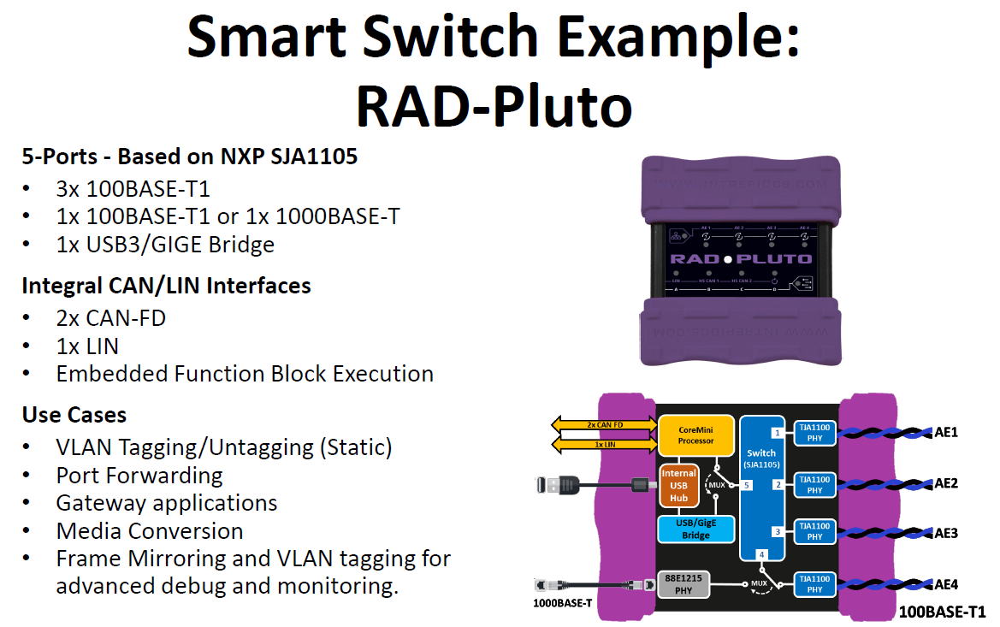

## Functionality
```The role of the switch is to receive incoming link-layer frames and forward them onto outgoing links. switch itself is transparent to the hosts and routers in the subnet```

Switches are **plug-and-play** devices because they require no intervention
from a network administrator or user. A network administrator wanting to install
a switch need do nothing more than connect the LAN segments to the switch
interfaces. The administrator need not configure the switch tables at the time of
installation or when a host is removed from one of the LAN segments. Switches
are also **full-duplex**, meaning any switch interface can send and receive at the
same time.

### Forwarding and Filtering
**Filtering** is the switch function that determines whether a frame should be forwarded
to some interface or should just be dropped. **Forwarding** is the switch
function that determines the interfaces to which a frame should be directed, and
then moves the frame to those interfaces. Switch filtering and forwarding are
done with a **switch table**:



Switch table entry contains:
1) a MAC address, 
2) the switch interface that leads toward that MAC address, and 
3) the time at which the entry was placed in the table

To understand how switch filtering and forwarding work, suppose a frame with
destination address DD-DD-DD-DD-DD-DD arrives at the switch on interface x. The
switch indexes its table with the MAC address DD-DD-DD-DD-DD-DD. There are
three possible cases:

- **Broadcast:** There is no entry in the table for DD-DD-DD-DD-DD-DD. In this case, the switch
forwards copies of the frame to the output buffers preceding **all interfaces except for interface x**. In other words, if there is no entry for the destination address, the
switch **broadcasts** the frame.

- **Filter:** There is an entry in the table, associating DD-DD-DD-DD-DD-DD with interface x. In this case, the frame is coming from a LAN segment that contains
adapter DD-DD-DD-DD-DD-DD. There being no need to forward the frame to
any of the other interfaces, the switch performs the filtering function by discarding
the frame.

- **Forward:** There is an entry in the table, associating DD-DD-DD-DD-DD-DD with interface y!=x. In this case, the frame needs to be forwarded to the LAN segment
attached to interface y. The switch performs its forwarding function by putting
the frame in an output buffer that precedes interface y.

### Self-learning
A switch has the wonderful property (particularly for the already-overworked network
administrator) that its table is **built automatically,dynamically, and autonomously** — without any intervention from a network administrator or from a
configuration protocol. In other words, switches are self-learning. This capability is
accomplished as follows:

1. The switch table is initially empty.
2. For each incoming frame received on an interface, the switch stores in its table
   1) the MAC address in the frame’s source address field, 
   2) the interface from which the frame arrived, and
   3) the current time. In this manner the switch
records in its table the LAN segment on which the sender resides. If every host
in the LAN eventually sends a frame, then every host will eventually get
recorded in the table.
1. The switch deletes an address in the table if no frames are received with that
address as the source address after some period of time (the aging time). In
this manner, if a PC is replaced by another PC (with a different adapter), the
MAC address of the original PC will eventually be purged from the switch
table.

### Frame Flooding

Switches automatically age out entries in their forwarding database after a period of time—typically five minutes—if they do not see any frames from a station. Therefore, if a station doesn’t send traffic for a designated period, then the switch will delete the forwarding entry for that station. This keeps the forwarding database from growing full of stale entries that might not reflect reality.

Of course, once the address entry has timed out, the switch won’t have any information in the database for that station the next time the switch receives a frame destined for it. This also happens when a station is newly connected to a switch, or when a station has been powered off and is turned back on more than five minutes later. So how does the switch handle packet forwarding for an unknown station?

The solution is simple: the switch forwards the frame destined for an unknown station out all switch ports other than the one it was received on, thus flooding the frame to all other stations. Flooding the frame guarantees that a frame with an unknown destination address will reach all network connections and be heard by the correct destination device, assuming that it is active and on the network. When the unknown device responds with return traffic, the switch will automatically learn which port the device is on, and will no longer flood traffic destined to that device.

## Broadcast and Multicast Traffic

In addition to transmitting frames directed to a single address, local area networks are capable of sending frames directed to a group address, called a multicast address, which can be received by a group of stations. They can also send frames directed to all stations, using the broadcast address. Group addresses always begin with a specific bit pattern defined in the Ethernet standard, making it possible for a switch to determine which frames are destined for a specific device rather than a group of devices.

A frame sent to a multicast destination address can be received by all stations configured to listen for that multicast address. The Ethernet software, also called “interface driver” software, programs the interface to accept frames sent to the group address, so that the interface is now a member of that group. The Ethernet interface address assigned at the factory is called a unicast address, and any given Ethernet interface can receive unicast frames and multicast frames. In other words, the interface can be programmed to receive frames sent to one or more multicast group addresses, as well as frames sent to the unicast MAC address belonging to that interface.

## Forwarding Loops

The design and operation of Ethernet requires that only a single packet transmission path may exist between any two stations. An Ethernet grows by extending branches in a network topology called a tree structure, which consists of multiple switches branching off of a central switch. The danger is that, in a sufficiently complex network, switches with multiple inter-switch connections can create loop paths in the network.

On a network with switches connected together to form a packet forwarding loop, packets will circulate endlessly around the loop, building up to very high levels of traffic and causing an overload.

The looped packets will circulate at the maximum rate of the network links, until the traffic rate gets so high that the network is saturated. Broadcast and multicast frames, as well as unicast frames to unknown destinations, are normally flooded to all ports in a basic switch, and all of this traffic will circulate in such a loop. Once a loop is formed, this failure mode can happen very rapidly, causing the network to be fully occupied with sending broadcast, multicast, and unknown frames, and it becomes very difficult for stations to send actual traffic.

Unfortunately, loops like the dotted path shown with arrows in Figure 1-3 are all too easy to achieve, despite your best efforts to avoid them. As networks grow to include more switches and more wiring closets, it becomes difficult to know exactly how things are connected together and to keep people from mistakenly creating a loop path.


### Spanning Tree Protocol
The purpose of the spanning tree protocol (STP) is to allow switches to automatically create a loop-free set of paths, even in a complex network with multiple paths connecting multiple switches. It provides the ability to dynamically create a tree topology in a network by blocking any packet forwarding on certain ports, and ensures that a set of Ethernet switches can automatically configure themselves to produce loop-free paths. The IEEE 802.1D standard describes the operation of spanning tree, and every switch that claims compliance with the 802.1D standard must include spanning tree capability.

## Properties of Link-Layer Switching

- **Elimination of collisions**. In a LAN built from switches (and without hubs), there
is no wasted bandwidth due to collisions! The switches buffer frames and never
transmit more than one frame on a segment at any one time. As with a router, the
maximum aggregate throughput of a switch is the sum of all the switch interface
rates. Thus, switches provide a significant performance improvement over LANs
with broadcast links.

- **Heterogeneous links**. Because a switch isolates one link from another, the different
links in the LAN can operate at different speeds and can run over different
media. For example, the uppermost switch in Figure 5.22 might have three
1 Gbps 1000BASE-T copper links, two 100 Mbps 100BASE-FX fiber links, and
one 100BASE-T copper link. Thus, a switch is ideal for mixing legacy equipment
with new equipment.

- **Management.** In addition to providing enhanced security (see sidebar on Focus
on Security), a switch also eases network management. For example, if an
adapter malfunctions and continually sends Ethernet frames (called a jabbering
adapter), a switch can detect the problem and internally disconnect the malfunctioning
adapter. Similarly, a
cable cut disconnects only that host that was using the cut cable to connect to
the switch. Switches also gather statistics on bandwidth usage, collision
rates, and traffic types, and make this information available to the network
manager.

## Switch Architecture


### Switch Port Memory
All switches contain some high-speed buffer memory in which a frame is stored, however briefly, before being forwarded onto another port or ports of the switch. This mechanism is known as store-and-forward switching. All IEEE 802.1D-compliant switches operate in store-and-forward mode, in which the packet is fully received on a port and placed into high-speed port buffer memory (stored) before being forwarded. A larger amount of buffer memory allows a bridge to handle longer streams of back-to-back frames, giving the switch improved performance in the presence of bursts of traffic on the LAN. A common switch design includes a pool of high-speed buffer memory that can be dynamically allocated to individual switch ports as needed.

### Switch CPU and RAM
Given that a switch is a special-purpose computer, the central CPU and RAM in a switch are important for such functions as **spanning tree operations, providing management information, managing multicast packet flows, and managing switch port and feature configuration**.

As usual in the computer industry, the more CPU performance and RAM, the better, but you will pay more as well. Vendors frequently do not make it easy for customers to find switch CPU and RAM specifications. Typically, higher cost switches will make this information available, but you won’t be able to order a faster CPU or more RAM for a given switch. Instead, this is information useful for comparing models from a vendor, or among vendors, to see which switches have the best specifications.

## Why Switch?



## Switch types



Managed Switch:



Example:



## Switches vs. Routers 

As we learned in Chapter 4, routers are store-and-forward packet switches that forward
packets using network-layer addresses. Although a switch is also a store-andforward
packet switch, it is fundamentally different from a router in that it forwards
packets using MAC addresses. Whereas a router is a layer-3 packet switch, a switch
is a layer-2 packet switch.

## Reference

https://www.oreilly.com/library/view/ethernet-switches/9781449367299/ch01.html

https://www.grotto-networking.com/BBSwitchArch.html