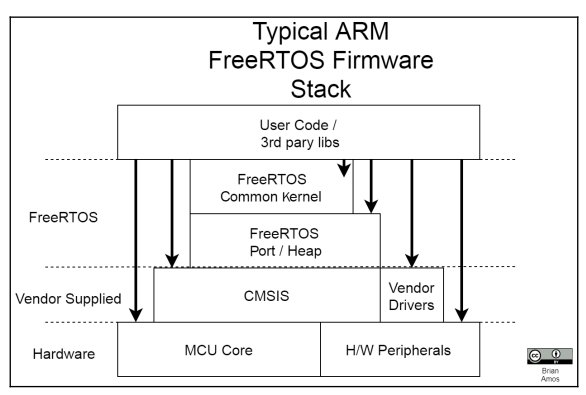

> ## 🚀 Practice & deep-dive on EmbeddedInterviewLab
>
> Get these OS / Linux concepts as community-ranked interview questions with model answers, plus interactive deep-dive guides.
>
> 👉 **[Browse Embedded Linux & OS questions →](https://embeddedinterviewlab.com/questions/domain/embedded-linux?utm_source=github&utm_medium=referral&utm_campaign=kb_cta&utm_content=operating_system)** &nbsp;·&nbsp; **[Browse the Embedded Linux guides →](https://embeddedinterviewlab.com/categories/embedded-linux?utm_source=github&utm_medium=referral&utm_campaign=kb_domain&utm_content=operating_system)**

---

## Freertos Firmware Stack

### Firmware Stack Layer diagram

- User code is able to access the same FreeRTOS API, regardless of the underlying hardware port implementation.
- FreeRTOS does __NOT__ prevent __User code__ from using vendor-supplied drivers, CMSIS or raw hardware register.