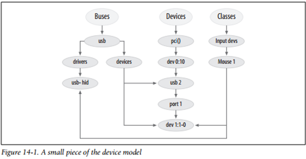
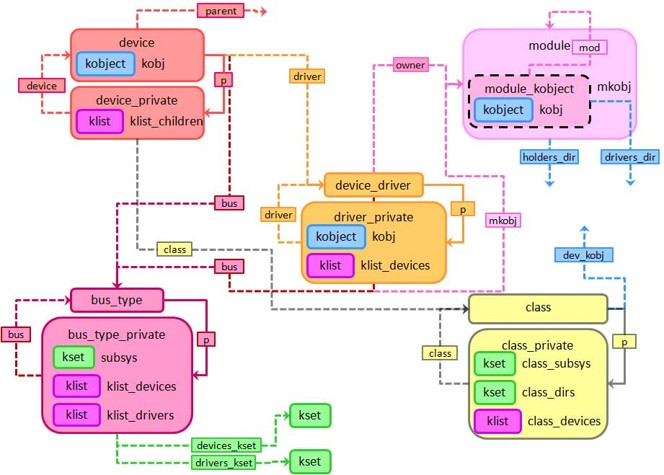
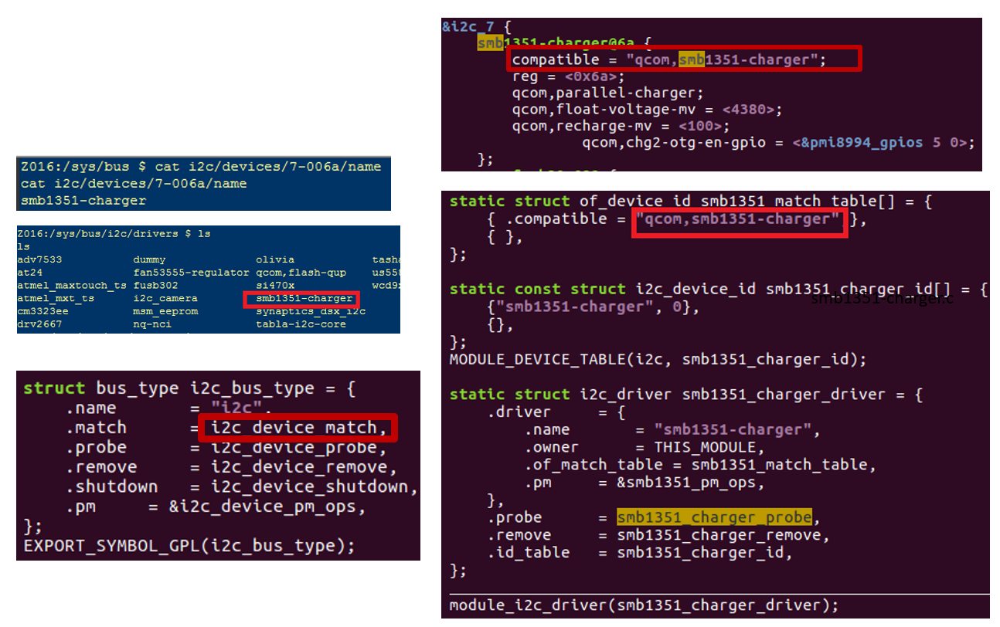
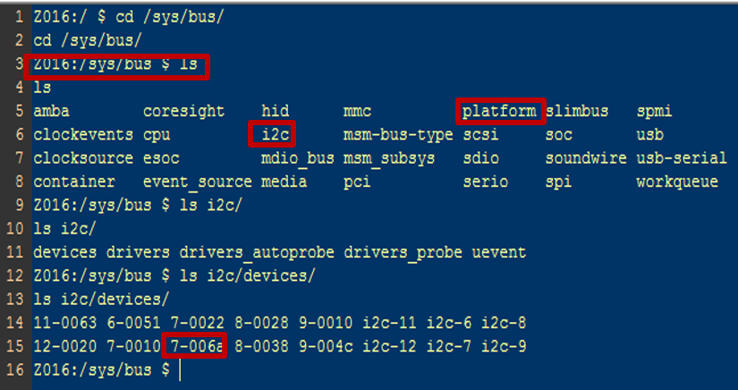
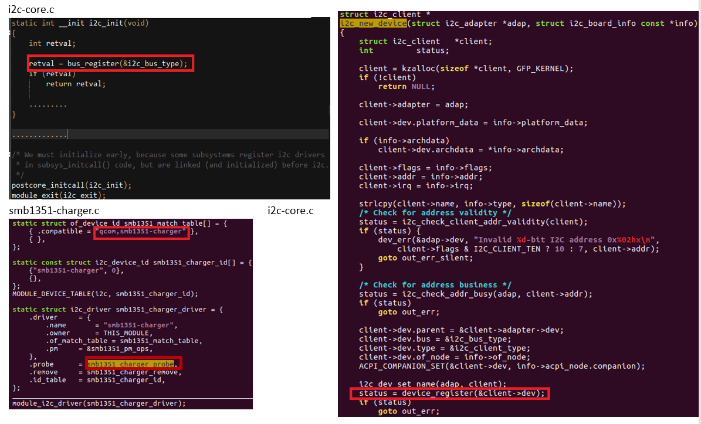
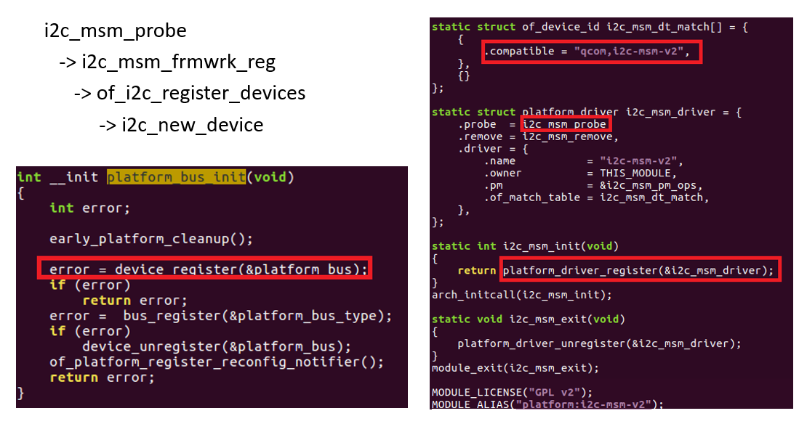
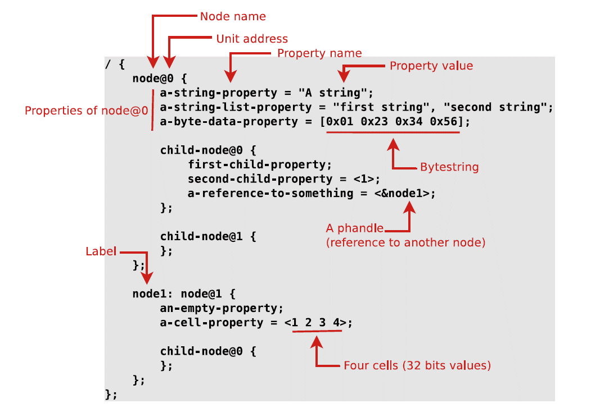
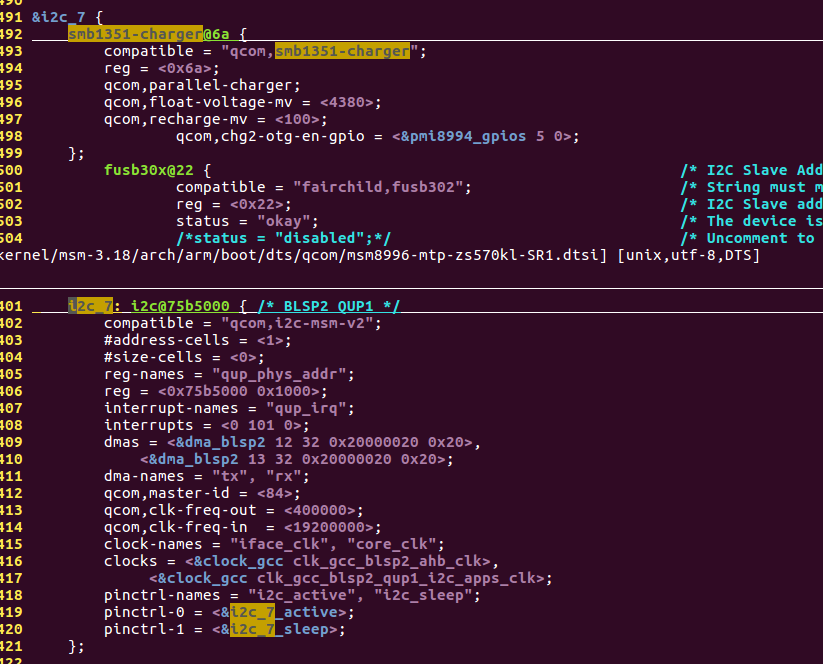
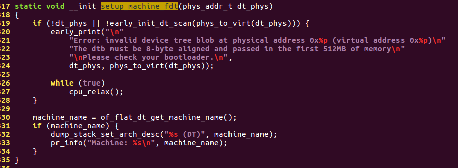

## Linux Device Model

### Small Piece of the Device model

### Architecture Diagram

### Example

#### I2C Charger Example

#### Who calls i2c_new_device?

### Device Tree dtsi file

Device node building Process:

    of_platform_populate
        -> of_platform_bus_create
            -> of_platform_device_create_pdata
                -> of_device_add
		            ->device_add
                        ->bus_probe_device

### Reference

_Linux Device Drivers, 3rd Edition_

http://www.slideshare.net/jserv/linux-discovery

http://m.blog.chinaunix.net/uid-29955651-id-5095220.html

http://www.cs.fsu.edu/~baker/devices/notes/ch14.html#(1)

