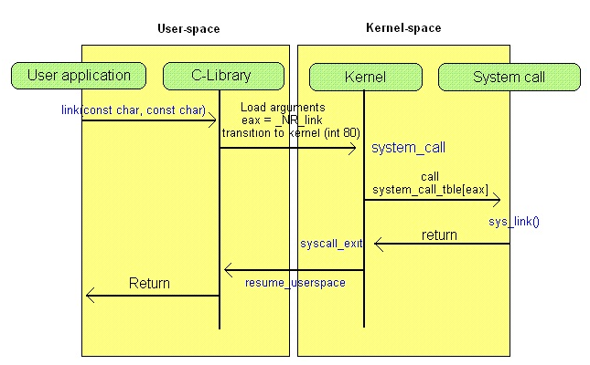
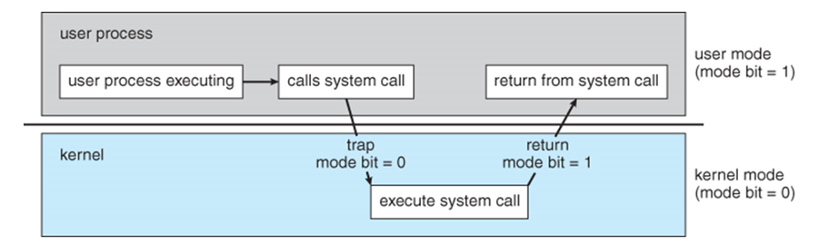

## Linux System Call Mechanism

### Why do we need system call?

System call is the method user space applications use to request for OS kernel services. This is because user space apps cannot directly access resources in OS kernel due to their privileage difference.

- Syscall is basically the API for user application to interact with OS kernel services. 
- Requestable OS kernel service such as: device I/O, process creation, hardware access, memory allocation and etc.
- Syscall generates _software interrupt_ to convert CPU to transition from __user mode__ to the __kernel mode__. Every syscall has its own syscall number to be handled in the software interrupt ISR routine.
- Syscall exist to protect kernel space so that user space applications won't be able to interfer with system resources directly, preventing malicious attempt to modify or damage the system.

System call Layer diagram:

User space process request for OS service:

### Take kill() syscall as an example:

- userspace method XXX, its corresponding syscall layer method is sys_XXX. e.g. kill() -> sys_kill().
- unistd.h (_/kernel/include/uapi/asm-generic/unistd.h_) has all the syscall software interrupt number info. 
- 

### Reference

https://www.slideshare.net/VandanaSalve/introduction-to-char-device-driver

https://www.slideshare.net/garyyeh165/linux-char-device-driver 

https://www.ptt.cc/bbs/b97902HW/M.1268953601.A.BA9.html

https://www.ptt.cc/bbs/b97902HW/M.1268932130.A.0CF.html

http://gityuan.com/2016/05/21/syscall/

http://hwchiu.logdown.com/posts/1733-c-pipe

http://wiki.csie.ncku.edu.tw/embedded/ARMv8

http://linux.vbird.org/linux_basic/0440processcontrol.php

_Advanced Programming in the UNIX Environment 3rd Edition_
